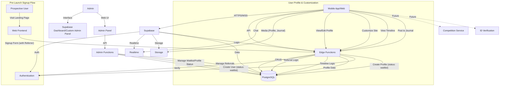

# iDance - System Architecture

## 1. Overview

iDance is a mobile application and web platform designed to facilitate connecting dancers to help find new dance partners, other dancers, dance jobs, building professional networks, and fostering a vibrant community.

**Key Features:**
- Comprehensive user profiles (dance styles, proficiency, media, awards)
- Swipe-based matching system
- TikTok-like timeline and dance journal
- Direct chat capabilities
- Multi-level referral system
- Custom user websites

**Guiding Principles:**
*   **Mobile-First:** Primary focus on iOS and Android apps
*   **Rapid Development:** Using React Native, Expo, Supabase
*   **Scalability:** Cloud-native architecture with Supabase
*   **Cost-Effectiveness:** Leveraging affordable managed services

## 2. Core Software Components

### 2.1 Mobile App (iOS/Android)
*   **Technology:**
    - React Native with Expo
    - Javascript
    - EAS Build + Updates
    - Supabase Client SDK
    - React Navigation

*   **Key Features:**
    - Authentication & profile management
    - Swipe-based matching
    - Timeline/social features
    - Chat system
    - Media management
    - Location-based search
    - Referral dashboard

*   **Key Screens:**
    - Auth & Onboarding
    - Timeline Feed
    - Swipe Discovery
    - Profile Management
    - Chat & Messages
    - Settings & Preferences
    - Referral Dashboard

### 2.2 Backend Services
*   **Technology:**
    - Supabase Platform
    - Edge Functions (TypeScript)
    - PostgreSQL + PostGIS
    - iDrive E2 Storage
    - Supabase Realtime

*   **Core Services:**
    - User Authentication
    - Database & Data Access
    - Media Storage
    - Real-time Features
    - Business Logic (Edge Functions)
    - Geospatial Search

*   **Key Functions:**
    - User Management
    - Profile Operations
    - Matching Logic
    - Timeline Processing
    - Referral System
    - Media Handling
    - Analytics Collection

### 2.3 Admin Portal
*   **Technology:**
    - Next.js
    - TypeScript
    - Cloudflare Pages
    - TailwindCSS
    - Supabase Admin SDK

*   **Core Features:**
    - Real-time Dashboard
    - User Management
    - Content Moderation
    - Referral Management
    - Analytics & Reports
    - System Configuration

*   **Key Interfaces:**
    - Admin Dashboard
    - User Management
    - Content Moderation
    - Referral System
    - Analytics & Reports

### 2.4 User Sites
*   **Technology:**
    - Next.js
    - TypeScript
    - Cloudflare Pages
    - TailwindCSS
    - iDrive E2

*   **Core Features:**
    - Public Profile Site
    - Custom Domain Support
    - Portfolio Showcase
    - Media Gallery
    - Blog/Journal
    - Contact Forms

*   **Admin Interface:**
    - Site Customization
    - Content Management
    - Analytics Dashboard
    - Media Library
    - Domain Management

## 3. Infrastructure & Services

### 3.1 Storage (iDrive E2)
*   **Features:**
    - Media storage
    - Image optimization
    - Video transcoding
    - CDN integration
    - Access control
    - Quota management

### 3.2 Deployment Infrastructure
*   **Mobile App:**
    - EAS Build (iOS/Android)
    - EAS Update (OTA updates)

*   **Web Components:**
    - Cloudflare Pages (SSR/Static)
    - Cloudflare Functions
    - Custom Domain Support

*   **Backend:**
    - Supabase Platform
    - Database Migrations
    - Edge Functions

### 3.3 Domain & DNS
*   **Components:**
    - Dynadot (Domain Registrar)
    - Cloudflare (DNS/CDN)
    - SSL Management
    - Custom Domain Support

## 4. Business Features

### 4.1 User Tiers
*   **Basic (Free):**
    - Basic profile features
    - Limited swipes
    - Basic timeline access
    - Standard chat

*   **Pro ($19.99/mo):**
    - Enhanced features
    - Unlimited swipes
    - Custom domain
    - Referral commissions

*   **VIP (Earned):**
    - All Pro features
    - Special perks
    - Priority features
    - Enhanced visibility

### 4.2 Referral System
*   **Features:**
    - Multi-level structure
    - Commission tracking
    - Automated payouts
    - Analytics dashboard

## 5. Launch Strategy

### 5.1 Pre-Launch
*   **Phase 1: Signup**
    - Landing page
    - Waitlist system
    - Referral tracking

*   **Phase 2: Engagement**
    - Profile completion
    - Email communication
    - Community building

*   **Phase 3: Activation**
    - User review
    - Account activation
    - Feature enablement

### 5.2 Launch Perks
*   Free Pro membership (1 year)
*   Custom website access
*   Early referral benefits
*   Professional features

## 6. Technical Architecture

## 7. Development & Deployment

### 7.1 Development
*   **Monorepo Structure:**
    - pnpm workspace
    - Shared types
    - Consistent tooling

*   **Key Tools:**
    - TypeScript
    - ESLint/Prettier
    - Jest/Testing Library
    - Storybook

### 7.2 CI/CD
*   **Mobile:**
    - EAS Build
    - TestFlight/Internal Testing
    - Production Release

*   **Web:**
    - Cloudflare Pages
    - Preview Deployments
    - Production Release

## 8. Future Roadmap

### 8.1 MVP Launch
*   Core authentication
*   Basic profiles
*   Matching system
*   Timeline/Journal
*   Chat functionality
*   Referral system

### 8.2 Near-term Enhancements
*   Advanced matching
*   Enhanced timeline
*   Content moderation
*   Analytics improvements

### 8.3 Future Features
*   ID verification
*   AI matchmaking
*   Advanced analytics
*   Community features

## 9. Technology Stack Summary
*   **Frontend:** React Native, Next.js
*   **Backend:** Supabase, Edge Functions
*   **Storage:** iDrive E2
*   **Infrastructure:** Cloudflare
*   **Payment:** Stripe
*   **Tools:** pnpm, TypeScript