# iDance - System Architecture

## 1. Overview

iDance is a mobile application and web platform designed to facilitate connecting dancers to showcase their dance talents, help find new dance partners, other dancers, dance jobs, building professional networks, and fostering a vibrant community.

**Key Features:**
- Comprehensive user profiles (dance styles, proficiency, media, awards)
- Swipe-based matching system
- TikTok-like timeline and dance journal
- Direct chat capabilities
- Multi-level referral system
- Custom user websites

**Guiding Principles:**
*   **Mobile-First:** Primary focus on iOS and Android apps
*   **Rapid Development:** Using React Native, Expo, Supabase
*   **Scalability:** Cloud-native architecture with Supabase
*   **Cost-Effectiveness:** Leveraging affordable managed services

## 2. Core Software Components

### 2.1 Mobile App (iOS/Android)
*   **Technology:**
    - React Native with Expo
    - TypeScript
    - EAS Build + Updates
    - Supabase Client SDK
    - React Navigation

*   **Key Features:**
    - Authentication & profile management
    - Swipe-based matching
    - Timeline/social features
    - Chat system
    - Media management
    - Location-based search
    - Referral dashboard

*   **Key Screens:**
    - Auth & Onboarding
    - Timeline Feed
    - Swipe Discovery
    - Profile Management
    - Chat & Messages
    - Settings & Preferences
    - Referral Dashboard

### 2.2 Backend Services
*   **Technology:**
    - Supabase Platform
    - Edge Functions (TypeScript)
    - PostgreSQL + PostGIS
    - iDrive E2 Storage
    - Supabase Realtime

*   **Core Services:**
    - User Authentication
    - Database & Data Access
    - Media Storage
    - Real-time Features
    - Business Logic (Edge Functions)
    - Geospatial Search

*   **Key Functions:**
    - User Management
    - Profile Operations
    - Matching Logic
    - Timeline Processing
    - Referral System
    - Media Handling
    - Analytics Collection

### 2.3 Admin Portal
*   **Technology:**
    - Next.js
    - TypeScript
    - Cloudflare Pages
    - TailwindCSS
    - Supabase Admin SDK

*   **Core Features:**
    - Real-time Dashboard
    - User Management
    - Content Moderation
    - Referral Management
    - Analytics & Reports
    - System Configuration

*   **Key Interfaces:**
    - Admin Dashboard
    - User Management
    - Content Moderation
    - Referral System
    - Analytics & Reports

### 2.4 User Sites (Primary MVP Product)
*   **Technology:**
    - Next.js
    - TypeScript
    - Cloudflare Pages
    - TailwindCSS
    - iDrive E2

*   **Core Features:**
    - Personal dance website at `username.idance.live`
    - Professional portfolio showcase
    - Media gallery with optimization
    - Dance journal/blog
    - SEO-optimized profiles
    - Custom domain mapping
    - Social media integration
    - Contact forms with spam protection

*   **User Admin Portal:**
    - Site theme customization
    - Content management system
    - Visitor analytics
    - Referral tracking dashboard
    - Media library
    - Domain settings
    - SEO tools
    - Commission tracking

## 3. Infrastructure & Services

### 3.1 Storage (iDrive E2)
*   **Features:**
    - Media storage
    - Image optimization
    - Video transcoding
    - CDN integration
    - Access control
    - Quota management

### 3.2 Deployment Infrastructure
*   **Mobile App:**
    - EAS Build (iOS/Android)
    - EAS Update (OTA updates)

*   **Web Components:**
    - Cloudflare Pages (SSR/Static)
    - Cloudflare Functions
    - Custom Domain Support

*   **Backend:**
    - Supabase Platform
    - Database Migrations
    - Edge Functions

### 3.3 Domain & DNS
*   **Core Setup:**
    - Cloudflare for `idance.live` domain
    - Automatic SSL for all subdomains
    - CDN for global performance
    - CNAME setup for custom domains

*   **Custom Domain Support:**
    - Simple documentation for CNAME setup
    - Users can point their domains to `sites.idance.live`
    - Automatic SSL via Cloudflare
    - Zero additional cost for the platform

## 4. Business Features

### 4.1 User Tiers
*   **Initial Launch (Free):**
    - Personal `username.idance.live` subdomain
    - Full featured portfolio site
    - Media gallery and blog
    - Contact form
    - Basic analytics
    - Custom domain support (via CNAME)
    - Basic SEO tools
    - Referral tracking

*   **Pro Tier (Future):**
    - To be introduced after company setup
    - Enhanced analytics
    - Priority support
    - Premium themes
    - Advanced SEO tools
    - Commission payouts

*   **VIP (Future - Earned):**
    - Recognition for top creators
    - Special profile badges
    - Early feature access
    - Community leadership opportunities

### 4.2 Referral System
*   **Features:**
    - Multi-level structure
    - Commission tracking
    - Automated payouts
    - Analytics dashboard

## 5. Launch Strategy: User Sites First

### 5.1 Initial Launch: Personal Dance Sites
*   **Direct Value Proposition**
    - Instant `username.idance.live` subdomain upon signup
    - Portfolio site with media gallery and blog
    - Built-in SEO optimization
    - Contact forms and social links
    - Custom domain support
    - Analytics dashboard

*   **Admin Portal Access**
    - Site customization tools
    - Content management
    - Visitor analytics
    - Referral system tracking
    - SEO settings

*   **Built-in Growth Engine**
    - Users share their iDance sites on social media
    - Referral tracking from day one
    - Commission system for Pro signups
    - SEO drives organic growth

### 5.2 Phase Two: Mobile App Launch
*   **Data-Driven Features**
    - Pre-built network of verified dancers
    - Existing content for timeline/social features
    - Ready user base for matching algorithm
    - Proven user engagement metrics

*   **Natural Platform Evolution**
    - Web users transition to mobile features
    - Integration between sites and app
    - Cross-platform content sharing
    - Unified analytics and tracking

## 6. Technical Architecture

```mermaid
flowchart TD
    %% Main Infrastructure
    User["User Browser"] -->|"HTTPS"| CF["Cloudflare"]
    CF -->|"*.idance.live"| Worker["Site Router Worker"]
    Worker -->|"Subdomain Route"| Pages["Main App"]
    Worker -->|"Custom Domain"| Pages
    Pages -->|"Supabase SDK"| Supabase["Supabase Platform"]
    
    %% Site Generation
    subgraph BuildSystem["Build System"]
        direction TB
        Builder["Site Builder Worker"] --> Templates["Site Templates"]
        Builder --> Assets["Asset Pipeline"]
        Templates --> Deploy["Deploy Service"]
        Assets --> Deploy
    end
    
    %% Supabase Backend Services
    subgraph Supabase["Supabase Backend"]
        direction TB
        Auth["Authentication"] --> DB[("PostgreSQL")]
        Edge["Edge Functions"] --> DB
        RT["Realtime"] --> DB
        Store["Storage"] --> CDN["CDN"]
    end
    
    %% Dynamic Content
    subgraph DynamicContent["Dynamic Content"]
        direction TB
        Profile["Profile Data"] --> DB
        Media["Media Assets"] --> Store
        Posts["Blog Posts"] --> DB
        Stats["Analytics"] --> DB
    end
    
    %% Control Flow
    Edge -->|"Trigger Build"| Builder
    DB -->|"Site Config"| Builder
    Store -->|"Media"| Assets
    Deploy -->|"Push"| CF
    
    %% Platform Connections
    Pages --> UserSites
    Pages --> AdminPortal
    UserSites --> Supabase
    AdminPortal --> Supabase
    
    %% Visual Styling
    classDef primary fill:#2d3748,stroke:#cbd5e0,stroke-width:2px
    classDef secondary fill:#1a202c,stroke:#718096,stroke-width:1px
    classDef highlight fill:#2c5282,stroke:#90cdf4,stroke-width:2px
    class Supabase,UserSites,AdminPortal primary
    class Auth,Edge,RT,Store,Profile,Dashboard secondary
    class User,CF,Pages highlight
    
    %% Default styling for all nodes
    classDef default color:#e2e8f0,fill:#2d3748,stroke:#718096
```

## 7. Development & Deployment

### 7.1 Development
*   **Monorepo Structure:**
    - pnpm workspace
    - Shared types
    - Consistent tooling

*   **Key Tools:**
    - TypeScript
    - ESLint/Prettier
    - Jest/Testing Library
    - Storybook

### 7.2 CI/CD
*   **Mobile:**
    - EAS Build
    - TestFlight/Internal Testing
    - Production Release

*   **Web:**
    - Cloudflare Pages
    - Preview Deployments
    - Production Release

## 8. Technology Stack Summary
*   **Frontend:** React Native (TypeScript), Next.js (TypeScript)
*   **Backend:** Supabase, Edge Functions (TypeScript)
*   **Storage:** iDrive E2
*   **Infrastructure:** Cloudflare
*   **Payment:** Stripe
*   **Development Tools:**
    *   TypeScript for all components (mobile, web, backend)
    *   pnpm for package management
    *   ESLint + Prettier for code formatting
    *   Jest for testing
    *   GitHub Actions for CI/CD

### Type Safety & Code Sharing

*   Shared TypeScript types between:
    *   Mobile app and web components
    *   Frontend and backend (Supabase)
    *   API interfaces and database schema
*   Automatic type generation from database schema
*   Strong typing for API responses and requests

This architecture emphasizes type safety, code reuse, and maintainable development practices while enabling rapid iteration and scalability.