# iDance - Database Schema (Normalized)

This document details the PostgreSQL database schema for the "iDance" application, hosted on Supabase. Row Level Security (RLS) will be enabled on all tables containing user data. This version incorporates normalization for better data integrity and querying.

## 1. Entity Relationship Diagram (ERD)

```mermaid
erDiagram
    users {
        uuid id PK "Supabase Auth User ID"
        timestamp created_at
        timestamp updated_at
        string email
        string role "e.g., authenticated, admin"
    }

    profiles {
        uuid user_id PK "FK to users.id"
        text username UK "Unique, for profile URL (username.idance.live)"
        text first_name "Not Null"
        text last_name "Not Null"
        date date_of_birth "Not Null"
        text gender "CHECK: Male, Female, Non-binary, Other, Prefer not to say"
        text bio "Max 2000 chars"
        boolean looking_for_partners "Default: false"
        boolean looking_for_jobs "Default: false"
        uuid referrer_id FK "References users.id, Nullable (for first users or direct signups)"
        text referral_code UK "Unique code generated for user, Nullable"
        text commission_tier "Nullable (e.g., 'Bronze', 'Silver', 'Gold')"
        text profile_status "Not Null, Default: 'pending_waitlist_approval', CHECK: ('pending_waitlist_approval', 'active', 'incomplete', 'suspended', 'vip')"
        text profile_picture_url "Nullable, valid URL"
        text user_tier "Not Null, Default: 'basic', CHECK: ('basic', 'pro', 'vip')"
        text stripe_customer_id UK "Nullable, Stripe Customer ID"
        text stripe_subscription_id UK "Nullable, Stripe Subscription ID"
        text pro_subscription_status "Nullable (e.g., 'active', 'canceled', 'past_due', 'incomplete', 'trialing')"
        timestamptz pro_subscription_ends_at "Nullable"
        text location_city "Nullable"
        text location_state "Nullable"
        text location_country "Nullable"
        float8 latitude "Nullable, for PostGIS"
        float8 longitude "Nullable, for PostGIS"
        timestamptz last_active_at "Default: now()"
        timestamptz created_at "Default: now()"
        timestamptz updated_at "Default: now()"
    }

    dance_styles_lookup {
        integer id PK "Serial ID"
        text name UK "Unique dance style name, Not Null"
    }

    user_dance_styles {
        uuid user_id PK "Part of Composite PK, FK to profiles.user_id"
        integer dance_style_id PK "Part of Composite PK, FK to dance_styles_lookup.id"
        text proficiency_level "Not Null, CHECK: ('Beginner', 'Intermediate', 'Advanced', 'Professional', 'Social/Fun')"
    }

    user_awards {
        uuid id PK "Default: uuid_generate_v4()"
        uuid user_id FK "References profiles.user_id, Not Null"
        text name "Not Null"
        integer year "Nullable"
        text description "Nullable"
    }

    interests_lookup {
        integer id PK "Serial ID"
        text name UK "Unique interest name, Not Null"
    }

    user_interests {
        uuid user_id PK "Part of Composite PK, FK to profiles.user_id"
        integer interest_id PK "Part of Composite PK, FK to interests_lookup.id"
    }

    social_platforms_lookup {
        integer id PK "Serial ID"
        text name UK "Unique platform name (e.g., Instagram, YouTube), Not Null"
    }

    user_social_links {
        uuid id PK "Default: uuid_generate_v4()"
        uuid user_id FK "References profiles.user_id, Not Null"
        integer platform_id FK "References social_platforms_lookup.id, Not Null"
        text url "Not Null, valid URL"
    }

    user_portfolio_items {
        uuid id PK "Default: uuid_generate_v4()"
        uuid user_id FK "References profiles.user_id, Not Null"
        text item_type "Not Null, CHECK: ('image', 'video', 'audio')"
        text url "Not Null, valid URL"
        text caption "Nullable"
        text thumbnail_url "Nullable, valid URL"
        integer display_order "Default: 0"
    }

    user_preferences {
        uuid user_id PK "FK to users.id"
        jsonb discovery_dance_styles "Array of integer dance_style_ids for filtering"
        jsonb discovery_skill_levels "Array of text"
        integer discovery_min_age "CHECK >= 18"
        integer discovery_max_age "CHECK >= discovery_min_age"
        integer discovery_distance_miles "Default: 50, CHECK > 0"
        jsonb discovery_gender_preference "Array of text (Male, Female, Non-binary, Other)"
        boolean notifications_new_match "Default: true"
        boolean notifications_new_message "Default: true"
        boolean notifications_new_like "Default: true"
        boolean notifications_timeline_activity "Default: true"
        boolean notifications_referral_milestone "Default: true"
        timestamptz updated_at "Default: now()"
    }

    swipes {
        uuid swiper_user_id PK "Part of Composite PK, FK to users.id (swiper)"
        uuid swiped_user_id PK "Part of Composite PK, FK to users.id (swiped)"
        text swipe_type "Not Null, CHECK: ('like', 'pass', 'superlike')"
        timestamptz created_at "Default: now()"
    }

    matches {
        uuid id PK "Default: uuid_generate_v4()"
        uuid user1_id FK "References users.id, Not Null"
        uuid user2_id FK "References users.id, Not Null"
        timestamptz created_at "Default: now()"
    }

    chats {
        uuid id PK "Default: uuid_generate_v4()"
        uuid match_id FK "Unique Key, References matches.id, Not Null"
        uuid last_message_id FK "References messages.id, Nullable, ON DELETE SET NULL"
        timestamptz user1_last_read_at "Nullable"
        timestamptz user2_last_read_at "Nullable"
        timestamptz created_at "Default: now()"
        timestamptz updated_at "Default: now()"
    }

    messages {
        uuid id PK "Default: uuid_generate_v4()"
        uuid chat_id FK "References chats.id, Not Null"
        uuid sender_id FK "References users.id, Not Null"
        text content_type "Not Null, Default: 'text', CHECK: ('text', 'image', 'video_thumbnail', 'audio_link', 'system_message')"
        text content "Not Null"
        text media_url "Nullable, valid URL"
        timestamptz created_at "Default: now()"
    }

    journal_posts {
        uuid id PK "Default: uuid_generate_v4()"
        uuid user_id FK "References users.id, Not Null"
        text post_type "Not Null, CHECK: ('video', 'vlog', 'photo_album', 'text_story', 'audio_clip')"
        text title "Nullable"
        text caption "Nullable, Max 2200 chars"
        jsonb media_items "Array of {url: text, type: text, thumbnail_url: text}, Nullable"
        integer view_count "Default: 0"
        integer like_count "Default: 0"
        integer comment_count "Default: 0"
        text visibility "Not Null, Default: 'public', CHECK: ('public', 'followers_only', 'private')"
        timestamptz created_at "Default: now()"
        timestamptz updated_at "Default: now()"
    }

    referrals {
        uuid id PK "Default: uuid_generate_v4()"
        uuid referrer_user_id FK "References users.id, Not Null (The one who referred)"
        uuid referred_user_id FK "Unique Key, References users.id, Not Null (The one who was referred)"
        text status "Not Null, Default: 'pending_activation', CHECK: ('pending_activation', 'active_basic', 'active_pro', 'lapsed_pro', 'commission_eligible')"
        integer referral_level "Not Null, Default: 1 (1 for direct, 2 for secondary, etc.)"
        uuid originating_referral_id FK "References referrals.id, Nullable (for multi-level tracking)"
        timestamptz created_at "Default: now()"
        timestamptz updated_at "Default: now()"
    }

    commission_ledgers {
        uuid id PK "Default: uuid_generate_v4()"
        uuid referral_id FK "References referrals.id, Not Null"
        uuid earning_user_id FK "References users.id, Not Null (User who earned the commission)"
        uuid paying_user_id FK "References users.id, Not Null (User whose Pro subscription generated commission)"
        numeric amount "Not Null, CHECK > 0"
        text currency "Not Null, Default: 'USD'"
        text commission_type "Not Null, CHECK: ('direct_pro_signup', 'secondary_pro_signup', 'tertiary_pro_signup', 'direct_pro_renewal', 'secondary_pro_renewal', 'tertiary_pro_renewal')"
        timestamptz transaction_date "Default: now()"
        text status "Not Null, Default: 'pending_payout', CHECK: ('pending_payout', 'paid_out', 'failed', 'refunded', 'on_hold')"
        uuid payment_id "Nullable (e.g., Stripe transaction ID)"
    }

    users ||--o{ profiles : "has one"
    profiles }o--|| user_dance_styles : "has many"
    dance_styles_lookup ||--o{ user_dance_styles : "categorizes"
    profiles }o--|| user_awards : "has many"
    profiles }o--|| user_interests : "has many"
    interests_lookup ||--o{ user_interests : "categorizes"
    profiles }o--|| user_social_links : "has many"
    social_platforms_lookup ||--o{ user_social_links : "categorizes"
    profiles }o--|| user_portfolio_items : "has many"

    users ||--o{ user_preferences : "configures"
    users ||--o{ swipes : "initiates (swiper)"
    users ||--o{ swipes : "receives (swiped)"
    users ||--o{ matches : "is part of (user1 or user2)"
    users ||--o{ messages : "sends"
    users ||--o{ journal_posts : "creates"
    users ||--o{ referrals : "is referrer_user_id"
    users ||--o{ referrals : "is referred_user_id"
    users ||--o{ commission_ledgers : "earns (earning_user_id)"
    users ||--o{ commission_ledgers : "generates_from (paying_user_id)"

    matches ||--|| chats : "has one"
    chats ||--o{ messages : "contains"
    referrals ||--o{ commission_ledgers : "generates"
    referrals ||--o{ referrals : "can_originate_from (originating_referral_id)"
```

## 2. Table Schemas

### `users` (Provided by Supabase Auth, extended via `profiles`)
*   This table is managed by Supabase Auth.
*   Key fields: `id` (UUID), `email`, `role`, `created_at`, `updated_at`.

### `profiles`
Stores core public and private details for a user.
*   `user_id` (UUID, PK, FK to `auth.users.id` ON DELETE CASCADE)
*   `username` (TEXT, UNIQUE, NOT NULL, CHECK: length between 3 and 30, valid URL slug characters)
*   `first_name` (TEXT, NOT NULL)
*   `last_name` (TEXT, NOT NULL)
*   `date_of_birth` (DATE, NOT NULL)
*   `gender` (TEXT, CHECK: `gender IN ('Male', 'Female', 'Non-binary', 'Other', 'Prefer not to say')`)
*   `bio` (TEXT, NULLABLE, CHECK: length up to 2000 chars)
*   `looking_for_partners` (BOOLEAN, NOT NULL, Default: FALSE)
*   `looking_for_jobs` (BOOLEAN, NOT NULL, Default: FALSE)
*   `referrer_id` (UUID, NULLABLE, FK to `auth.users.id` ON DELETE SET NULL)
*   `referral_code` (TEXT, UNIQUE, NULLABLE) - Generated for user to share.
*   `commission_tier` (TEXT, NULLABLE)
*   `profile_status` (TEXT, NOT NULL, Default: 'pending_waitlist_approval', CHECK: `profile_status IN ('pending_waitlist_approval', 'active', 'incomplete', 'suspended', 'vip_pending_criteria', 'vip')`)
*   `profile_picture_url` (TEXT, NULLABLE, CHECK: valid URL)
*   `user_tier` (TEXT, NOT NULL, Default: 'basic', CHECK: `user_tier IN ('basic', 'pro', 'vip')`)
*   `stripe_customer_id` (TEXT, UNIQUE, NULLABLE)
*   `stripe_subscription_id` (TEXT, UNIQUE, NULLABLE)
*   `pro_subscription_status` (TEXT, NULLABLE, CHECK: `pro_subscription_status IN ('active', 'canceled', 'past_due', 'incomplete', 'trialing')`)
*   `pro_subscription_ends_at` (TIMESTAMPTZ, NULLABLE)
*   `location_city` (TEXT, NULLABLE)
*   `location_state` (TEXT, NULLABLE)
*   `location_country` (TEXT, NULLABLE)
*   `latitude` (FLOAT8, NULLABLE) - For PostGIS.
*   `longitude` (FLOAT8, NULLABLE) - For PostGIS.
*   `last_active_at` (TIMESTAMPTZ, Default: `now()`)
*   `created_at` (TIMESTAMPTZ, Default: `now()`)
*   `updated_at` (TIMESTAMPTZ, Default: `now()`)

### `dance_styles_lookup`
Lookup table for predefined dance styles.
*   `id` (SERIAL, PK)
*   `name` (TEXT, UNIQUE, NOT NULL) - e.g., "Salsa", "Ballet", "Hip Hop".

### `user_dance_styles`
Links users to dance styles and their proficiency.
*   `user_id` (UUID, PK, FK to `profiles.user_id` ON DELETE CASCADE)
*   `dance_style_id` (INTEGER, PK, FK to `dance_styles_lookup.id` ON DELETE CASCADE)
*   `proficiency_level` (TEXT, NOT NULL, CHECK: `proficiency_level IN ('Beginner', 'Intermediate', 'Advanced', 'Professional', 'Social/Fun')`)

### `user_awards`
Stores awards received by users.
*   `id` (UUID, PK, Default: `uuid_generate_v4()`)
*   `user_id` (UUID, NOT NULL, FK to `profiles.user_id` ON DELETE CASCADE)
*   `name` (TEXT, NOT NULL) - Name of the award.
*   `year` (INTEGER, NULLABLE) - Year award was received.
*   `description` (TEXT, NULLABLE) - Details about the award.

### `interests_lookup`
Lookup table for predefined interests.
*   `id` (SERIAL, PK)
*   `name` (TEXT, UNIQUE, NOT NULL) - e.g., "Music Production", "Photography", "Yoga".

### `user_interests`
Links users to their other interests.
*   `user_id` (UUID, PK, FK to `profiles.user_id` ON DELETE CASCADE)
*   `interest_id` (INTEGER, PK, FK to `interests_lookup.id` ON DELETE CASCADE)

### `social_platforms_lookup`
Lookup table for predefined social media platforms.
*   `id` (SERIAL, PK)
*   `name` (TEXT, UNIQUE, NOT NULL) - e.g., "Instagram", "TikTok", "YouTube", "LinkedIn", "Personal Website".

### `user_social_links`
Stores user's social media profile URLs.
*   `id` (UUID, PK, Default: `uuid_generate_v4()`)
*   `user_id` (UUID, NOT NULL, FK to `profiles.user_id` ON DELETE CASCADE)
*   `platform_id` (INTEGER, NOT NULL, FK to `social_platforms_lookup.id` ON DELETE CASCADE)
*   `url` (TEXT, NOT NULL, CHECK: valid URL)
*   CONSTRAINT `unique_user_platform_link` UNIQUE (`user_id`, `platform_id`)

### `user_portfolio_items`
Stores user's portfolio items (images, videos, audio).
*   `id` (UUID, PK, Default: `uuid_generate_v4()`)
*   `user_id` (UUID, NOT NULL, FK to `profiles.user_id` ON DELETE CASCADE)
*   `item_type` (TEXT, NOT NULL, CHECK: `item_type IN ('image', 'video', 'audio')`)
*   `url` (TEXT, NOT NULL, CHECK: valid URL) - Link to the media file in Supabase Storage or external.
*   `caption` (TEXT, NULLABLE)
*   `thumbnail_url` (TEXT, NULLABLE, CHECK: valid URL) - For videos or audio.
*   `display_order` (INTEGER, NOT NULL, Default: 0) - For ordering items on profile.

### `user_preferences`
(Schema remains largely the same, but `discovery_dance_styles` might store `dance_style_lookup.id`s)
*   `user_id` (UUID, PK, FK to `auth.users.id` ON DELETE CASCADE)
*   `discovery_dance_styles` (JSONB, NULLABLE, Default: `'[]'::jsonb`) - Array of INTEGERs (dance_style_lookup IDs).
*   `discovery_skill_levels` (JSONB, NULLABLE, Default: `'[]'::jsonb`) - Array of TEXT.
*   `discovery_min_age` (INTEGER, NULLABLE, CHECK: `discovery_min_age >= 18`)
*   `discovery_max_age` (INTEGER, NULLABLE, CHECK: `discovery_max_age >= discovery_min_age`)
*   `discovery_distance_miles` (INTEGER, NOT NULL, Default: 50, CHECK: `discovery_distance_miles > 0`)
*   `discovery_gender_preference` (JSONB, NULLABLE, Default: `'[]'::jsonb`) - Array of TEXT.
*   `notifications_new_match` (BOOLEAN, NOT NULL, Default: TRUE)
*   `notifications_new_message` (BOOLEAN, NOT NULL, Default: TRUE)
*   `notifications_new_like` (BOOLEAN, NOT NULL, Default: TRUE)
*   `notifications_timeline_activity` (BOOLEAN, NOT NULL, Default: TRUE)
*   `notifications_referral_milestone` (BOOLEAN, NOT NULL, Default: TRUE)
*   `updated_at` (TIMESTAMPTZ, Default: `now()`)

### `swipes`, `matches`, `chats`, `messages`, `journal_posts`, `referrals`, `commission_ledgers`
(These table schemas remain as previously defined, with ERD key designators corrected where necessary, e.g., `FK UK` to `FK "FK, UK, ..."`)

## 3. Database Extensions
*   **`uuid-ossp`**: For `uuid_generate_v4()`.
*   **`postgis`**: For geospatial queries.

## 4. Key Indexes
(Indexes for existing tables remain. Add indexes for new tables):
*   **`dance_styles_lookup` table:**
    *   `CREATE INDEX idx_dance_styles_lookup_name ON dance_styles_lookup (name);`
*   **`user_dance_styles` table:**
    *   (Composite PK `(user_id, dance_style_id)` is primary index)
    *   `CREATE INDEX idx_user_dance_styles_dance_style_id ON user_dance_styles (dance_style_id);`
*   **`user_awards` table:**
    *   `CREATE INDEX idx_user_awards_user_id ON user_awards (user_id);`
*   **`interests_lookup` table:**
    *   `CREATE INDEX idx_interests_lookup_name ON interests_lookup (name);`
*   **`user_interests` table:**
    *   (Composite PK `(user_id, interest_id)` is primary index)
    *   `CREATE INDEX idx_user_interests_interest_id ON user_interests (interest_id);`
*   **`social_platforms_lookup` table:**
    *   `CREATE INDEX idx_social_platforms_lookup_name ON social_platforms_lookup (name);`
*   **`user_social_links` table:**
    *   `CREATE INDEX idx_user_social_links_user_id ON user_social_links (user_id);`
    *   `CREATE INDEX idx_user_social_links_platform_id ON user_social_links (platform_id);`
*   **`user_portfolio_items` table:**
    *   `CREATE INDEX idx_user_portfolio_items_user_id_display_order ON user_portfolio_items (user_id, display_order);`
    *   `CREATE INDEX idx_user_portfolio_items_item_type ON user_portfolio_items (item_type);`
*   **`profiles` table (updated):**
    *   Remove `CREATE INDEX idx_profiles_dance_styles ON profiles USING GIN (dance_styles);` (and similar for other removed JSONB fields if they had specific GIN indexes).

## 5. Row Level Security (RLS) Policies
*   Users can only read/write their own related entries in `user_dance_styles`, `user_awards`, `user_interests`, `user_social_links`, `user_portfolio_items`.
*   Lookup tables (`dance_styles_lookup`, `interests_lookup`, `social_platforms_lookup`) are generally public read.
*   Other RLS policies remain as previously described, adapted for the normalized structure.

This normalized schema provides a more robust and scalable foundation.