# iDance - Database Schema (Normalized)

This document details the PostgreSQL database schema for the "iDance" application, hosted on Supabase. Row Level Security (RLS) will be enabled on all tables containing user data. This version incorporates normalization for better data integrity and querying.

## 1. Entity Relationship Diagram (ERD)

```mermaid
erDiagram
    users {
        UUID id PK "Auth User ID"
        TIMESTAMP created_at
        TIMESTAMP updated_at
        STRING email
        STRING role "(authenticated|admin)"
    }

    profiles {
        UUID user_id PK "FK to users.id"
        TEXT username UK "Unique username"
        TEXT first_name "Not Null"
        TEXT last_name "Not Null"
        DATE date_of_birth "Not Null"
        TEXT gender "Enum type"
        TEXT bio "Max 2000 chars"
        BOOLEAN looking_for_partners "Default false"
        BOOLEAN looking_for_jobs "Default false"
        BOOLEAN looking_for_dancers "Default false"
        UUID referrer_id FK "References users"
        TEXT referral_code UK "Unique code"
        TEXT commission_tier "Tier level"
        TEXT profile_status "Status type"
        TEXT profile_picture_url "URL"
        TEXT user_tier "Account tier"
        TEXT stripe_customer_id UK "External ID"
        TEXT location_city
        TEXT location_state
        TEXT location_country
        FLOAT8 latitude "PostGIS"
        FLOAT8 longitude "PostGIS"
        TIMESTAMPTZ last_active_at "Auto-updated"
    }

    dance_styles {
        INT id PK "Serial"
        TEXT name UK "Style name"
        TIMESTAMPTZ created_at "Auto-generated"
    }

    user_dance_styles {
        UUID user_id PK "FK profiles"
        INT style_id PK "FK dance_styles"
        TEXT proficiency_level "Skill level"
        TIMESTAMPTZ created_at "Auto-generated"
    }

    user_awards {
        UUID id PK "Generated v4"
        UUID user_id FK "FK profiles"
        TEXT name "Award name"
        INT year "Optional"
        TEXT description "Optional"
        TIMESTAMPTZ created_at "Auto-generated"
    }

    interests {
        INT id PK "Serial"
        TEXT name UK "Interest name"
        TIMESTAMPTZ created_at "Auto-generated"
    }

    user_interests {
        UUID user_id PK "FK profiles"
        INT interest_id PK "FK interests"
        TIMESTAMPTZ created_at "Auto-generated"
    }

    social_platforms {
        INT id PK "Serial"
        TEXT name UK "Platform name"
        TIMESTAMPTZ created_at "Auto-generated"
    }

    user_social_links {
        UUID id PK "Generated v4"
        UUID user_id FK "FK profiles"
        INT platform_id FK "FK platforms"
        TEXT url "Valid URL"
        TIMESTAMPTZ created_at "Auto-generated"
    }

    user_portfolio_items {
        UUID id PK "Generated v4"
        UUID user_id FK "FK profiles"
        TEXT item_type "Media type"
        TEXT url "Media URL"
        TEXT caption "Optional"
        TEXT thumbnail_url "Preview"
        INT display_order "Sorting"
        TIMESTAMPTZ created_at "Auto-generated"
    }

    user_preferences {
        UUID user_id PK "FK users"
        JSONB discovery_dance_styles "ID array"
        JSONB discovery_skill_levels "Level array"
        INT discovery_min_age "Min 18"
        INT discovery_max_age "Age limit"
        INT discovery_distance_miles "Range"
        JSONB discovery_gender_preference "Preferences"
        BOOLEAN notifications_enabled "Default true"
        TEXT search_location_city "Custom search city"
        TEXT search_location_state "Custom search state"
        TEXT search_location_country "Custom search country"
        FLOAT8 search_latitude "Custom search PostGIS"
        FLOAT8 search_longitude "Custom search PostGIS"
        BOOLEAN use_custom_location "Default false"
        TIMESTAMPTZ updated_at "Auto-updated"
    }

    swipes {
        UUID swiper_user_id PK "FK users"
        UUID swiped_user_id PK "FK users"
        TEXT swipe_type "Action type"
        TIMESTAMPTZ created_at "Auto-generated"
    }

    matches {
        UUID id PK "Generated v4"
        UUID user1_id FK "FK users"
        UUID user2_id FK "FK users"
        TIMESTAMPTZ matched_at "Auto-generated"
    }

    chats {
        UUID id PK "Generated v4"
        UUID match_id UK "FK matches"
        UUID last_message_id FK "FK messages"
        TIMESTAMPTZ last_activity "Auto-updated"
    }

    messages {
        UUID id PK "Generated v4"
        UUID chat_id FK "FK chats"
        UUID sender_id FK "FK users"
        TEXT content_type "Message type"
        TEXT content "Body"
        TEXT media_url "Optional"
        TIMESTAMPTZ sent_at "Auto-generated"
    }

    journal_posts {
        UUID id PK "Generated v4"
        UUID user_id FK "FK users"
        TEXT post_type "Content type"
        TEXT title "Optional"
        TEXT caption "Optional"
        JSONB media_items "Media array"
        INT engagement_counts "Statistics"
        TEXT visibility "Access level"
        TIMESTAMPTZ created_at "Auto-generated"
    }

    post_likes {
        UUID id PK "Generated v4"
        UUID post_id FK "FK journal_posts"
        UUID user_id FK "FK users"
        TIMESTAMPTZ created_at "Auto-generated"
    }

    post_comments {
        UUID id PK "Generated v4"
        UUID post_id FK "FK journal_posts"
        UUID user_id FK "FK users"
        TEXT content "Comment text"
        JSONB metadata "Optional data"
        INT reply_to_id FK "Self-reference"
        TIMESTAMPTZ created_at "Auto-generated"
        TIMESTAMPTZ updated_at "Auto-updated"
    }

    post_shares {
        UUID id PK "Generated v4"
        UUID post_id FK "FK journal_posts"
        UUID user_id FK "FK users"
        TEXT share_type "Platform type"
        TIMESTAMPTZ created_at "Auto-generated"
    }

    referrals {
        UUID id PK "Generated v4"
        UUID referrer_id FK "FK users"
        UUID referred_id UK "FK users"
        TEXT status "Current state"
        INT level "Referral depth"
        UUID parent_referral_id FK "Self ref"
        TIMESTAMPTZ created_at "Auto-generated"
    }

    commissions {
        UUID id PK "Generated v4"
        UUID referral_id FK "FK referrals"
        UUID earner_id FK "FK users"
        UUID payer_id FK "FK users"
        NUMERIC amount "Positive value"
        TEXT currency "Default USD"
        TEXT type "Commission type"
        TEXT status "Payment status"
        TIMESTAMPTZ created_at "Auto-generated"
    }

    users ||--o| profiles: has
    users ||--o{ user_preferences: configures
    users ||--o{ swipes: initiates
    users ||--o{ matches: participates
    users ||--o{ messages: sends
    users ||--o{ journal_posts: creates
    users ||--o{ post_likes: creates
    users ||--o{ post_comments: writes
    users ||--o{ post_shares: shares
    users ||--o{ referrals: refers

    profiles ||--o{ user_dance_styles: has
    profiles ||--o{ user_awards: earns
    profiles ||--o{ user_interests: has
    profiles ||--o{ user_social_links: owns
    profiles ||--o{ user_portfolio_items: showcases

    dance_styles ||--o{ user_dance_styles: categorizes
    interests ||--o{ user_interests: categorizes
    social_platforms ||--o{ user_social_links: platforms

    matches ||--|| chats: enables
    chats ||--o{ messages: contains
    journal_posts ||--o{ post_likes: has
    journal_posts ||--o{ post_comments: has
    journal_posts ||--o{ post_shares: tracks
    referrals ||--o{ commissions: generates
    referrals ||--o{ referrals: branches
    post_comments ||--o{ post_comments: "replies to"
```

## 2. Table Schemas

### `users` (Provided by Supabase Auth)
*   This table is managed by Supabase Auth.
*   Key fields: `id` (UUID), `email`, `role`, `created_at`, `updated_at`.

### `profiles`
*   `user_id` (UUID, PK, FK to `auth.users.id` ON DELETE CASCADE)
*   `username` (TEXT, UNIQUE, NOT NULL, CHECK: length between 3 and 30, valid URL slug characters)
*   `first_name` (TEXT, NOT NULL)
*   `last_name` (TEXT, NOT NULL)
*   `date_of_birth` (DATE, NOT NULL)
*   `gender` (TEXT, CHECK: `gender IN ('Male', 'Female', 'Non-binary', 'Other', 'Prefer not to say')`)
*   `bio` (TEXT, NULLABLE, CHECK: length up to 2000 chars)
*   `looking_for_partners` (BOOLEAN, NOT NULL, Default: FALSE)
*   `looking_for_jobs` (BOOLEAN, NOT NULL, Default: FALSE)
*   `looking_for_dancers` (BOOLEAN, NOT NULL, Default: FALSE)
*   `referrer_id` (UUID, NULLABLE, FK to `auth.users.id` ON DELETE SET NULL)
*   `referral_code` (TEXT, UNIQUE, NULLABLE)
*   `commission_tier` (TEXT, NULLABLE)
*   `profile_status` (TEXT, NOT NULL, Default: 'pending_waitlist_approval')
*   `profile_picture_url` (TEXT, NULLABLE, CHECK: valid URL)
*   `user_tier` (TEXT, NOT NULL, Default: 'basic')
*   `stripe_customer_id` (TEXT, UNIQUE, NULLABLE)
*   `location_city` (TEXT, NULLABLE)
*   `location_state` (TEXT, NULLABLE)
*   `location_country` (TEXT, NULLABLE)
*   `latitude` (FLOAT8, NULLABLE)
*   `longitude` (FLOAT8, NULLABLE)
*   `last_active_at` (TIMESTAMPTZ, Default: now())
*   `created_at` (TIMESTAMPTZ, Default: now())
*   `updated_at` (TIMESTAMPTZ, Default: now())

### `dance_styles`
*   `id` (SERIAL, PK)
*   `name` (TEXT, UNIQUE, NOT NULL)
*   `created_at` (TIMESTAMPTZ, Default: now())

### `user_dance_styles`
*   `user_id` (UUID, PK, FK to `profiles.user_id` ON DELETE CASCADE)
*   `style_id` (INTEGER, PK, FK to `dance_styles.id` ON DELETE CASCADE)
*   `proficiency_level` (TEXT, NOT NULL)
*   `created_at` (TIMESTAMPTZ, Default: now())

### `user_awards`
*   `id` (UUID, PK, Default: uuid_generate_v4())
*   `user_id` (UUID, NOT NULL, FK to `profiles.user_id` ON DELETE CASCADE)
*   `name` (TEXT, NOT NULL)
*   `year` (INTEGER, NULLABLE)
*   `description` (TEXT, NULLABLE)
*   `created_at` (TIMESTAMPTZ, Default: now())

### `interests`
*   `id` (SERIAL, PK)
*   `name` (TEXT, UNIQUE, NOT NULL)
*   `created_at` (TIMESTAMPTZ, Default: now())

### `user_interests`
*   `user_id` (UUID, PK, FK to `profiles.user_id` ON DELETE CASCADE)
*   `interest_id` (INTEGER, PK, FK to `interests.id` ON DELETE CASCADE)
*   `created_at` (TIMESTAMPTZ, Default: now())

### `social_platforms`
*   `id` (SERIAL, PK)
*   `name` (TEXT, UNIQUE, NOT NULL)
*   `created_at` (TIMESTAMPTZ, Default: now())

### `user_social_links`
*   `id` (UUID, PK, Default: uuid_generate_v4())
*   `user_id` (UUID, NOT NULL, FK to `profiles.user_id` ON DELETE CASCADE)
*   `platform_id` (INTEGER, NOT NULL, FK to `social_platforms.id` ON DELETE CASCADE)
*   `url` (TEXT, NOT NULL, CHECK: valid URL)
*   `created_at` (TIMESTAMPTZ, Default: now())
*   CONSTRAINT `unique_user_platform_link` UNIQUE (`user_id`, `platform_id`)

### `user_portfolio_items`
*   `id` (UUID, PK, Default: uuid_generate_v4())
*   `user_id` (UUID, NOT NULL, FK to `profiles.user_id` ON DELETE CASCADE)
*   `item_type` (TEXT, NOT NULL)
*   `url` (TEXT, NOT NULL, CHECK: valid URL)
*   `caption` (TEXT, NULLABLE)
*   `thumbnail_url` (TEXT, NULLABLE, CHECK: valid URL)
*   `display_order` (INTEGER, NOT NULL, Default: 0)
*   `created_at` (TIMESTAMPTZ, Default: now())

### `user_preferences`
*   `user_id` (UUID, PK, FK to `auth.users.id` ON DELETE CASCADE)
*   `discovery_dance_styles` (JSONB, NULLABLE, Default: '[]'::jsonb)
*   `discovery_skill_levels` (JSONB, NULLABLE, Default: '[]'::jsonb)
*   `discovery_min_age` (INTEGER, NULLABLE, CHECK: `discovery_min_age >= 18`)
*   `discovery_max_age` (INTEGER, NULLABLE, CHECK: `discovery_max_age >= discovery_min_age`)
*   `discovery_distance_miles` (INTEGER, NOT NULL, Default: 50)
*   `discovery_gender_preference` (JSONB, NULLABLE, Default: '[]'::jsonb)
*   `notifications_enabled` (BOOLEAN, NOT NULL, Default: TRUE)
*   `search_location_city` (TEXT, NULLABLE)
*   `search_location_state` (TEXT, NULLABLE)
*   `search_location_country` (TEXT, NULLABLE)
*   `search_latitude` (FLOAT8, NULLABLE)
*   `search_longitude` (FLOAT8, NULLABLE)
*   `use_custom_location` (BOOLEAN, NOT NULL, Default: FALSE)
*   `updated_at` (TIMESTAMPTZ, Default: now())

### `post_likes`
*   `id` (UUID, PK, Default: uuid_generate_v4())
*   `post_id` (UUID, NOT NULL, FK to `journal_posts.id` ON DELETE CASCADE)
*   `user_id` (UUID, NOT NULL, FK to `users.id` ON DELETE CASCADE)
*   `created_at` (TIMESTAMPTZ, Default: now())
*   CONSTRAINT `unique_post_like` UNIQUE (`post_id`, `user_id`)

### `post_comments`
*   `id` (UUID, PK, Default: uuid_generate_v4())
*   `post_id` (UUID, NOT NULL, FK to `journal_posts.id` ON DELETE CASCADE)
*   `user_id` (UUID, NOT NULL, FK to `users.id` ON DELETE CASCADE)
*   `content` (TEXT, NOT NULL)
*   `metadata` (JSONB, NULLABLE)
*   `reply_to_id` (UUID, NULLABLE, FK to `post_comments.id` ON DELETE CASCADE)
*   `created_at` (TIMESTAMPTZ, Default: now())
*   `updated_at` (TIMESTAMPTZ, Default: now())

### `post_shares`
*   `id` (UUID, PK, Default: uuid_generate_v4())
*   `post_id` (UUID, NOT NULL, FK to `journal_posts.id` ON DELETE CASCADE)
*   `user_id` (UUID, NOT NULL, FK to `users.id` ON DELETE CASCADE)
*   `share_type` (TEXT, NOT NULL)
*   `created_at` (TIMESTAMPTZ, Default: now())

## 3. Database Extensions
*   **`uuid-ossp`**: For uuid_generate_v4()
*   **`postgis`**: For geospatial queries

## 4. Key Indexes
*   **`dance_styles` table:**
    *   `CREATE INDEX idx_dance_styles_name ON dance_styles (name);`
*   **`user_dance_styles` table:**
    *   `CREATE INDEX idx_user_dance_styles_style_id ON user_dance_styles (style_id);`
*   **`user_awards` table:**
    *   `CREATE INDEX idx_user_awards_user_id ON user_awards (user_id);`
*   **`interests` table:**
    *   `CREATE INDEX idx_interests_name ON interests (name);`
*   **`user_interests` table:**
    *   `CREATE INDEX idx_user_interests_interest_id ON user_interests (interest_id);`
*   **`social_platforms` table:**
    *   `CREATE INDEX idx_social_platforms_name ON social_platforms (name);`
*   **`user_social_links` table:**
    *   `CREATE INDEX idx_user_social_links_user_id ON user_social_links (user_id);`
    *   `CREATE INDEX idx_user_social_links_platform_id ON user_social_links (platform_id);`
*   **`user_portfolio_items` table:**
    *   `CREATE INDEX idx_user_portfolio_items_user_id_display_order ON user_portfolio_items (user_id, display_order);`
    *   `CREATE INDEX idx_user_portfolio_items_item_type ON user_portfolio_items (item_type);`
*   **`post_likes` table:**
    *   `CREATE INDEX idx_post_likes_post_id ON post_likes (post_id);`
    *   `CREATE INDEX idx_post_likes_user_id ON post_likes (user_id);`
*   **`post_comments` table:**
    *   `CREATE INDEX idx_post_comments_post_id ON post_comments (post_id);`
    *   `CREATE INDEX idx_post_comments_user_id ON post_comments (user_id);`
    *   `CREATE INDEX idx_post_comments_reply_to_id ON post_comments (reply_to_id);`
*   **`post_shares` table:**
    *   `CREATE INDEX idx_post_shares_post_id ON post_shares (post_id);`
    *   `CREATE INDEX idx_post_shares_user_id ON post_shares (user_id);`

## 5. Row Level Security (RLS) Policies
*   Users can only read/write their own related entries in `user_dance_styles`, `user_awards`, `user_interests`, `user_social_links`, `user_portfolio_items`, `post_likes`, `post_comments`, `post_shares`
*   Reference tables (`dance_styles`, `interests`, `social_platforms`) are public read-only
*   All other RLS policies remain as previously defined