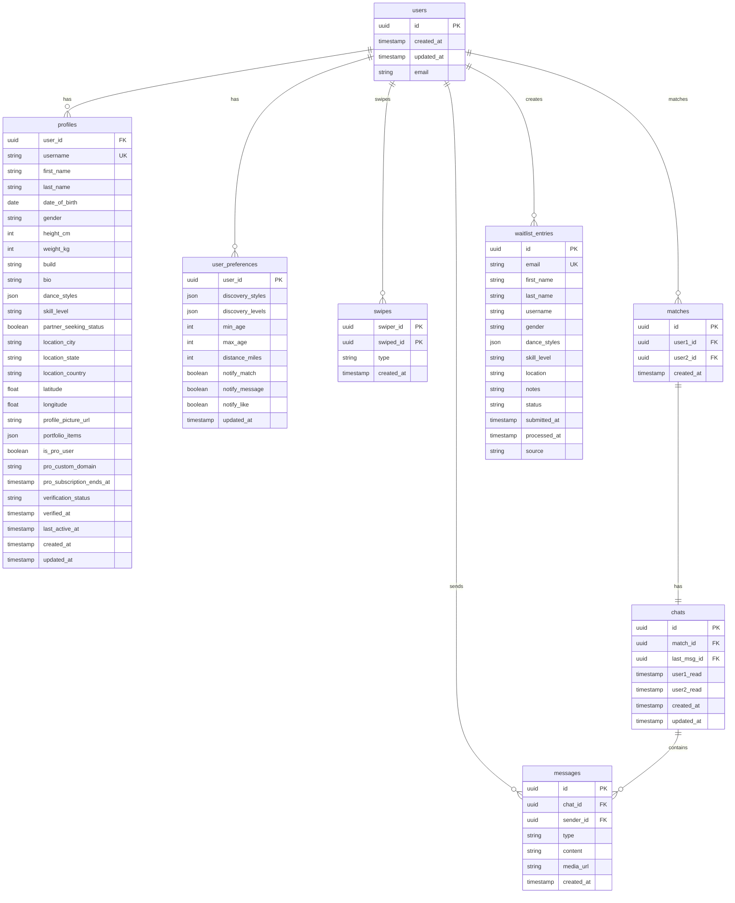

# iDance - Database Schema (MVP)

This document details the PostgreSQL database schema for the "iDance" application, hosted on Supabase. Row Level Security (RLS) will be enabled on all tables containing user data.

## 1. Entity Relationship Diagram (ERD)

## 2. Table Schemas

### `users` (Provided by Supabase Auth, extended via `profiles`)
*   This table is managed by Supabase Auth. We will create a `profiles` table that has a one-to-one relationship with `auth.users`.
*   Key fields from `auth.users` like `id`, `email`, `created_at`, `updated_at` are implicitly available.

### `profiles`
Stores public and private details for a user.
*   `user_id` (UUID, PK, FK to `auth.users.id` ON DELETE CASCADE)
*   `username` (TEXT, UNIQUE, NOT NULL, CHECK: length between 3 and 30, valid characters) - For `username.idance.live`
*   `first_name` (TEXT, NOT NULL)
*   `last_name` (TEXT, NOT NULL)
*   `date_of_birth` (DATE, NOT NULL)
*   `gender` (TEXT, CHECK: `gender IN ('Male', 'Female', 'Non-binary', 'Other', 'Prefer not to say')`)
*   `height_cm` (INTEGER, NULLABLE, CHECK: `height_cm > 0`)
*   `weight_kg` (INTEGER, NULLABLE, CHECK: `weight_kg > 0`) - Consider privacy implications.
*   `build` (TEXT, NULLABLE, CHECK: `build IN ('Slim', 'Athletic', 'Average', 'Muscular', 'Curvy', 'Other', 'Prefer not to say')`)
*   `bio` (TEXT, NULLABLE, CHECK: length up to 1000 chars)
*   `dance_styles` (JSONB, NOT NULL, Default: `'[]'::jsonb`) - Array of strings. Examples: "Salsa", "Bachata", "Hip Hop", "Ballet", "Contemporary", "Jazz", "Tap", "Tango", "Waltz", "Swing", "Breaking", "Popping", "Locking", "House", "Krump", "Dancehall", "Vogue", "Folk", "Belly Dance", "Flamenco", "Irish Dance", "Zumba", "Cheerleading", "Pole Dance", "Shuffle", "Bhangra", "Other".
*   `skill_level` (TEXT, NOT NULL, CHECK: `skill_level IN ('Beginner', 'Intermediate', 'Advanced', 'Professional', 'Social/Fun')`)
*   `partner_seeking_status` (BOOLEAN, NOT NULL, Default: TRUE)
*   `location_city` (TEXT, NULLABLE)
*   `location_state` (TEXT, NULLABLE)
*   `location_country` (TEXT, NULLABLE)
*   `latitude` (FLOAT8, NULLABLE) - For PostGIS.
*   `longitude` (FLOAT8, NULLABLE) - For PostGIS.
*   `profile_picture_url` (TEXT, NULLABLE, CHECK: valid URL)
*   `portfolio_items` (JSONB, Default: `'[]'::jsonb`) - Array of objects: `{type: 'image'/'video', url: '...', caption: '...'}`.
*   `is_pro_user` (BOOLEAN, NOT NULL, Default: FALSE)
*   `pro_custom_domain` (TEXT, UNIQUE, NULLABLE)
*   `pro_subscription_id` (TEXT, NULLABLE) - Stripe subscription ID.
*   `pro_subscription_status` (TEXT, NULLABLE) - e.g., 'active', 'canceled', 'past_due'.
*   `pro_subscription_ends_at` (TIMESTAMPTZ, NULLABLE)
*   `verification_status` (TEXT, NOT NULL, Default: 'none', CHECK: `verification_status IN ('none', 'pending_submission', 'submitted', 'verified', 'rejected', 'needs_resubmission')`)
*   `verified_at` (TIMESTAMPTZ, NULLABLE)
*   `last_active_at` (TIMESTAMPTZ, Default: `now()`)
*   `created_at` (TIMESTAMPTZ, Default: `now()`)
*   `updated_at` (TIMESTAMPTZ, Default: `now()`)

### `user_preferences`
Stores user's discovery settings and notification preferences.
*   `user_id` (UUID, PK, FK to `auth.users.id` ON DELETE CASCADE)
*   `discovery_dance_styles` (JSONB, NULLABLE, Default: `'[]'::jsonb`)
*   `discovery_skill_levels` (JSONB, NULLABLE, Default: `'[]'::jsonb`) - Array of skill level strings.
*   `discovery_min_age` (INTEGER, NULLABLE, CHECK: `discovery_min_age >= 18`)
*   `discovery_max_age` (INTEGER, NULLABLE, CHECK: `discovery_max_age >= discovery_min_age`)
*   `discovery_distance_miles` (INTEGER, NOT NULL, Default: 50, CHECK: `discovery_distance_miles > 0`)
*   `discovery_gender_preference` (JSONB, NULLABLE, Default: `'[]'::jsonb`) - Array of gender strings.
*   `notifications_new_match` (BOOLEAN, NOT NULL, Default: TRUE)
*   `notifications_new_message` (BOOLEAN, NOT NULL, Default: TRUE)
*   `notifications_new_like` (BOOLEAN, NOT NULL, Default: TRUE)
*   `updated_at` (TIMESTAMPTZ, Default: `now()`)

### `swipes`
Records swipe actions between users.
*   `swiper_user_id` (UUID, PK, FK to `auth.users.id` ON DELETE CASCADE)
*   `swiped_user_id` (UUID, PK, FK to `auth.users.id` ON DELETE CASCADE) - The user being swiped on.
*   `swipe_type` (TEXT, NOT NULL, CHECK: `swipe_type IN ('like', 'pass', 'superlike')`)
*   `created_at` (TIMESTAMPTZ, Default: `now()`)
*   CONSTRAINT `different_users_check` CHECK (`swiper_user_id` != `swiped_user_id`)

### `matches`
Records mutual likes (matches).
*   `id` (UUID, PK, Default: `uuid_generate_v4()`)
*   `user1_id` (UUID, NOT NULL, FK to `auth.users.id` ON DELETE CASCADE)
*   `user2_id` (UUID, NOT NULL, FK to `auth.users.id` ON DELETE CASCADE)
*   `created_at` (TIMESTAMPTZ, Default: `now()`)
*   CONSTRAINT `unique_match_pair` UNIQUE (`user1_id`, `user2_id`)
*   CONSTRAINT `ordered_users_check` CHECK (`user1_id` < `user2_id`) - Ensures consistent ordering for uniqueness.

### `chats`
Represents a conversation thread between two matched users.
*   `id` (UUID, PK, Default: `uuid_generate_v4()`)
*   `match_id` (UUID, UNIQUE, NOT NULL, FK to `matches.id` ON DELETE CASCADE)
*   `last_message_id` (UUID, NULLABLE, FK to `messages.id` ON DELETE SET NULL) - For quick preview of last message.
*   `user1_last_read_at` (TIMESTAMPTZ, NULLABLE) - Corresponds to `matches.user1_id`.
*   `user2_last_read_at` (TIMESTAMPTZ, NULLABLE) - Corresponds to `matches.user2_id`.
*   `created_at` (TIMESTAMPTZ, Default: `now()`)
*   `updated_at` (TIMESTAMPTZ, Default: `now()`)

### `messages`
Individual messages within a chat.
*   `id` (UUID, PK, Default: `uuid_generate_v4()`)
*   `chat_id` (UUID, NOT NULL, FK to `chats.id` ON DELETE CASCADE)
*   `sender_id` (UUID, NOT NULL, FK to `auth.users.id` ON DELETE CASCADE)
*   `content_type` (TEXT, NOT NULL, Default: 'text', CHECK: `content_type IN ('text', 'image', 'video_thumbnail')`)
*   `content` (TEXT, NOT NULL) - The actual message text.
*   `media_url` (TEXT, NULLABLE, CHECK: valid URL if `content_type` is image/video)
*   `created_at` (TIMESTAMPTZ, Default: `now()`)

### `waitlist_entries`
Stores information from users signing up for the waitlist/pre-launch.
*   `id` (UUID, PK, Default: `uuid_generate_v4()`)
*   `email` (TEXT, UNIQUE, NOT NULL, CHECK: valid email format)
*   `first_name` (TEXT, NULLABLE)
*   `last_name` (TEXT, NULLABLE)
*   `username_preference` (TEXT, NULLABLE)
*   `gender_preference` (TEXT, NULLABLE)
*   `dance_styles_preference` (JSONB, NULLABLE, Default: `'[]'::jsonb`)
*   `skill_level_preference` (TEXT, NULLABLE)
*   `location_city_preference` (TEXT, NULLABLE)
*   `notes` (TEXT, NULLABLE) - Internal notes from admin review.
*   `status` (TEXT, NOT NULL, Default: 'pending_email_verification', CHECK: `status IN ('pending_email_verification', 'pending_application', 'pending_review', 'approved', 'imported', 'rejected')`)
*   `source` (TEXT, NULLABLE) - e.g., 'prelaunch_site_v1', 'systeme_io_form_v1'.
*   `submitted_at` (TIMESTAMPTZ, Default: `now()`)
*   `processed_at` (TIMESTAMPTZ, NULLABLE)

## 3. Database Extensions

*   **`uuid-ossp`**: For `uuid_generate_v4()`. Supabase usually enables this by default.
*   **`postgis`**: Essential for geospatial queries (matching users by location and distance). Needs to be explicitly enabled in Supabase project settings.

## 4. Key Indexes

The following indexes are crucial for performance. Primary Keys (PK) are automatically indexed. Foreign Keys (FK) are often indexed by default by PostgreSQL, but explicit creation can be beneficial.

*   **`profiles` table:**
    *   `CREATE INDEX idx_profiles_username ON profiles (username);`
    *   `CREATE INDEX idx_profiles_location ON profiles USING GIST (ST_MakePoint(longitude, latitude)::geography);` (Requires PostGIS, for location-based searches)
    *   `CREATE INDEX idx_profiles_last_active_at ON profiles (last_active_at DESC);`
    *   `CREATE INDEX idx_profiles_dance_styles ON profiles USING GIN (dance_styles);` (For searching within JSONB arrays)
*   **`user_preferences` table:**
    *   (PK `user_id` is sufficient for most lookups)
*   **`swipes` table:**
    *   (Composite PK `(swiper_user_id, swiped_user_id)` is primary index)
    *   `CREATE INDEX idx_swipes_swiped_user_id_type ON swipes (swiped_user_id, swipe_type);` (To quickly find who liked a user)
*   **`matches` table:**
    *   (Unique constraint on `(user1_id, user2_id)` creates an index)
    *   `CREATE INDEX idx_matches_user1_id ON matches (user1_id);` (If querying matches for user1 often)
    *   `CREATE INDEX idx_matches_user2_id ON matches (user2_id);` (If querying matches for user2 often)
*   **`chats` table:**
    *   (Unique index on `match_id` is created)
    *   `CREATE INDEX idx_chats_updated_at ON chats (updated_at DESC);` (For ordering chat lists)
*   **`messages` table:**
    *   `CREATE INDEX idx_messages_chat_id_created_at ON messages (chat_id, created_at DESC);` (Crucial for fetching messages in a chat)
*   **`waitlist_entries` table:**
    *   `CREATE INDEX idx_waitlist_entries_status ON waitlist_entries (status);`

**Note:** Further indexing strategies should be evaluated based on actual query patterns and performance monitoring post-launch.

## 5. Row Level Security (RLS) Policies

RLS will be implemented extensively:
*   Users can only read/write their own `profiles` (except for publicly viewable fields by others), `user_preferences`, `swipes`.
*   Users can only read `matches`, `chats`, `messages` they are part of.
*   Edge Functions will often operate with elevated privileges (e.g., using the `service_role` key) but will have their own internal logic to enforce permissions based on the authenticated user.

This schema provides a foundation for the MVP features. It can be evolved as new requirements emerge.