# iDance - Database Schema (Normalized)

This document details the PostgreSQL database schema for the "iDance" application, hosted on Supabase. Row Level Security (RLS) will be enabled on all tables containing user data. This version incorporates normalization for better data integrity and querying.

## 1. Entity Relationship Diagram (ERD)

```mermaid
erDiagram
    users ||--o{ user_roles : has
    users ||--o{ profiles : has
    users ||--o{ group_members : belongs_to
    users ||--o{ media_assets : owns
    users ||--o{ sites : configures
    
    roles ||--o{ user_roles : assigned_to
    
    groups ||--o{ group_members : contains
    groups ||--o{ sites : has
    groups ||--o{ media_assets : owns
    
    sites ||--o{ content_blocks : contains
    sites ||--o{ site_analytics : tracks
    
    users {
        UUID id PK "Auth User ID"
        TIMESTAMP created_at
        TIMESTAMP updated_at
        STRING email
    }

    roles {
        UUID id PK
        TEXT name "site_admin|group_admin|pro_user|free_user"
        JSONB permissions "Array of permission strings"
        TIMESTAMP created_at
    }

    user_roles {
        UUID user_id PK,FK "FK to users.id"
        UUID role_id PK,FK "FK to roles.id"
        UUID scope_id FK "FK to groups.id for group roles"
        TIMESTAMP granted_at
    }

    groups {
        UUID id PK
        TEXT name "Group name"
        TEXT type "company|studio|team"
        TEXT subdomain UK "For group.idance.live"
        TEXT custom_domain "Optional custom domain"
        JSONB settings "Group settings"
        TIMESTAMP created_at
    }

    group_members {
        UUID group_id PK,FK "FK to groups.id"
        UUID user_id PK,FK "FK to users.id"
        TEXT role "owner|admin|member"
        TIMESTAMP joined_at
    }

    profiles {
        UUID user_id PK "FK to users.id"
        TEXT username UK "For username.idance.live"
        TEXT first_name "Not Null"
        TEXT last_name "Not Null"
        DATE date_of_birth "Not Null"
        TEXT gender "Enum type"
        TEXT bio "Max 2000 chars"
        BOOLEAN looking_for_partners "Default false"
        BOOLEAN looking_for_jobs "Default false"
        BOOLEAN looking_for_dancers "Default false"
        UUID referrer_id FK "References users"
        TEXT referral_code UK "Unique code"
        TEXT commission_tier "Tier level"
        TEXT profile_status "Status type"
        TEXT profile_picture_url "URL"
        TEXT user_tier "Account tier"
        TEXT stripe_customer_id UK "External ID"
        TEXT location_city
        TEXT location_state
        TEXT location_country
        FLOAT8 latitude "PostGIS"
        FLOAT8 longitude "PostGIS"
        TIMESTAMPTZ last_active_at "Auto-updated"
    }

    dance_styles {
        INT id PK "Serial"
        TEXT name UK "Style name"
        TIMESTAMPTZ created_at "Auto-generated"
    }

    user_dance_styles {
        UUID user_id PK "FK profiles"
        INT style_id PK "FK dance_styles"
        TEXT proficiency_level "Skill level"
        TIMESTAMPTZ created_at "Auto-generated"
    }

    user_awards {
        UUID id PK "Generated v4"
        UUID user_id FK "FK profiles"
        TEXT name "Award name"
        INT year "Optional"
        TEXT description "Optional"
        TIMESTAMPTZ created_at "Auto-generated"
    }

    interests {
        INT id PK "Serial"
        TEXT name UK "Interest name"
        TIMESTAMPTZ created_at "Auto-generated"
    }

    user_interests {
        UUID user_id PK "FK profiles"
        INT interest_id PK "FK interests"
        TIMESTAMPTZ created_at "Auto-generated"
    }

    social_platforms {
        INT id PK "Serial"
        TEXT name UK "Platform name"
        TIMESTAMPTZ created_at "Auto-generated"
    }

    user_social_links {
        UUID id PK "Generated v4"
        UUID user_id FK "FK profiles"
        INT platform_id FK "FK platforms"
        TEXT url "Valid URL"
        TIMESTAMPTZ created_at "Auto-generated"
    }

    user_portfolio_items {
        UUID id PK "Generated v4"
        UUID user_id FK "FK profiles"
        TEXT item_type "Media type"
        TEXT url "Media URL"
        TEXT caption "Optional"
        TEXT thumbnail_url "Preview"
        INT display_order "Sorting"
        TIMESTAMPTZ created_at "Auto-generated"
    }

    user_search_preferences {
        UUID user_id PK "FK users"
        JSONB discovery_dance_styles "ID array"
        JSONB discovery_skill_levels "Level array"
        INT discovery_min_age "Min 18"
        INT discovery_max_age "Age limit"
        INT discovery_distance_miles "Range"
        JSONB discovery_gender_preference "Preferences"
        BOOLEAN notifications_enabled "Default true"
        TEXT search_location_city "Custom search city"
        TEXT search_location_state "Custom search state"
        TEXT search_location_country "Custom search country"
        FLOAT8 search_latitude "Custom search PostGIS"
        FLOAT8 search_longitude "Custom search PostGIS"
        BOOLEAN use_custom_location "Default false"
        TIMESTAMPTZ updated_at "Auto-updated"
    }

    swipes {
        UUID swiper_user_id PK "FK users"
        UUID swiped_user_id PK "FK users"
        TEXT swipe_type "Action type"
        TIMESTAMPTZ created_at "Auto-generated"
    }

    matches {
        UUID id PK "Generated v4"
        UUID user1_id FK "FK users"
        UUID user2_id FK "FK users"
        TIMESTAMPTZ matched_at "Auto-generated"
    }

    chats {
        UUID id PK "Generated v4"
        UUID match_id UK "FK matches"
        UUID last_message_id FK "FK messages"
        TIMESTAMPTZ last_activity "Auto-updated"
    }

    messages {
        UUID id PK "Generated v4"
        UUID chat_id FK "FK chats"
        UUID sender_id FK "FK users"
        TEXT content_type "Message type"
        TEXT content "Body"
        TEXT media_url "Optional"
        TIMESTAMPTZ sent_at "Auto-generated"
    }

    vlogs {
        UUID id PK "Generated v4"
        UUID user_id FK "FK users"
        TEXT post_type "Content type"
        TEXT title "Optional"
        TEXT caption "Optional"
        JSONB media_items "Media array"
        INT engagement_counts "Statistics"
        TEXT visibility "Access level"
        TIMESTAMPTZ created_at "Auto-generated"
    }

    vlog_likes {
        UUID id PK "Generated v4"
        UUID vlog_id FK "FK vlogs"
        UUID user_id FK "FK users"
        TIMESTAMPTZ created_at "Auto-generated"
    }

    vlog_comments {
        UUID id PK "Generated v4"
        UUID vlog_id FK "FK vlogs"
        UUID user_id FK "FK users"
        TEXT content "Comment text"
        JSONB metadata "Optional data"
        UUID reply_to_id FK "Self-reference"
        TIMESTAMPTZ created_at "Auto-generated"
        TIMESTAMPTZ updated_at "Auto-updated"
    }

    vlog_shares {
        UUID id PK "Generated v4"
        UUID vlog_id FK "FK vlogs"
        UUID user_id FK "FK users"
        TEXT share_type "Platform type"
        TIMESTAMPTZ created_at "Auto-generated"
    }

    referrals {
        UUID id PK "Generated v4"
        UUID referrer_id FK "FK users"
        UUID referred_id UK "FK users"
        TEXT status "Current state"
        INT level "Referral depth"
        UUID parent_referral_id FK "Self ref"
        TIMESTAMPTZ created_at "Auto-generated"
    }

    commissions {
        UUID id PK "Generated v4"
        UUID referral_id FK "FK referrals"
        UUID earner_id FK "FK users"
        UUID payer_id FK "FK users"
        NUMERIC amount "Positive value"
        TEXT currency "Default USD"
        TEXT type "Commission type"
        TEXT status "Payment status"
        TIMESTAMPTZ created_at "Auto-generated"
    }

    sites {
        UUID owner_id PK "FK to users.id or groups.id"
        TEXT owner_type "user|group"
        TEXT theme "Theme identifier"
        JSONB layout "Page layout configuration"
        JSONB settings "Site settings"
        TEXT custom_domain "Optional custom domain"
        TEXT site_title "SEO title"
        TEXT site_description "SEO description"
        BOOLEAN use_app_profile "Sync with app"
        BOOLEAN show_contact_form "Enable contact"
        TEXT contact_email "Contact email"
        JSONB social_links "Social links"
        JSONB featured_content "Pinned items"
        JSONB custom_sections "Extra sections"
        TIMESTAMP updated_at
    }

    site_analytics {
        UUID site_id PK "FK to site_configs.owner_id"
        DATE date PK "Stats date"
        INTEGER visits "Daily visits"
        INTEGER unique_visitors "Unique visitors"
        JSONB page_views "Page view counts"
        JSONB traffic_sources "Traffic source data"
        TIMESTAMP updated_at
    }

    content_blocks {
        UUID id PK
        UUID site_id FK "FK to site_configs.owner_id"
        TEXT type "text|gallery|blog|contact|etc"
        INTEGER order "Display order"
        JSONB content "Block content"
        BOOLEAN published "Published status"
        TIMESTAMP created_at
        TIMESTAMP updated_at
    }

    media_assets {
        UUID id PK
        UUID owner_id FK "FK to users.id or groups.id"
        TEXT owner_type "user|group"
        TEXT type "image|video|document"
        TEXT filename "Original filename"
        TEXT storage_path "Path in storage"
        INTEGER size_bytes "File size"
        TEXT url "Valid URL"
        JSONB metadata "Media metadata"
        TIMESTAMP uploaded_at
    }

    users ||--o| profiles: has
    users ||--o{ user_search_preferences: configures
    users ||--o{ swipes: initiates
    users ||--o{ matches: participates
    users ||--o{ messages: sends
    users ||--o{ vlogs: creates
    users ||--o{ vlog_likes: creates
    users ||--o{ vlog_comments: writes
    users ||--o{ vlog_shares: shares
    users ||--o{ referrals: refers

    profiles ||--o{ user_dance_styles: has
    profiles ||--o{ user_awards: earns
    profiles ||--o{ user_interests: has
    profiles ||--o{ user_social_links: owns
    profiles ||--o{ user_portfolio_items: has

    dance_styles ||--o{ user_dance_styles: categorizes
    interests ||--o{ user_interests: categorizes
    social_platforms ||--o{ user_social_links: platforms

    matches ||--|| chats: enables
    chats ||--o{ messages: contains
    vlogs ||--o{ vlog_likes: has
    vlogs ||--o{ vlog_comments: has
    vlogs ||--o{ vlog_shares: tracks
    referrals ||--o{ commissions: generates
    referrals ||--o{ referrals: branches
    vlog_comments ||--o{ vlog_comments: "replies to"
```



## 2. Table Schemas

### `users` (Provided by Supabase Auth)
*   This table is managed by Supabase Auth.
*   Key fields: `id` (UUID), `email`, `role`, `created_at`, `updated_at`.

### `profiles`
*   `user_id` (UUID, PK, FK to `auth.users.id` ON DELETE CASCADE)
*   `username` (TEXT, UNIQUE, NOT NULL, CHECK: length between 3 and 30, valid URL slug characters)
*   `first_name` (TEXT, NOT NULL)
*   `last_name` (TEXT, NOT NULL)
*   `date_of_birth` (DATE, NOT NULL)
*   `gender` (TEXT, CHECK: `gender IN ('Male', 'Female', 'Non-binary', 'Other', 'Prefer not to say')`)
*   `bio` (TEXT, NULLABLE, CHECK: length up to 2000 chars)
*   `looking_for_partners` (BOOLEAN, NOT NULL, Default: FALSE)
*   `looking_for_jobs` (BOOLEAN, NOT NULL, Default: FALSE)
*   `looking_for_dancers` (BOOLEAN, NOT NULL, Default: FALSE)
*   `referrer_id` (UUID, NULLABLE, FK to `auth.users.id` ON DELETE SET NULL)
*   `referral_code` (TEXT, UNIQUE, NULLABLE)
*   `commission_tier` (TEXT, NULLABLE)
*   `profile_status` (TEXT, NOT NULL, Default: 'pending_waitlist_approval')
*   `profile_picture_url` (TEXT, NULLABLE, CHECK: valid URL)
*   `user_tier` (TEXT, NOT NULL, Default: 'basic')
*   `stripe_customer_id` (TEXT, UNIQUE, NULLABLE)
*   `location_city` (TEXT, NULLABLE)
*   `location_state` (TEXT, NULLABLE)
*   `location_country` (TEXT, NULLABLE)
*   `latitude` (FLOAT8, NULLABLE)
*   `longitude` (FLOAT8, NULLABLE)
*   `last_active_at` (TIMESTAMPTZ, Default: now())
*   `created_at` (TIMESTAMPTZ, Default: now())
*   `updated_at` (TIMESTAMPTZ, Default: now())

### `roles`
*   `id` (UUID, PK, Default: uuid_generate_v4())
*   `name` (TEXT, NOT NULL, CHECK: `name IN ('site_admin', 'group_admin', 'pro_user', 'free_user')`)
*   `permissions` (JSONB, NOT NULL, Default: '[]'::jsonb)
*   `created_at` (TIMESTAMPTZ, Default: now())

### `user_roles`
*   `user_id` (UUID, PK, FK to `users.id` ON DELETE CASCADE)
*   `role_id` (UUID, PK, FK to `roles.id` ON DELETE CASCADE)
*   `scope_id` (UUID, NULLABLE, FK to `groups.id` ON DELETE CASCADE)
*   `granted_at` (TIMESTAMPTZ, Default: now())

### `dance_styles`
*   `id` (SERIAL, PK)
*   `name` (TEXT, UNIQUE, NOT NULL)
*   `created_at` (TIMESTAMPTZ, Default: now())

### `user_dance_styles`
*   `user_id` (UUID, PK, FK to `profiles.user_id` ON DELETE CASCADE)
*   `style_id` (INTEGER, PK, FK to `dance_styles.id` ON DELETE CASCADE)
*   `proficiency_level` (TEXT, NOT NULL)
*   `created_at` (TIMESTAMPTZ, Default: now())

### `user_awards`
*   `id` (UUID, PK, Default: uuid_generate_v4())
*   `user_id` (UUID, NOT NULL, FK to `profiles.user_id` ON DELETE CASCADE)
*   `name` (TEXT, NOT NULL)
*   `year` (INTEGER, NULLABLE)
*   `description` (TEXT, NULLABLE)
*   `created_at` (TIMESTAMPTZ, Default: now())

### `interests`
*   `id` (SERIAL, PK)
*   `name` (TEXT, UNIQUE, NOT NULL)
*   `created_at` (TIMESTAMPTZ, Default: now())

### `user_interests`
*   `user_id` (UUID, PK, FK to `profiles.user_id` ON DELETE CASCADE)
*   `interest_id` (INTEGER, PK, FK to `interests.id` ON DELETE CASCADE)
*   `created_at` (TIMESTAMPTZ, Default: now())

### `social_platforms`
*   `id` (SERIAL, PK)
*   `name` (TEXT, UNIQUE, NOT NULL)
*   `created_at` (TIMESTAMPTZ, Default: now())

### `user_social_links`
*   `id` (UUID, PK, Default: uuid_generate_v4())
*   `user_id` (UUID, NOT NULL, FK to `profiles.user_id` ON DELETE CASCADE)
*   `platform_id` (INTEGER, NOT NULL, FK to `social_platforms.id` ON DELETE CASCADE)
*   `url` (TEXT, NOT NULL, CHECK: valid URL)
*   `created_at` (TIMESTAMPTZ, Default: now())
*   CONSTRAINT `unique_user_platform_link` UNIQUE (`user_id`, `platform_id`)

### `user_portfolio_items`
*   `id` (UUID, PK, Default: uuid_generate_v4())
*   `user_id` (UUID, NOT NULL, FK to `profiles.user_id` ON DELETE CASCADE)
*   `item_type` (TEXT, NOT NULL)
*   `url` (TEXT, NOT NULL, CHECK: valid URL)
*   `caption` (TEXT, NULLABLE)
*   `thumbnail_url` (TEXT, NULLABLE, CHECK: valid URL)
*   `display_order` (INTEGER, NOT NULL, Default: 0)
*   `created_at` (TIMESTAMPTZ, Default: now())

### `user_search_preferences`
*   `user_id` (UUID, PK, FK to `auth.users.id` ON DELETE CASCADE)
*   `discovery_dance_styles` (JSONB, NULLABLE, Default: '[]'::jsonb)
*   `discovery_skill_levels` (JSONB, NULLABLE, Default: '[]'::jsonb)
*   `discovery_min_age` (INTEGER, NULLABLE, CHECK: `discovery_min_age >= 18`)
*   `discovery_max_age` (INTEGER, NULLABLE, CHECK: `discovery_max_age >= discovery_min_age`)
*   `discovery_distance_miles` (INTEGER, NOT NULL, Default: 50)
*   `discovery_gender_preference` (JSONB, NULLABLE, Default: '[]'::jsonb)
*   `notifications_enabled` (BOOLEAN, NOT NULL, Default: TRUE)
*   `search_location_city` (TEXT, NULLABLE)
*   `search_location_state` (TEXT, NULLABLE)
*   `search_location_country` (TEXT, NULLABLE)
*   `search_latitude` (FLOAT8, NULLABLE)
*   `search_longitude` (FLOAT8, NULLABLE)
*   `use_custom_location` (BOOLEAN, NOT NULL, Default: FALSE)
*   `updated_at` (TIMESTAMPTZ, Default: now())

### `groups`
*   `id` (UUID, PK, Default: uuid_generate_v4())
*   `name` (TEXT, NOT NULL)
*   `type` (TEXT, NOT NULL, CHECK: `type IN ('company', 'studio', 'team')`)
*   `subdomain` (TEXT, UNIQUE, NOT NULL)
*   `custom_domain` (TEXT, UNIQUE, NULLABLE)
*   `settings` (JSONB, NOT NULL, Default: '{}')
*   `created_at` (TIMESTAMPTZ, Default: now())

### `group_members`
*   `group_id` (UUID, PK, FK to `groups.id` ON DELETE CASCADE)
*   `user_id` (UUID, PK, FK to `users.id` ON DELETE CASCADE)
*   `role` (TEXT, NOT NULL, CHECK: `role IN ('owner', 'admin', 'member')`)
*   `joined_at` (TIMESTAMPTZ, Default: now())

### `swipes`
*   `swiper_user_id` (UUID, PK, FK to `users.id` ON DELETE CASCADE)
*   `swiped_user_id` (UUID, PK, FK to `users.id` ON DELETE CASCADE)
*   `swipe_type` (TEXT, NOT NULL, CHECK: `swipe_type IN ('like', 'dislike', 'superlike')`)
*   `created_at` (TIMESTAMPTZ, Default: now())

### `matches`
*   `id` (UUID, PK, Default: uuid_generate_v4())
*   `user1_id` (UUID, NOT NULL, FK to `users.id` ON DELETE CASCADE)
*   `user2_id` (UUID, NOT NULL, FK to `users.id` ON DELETE CASCADE)
*   `matched_at` (TIMESTAMPTZ, Default: now())
*   CONSTRAINT `unique_match_pair` UNIQUE (`user1_id`, `user2_id`)

### `chats`
*   `id` (UUID, PK, Default: uuid_generate_v4())
*   `match_id` (UUID, UNIQUE, NOT NULL, FK to `matches.id` ON DELETE CASCADE)
*   `last_message_id` (UUID, NULLABLE, FK to `messages.id`)
*   `last_activity` (TIMESTAMPTZ, Default: now())

### `messages`
*   `id` (UUID, PK, Default: uuid_generate_v4())
*   `chat_id` (UUID, NOT NULL, FK to `chats.id` ON DELETE CASCADE)
*   `sender_id` (UUID, NOT NULL, FK to `users.id` ON DELETE CASCADE)
*   `content_type` (TEXT, NOT NULL, CHECK: `content_type IN ('text', 'image', 'video', 'audio')`)
*   `content` (TEXT, NOT NULL)
*   `media_url` (TEXT, NULLABLE, CHECK: valid URL)
*   `sent_at` (TIMESTAMPTZ, Default: now())

### `vlogs`
*   `id` (UUID, PK, Default: uuid_generate_v4())
*   `user_id` (UUID, NOT NULL, FK to `users.id` ON DELETE CASCADE)
*   `post_type` (TEXT, NOT NULL, CHECK: `post_type IN ('text', 'image', 'video', 'story')`)
*   `title` (TEXT, NULLABLE)
*   `caption` (TEXT, NULLABLE)
*   `media_items` (JSONB, NOT NULL, Default: '[]'::jsonb)
*   `engagement_counts` (JSONB, NOT NULL, Default: '{"likes": 0, "comments": 0, "shares": 0}'::jsonb)
*   `visibility` (TEXT, NOT NULL, CHECK: `visibility IN ('public', 'private', 'followers')`)
*   `created_at` (TIMESTAMPTZ, Default: now())

### `referrals`
*   `id` (UUID, PK, Default: uuid_generate_v4())
*   `referrer_id` (UUID, NOT NULL, FK to `users.id` ON DELETE CASCADE)
*   `referred_id` (UUID, UNIQUE, NOT NULL, FK to `users.id` ON DELETE CASCADE)
*   `status` (TEXT, NOT NULL, CHECK: `status IN ('pending', 'confirmed', 'paid')`)
*   `level` (INTEGER, NOT NULL, CHECK: `level > 0`)
*   `parent_referral_id` (UUID, NULLABLE, FK to `referrals.id` ON DELETE SET NULL)
*   `created_at` (TIMESTAMPTZ, Default: now())

### `commissions`
*   `id` (UUID, PK, Default: uuid_generate_v4())
*   `referral_id` (UUID, NOT NULL, FK to `referrals.id` ON DELETE CASCADE)
*   `earner_id` (UUID, NOT NULL, FK to `users.id` ON DELETE CASCADE)
*   `payer_id` (UUID, NOT NULL, FK to `users.id` ON DELETE CASCADE)
*   `amount` (NUMERIC, NOT NULL, CHECK: `amount > 0`)
*   `currency` (TEXT, NOT NULL, Default: 'USD')
*   `type` (TEXT, NOT NULL, CHECK: `type IN ('signup', 'subscription', 'purchase')`)
*   `status` (TEXT, NOT NULL, CHECK: `status IN ('pending', 'paid', 'cancelled')`)
*   `created_at` (TIMESTAMPTZ, Default: now())

### `sites`
*   `owner_id` (UUID, PK, FK to `auth.users.id` or `groups.id`)
*   `owner_type` (TEXT, NOT NULL, CHECK: `owner_type IN ('user', 'group')`)
*   `theme` (TEXT, NOT NULL)
*   `layout` (JSONB, NOT NULL, Default: '{}')
*   `settings` (JSONB, NOT NULL, Default: '{}')
*   `custom_domain` (TEXT, UNIQUE, NULLABLE)
*   `site_title` (TEXT, NULLABLE)
*   `site_description` (TEXT, NULLABLE)
*   `use_app_profile` (BOOLEAN, NOT NULL, Default: TRUE)
*   `show_contact_form` (BOOLEAN, NOT NULL, Default: TRUE)
*   `contact_email` (TEXT, NULLABLE)
*   `social_links` (JSONB, NOT NULL, Default: '[]'::jsonb)
*   `featured_content` (JSONB, NOT NULL, Default: '[]'::jsonb)
*   `custom_sections` (JSONB, NOT NULL, Default: '[]'::jsonb)
*   `updated_at` (TIMESTAMPTZ, Default: now())

### `site_analytics`
*   `site_id` (UUID, PK, FK to `sites.owner_id` ON DELETE CASCADE)
*   `date` (DATE, PK, NOT NULL)
*   `visits` (INTEGER, NOT NULL, Default: 0)
*   `unique_visitors` (INTEGER, NOT NULL, Default: 0)
*   `page_views` (JSONB, NOT NULL, Default: '{}')
*   `traffic_sources` (JSONB, NOT NULL, Default: '{}')
*   `updated_at` (TIMESTAMPTZ, Default: now())

### `content_blocks`
*   `id` (UUID, PK, Default: uuid_generate_v4())
*   `site_id` (UUID, NOT NULL, FK to `sites.owner_id` ON DELETE CASCADE)
*   `type` (TEXT, NOT NULL, CHECK: `type IN ('text', 'gallery', 'blog', 'contact', 'etc')`)
*   `order` (INTEGER, NOT NULL, Default: 0)
*   `content` (JSONB, NOT NULL, Default: '{}')
*   `published` (BOOLEAN, NOT NULL, Default: FALSE)
*   `created_at` (TIMESTAMPTZ, Default: now())
*   `updated_at` (TIMESTAMPTZ, Default: now())

### `media_assets`
*   `id` (UUID, PK, Default: uuid_generate_v4())
*   `owner_id` (UUID, NOT NULL, FK to `auth.users.id` or `groups.id` ON DELETE CASCADE)
*   `owner_type` (TEXT, NOT NULL, CHECK: `owner_type IN ('user', 'group')`)
*   `type` (TEXT, NOT NULL, CHECK: `type IN ('image', 'video', 'document')`)
*   `filename` (TEXT, NOT NULL)
*   `storage_path` (TEXT, NOT NULL)
*   `size_bytes` (INTEGER, NOT NULL)
*   `url` (TEXT, NOT NULL, CHECK: valid URL)

### `vlog_likes`
*   `id` (UUID, PK, Default: uuid_generate_v4())
*   `vlog_id` (UUID, NOT NULL, FK to `vlogs.id` ON DELETE CASCADE)
*   `user_id` (UUID, NOT NULL, FK to `users.id` ON DELETE CASCADE)
*   `created_at` (TIMESTAMPTZ, Default: now())
*   CONSTRAINT `unique_vlog_like` UNIQUE (`vlog_id`, `user_id`)

### `vlog_comments`
*   `id` (UUID, PK, Default: uuid_generate_v4())
*   `vlog_id` (UUID, NOT NULL, FK to `vlogs.id` ON DELETE CASCADE)
*   `user_id` (UUID, NOT NULL, FK to `users.id` ON DELETE CASCADE)
*   `content` (TEXT, NOT NULL)
*   `metadata` (JSONB, NULLABLE)
*   `reply_to_id` (UUID, NULLABLE, FK to `vlog_comments.id` ON DELETE CASCADE)
*   `created_at` (TIMESTAMPTZ, Default: now())
*   `updated_at` (TIMESTAMPTZ, Default: now())

### `vlog_shares`
*   `id` (UUID, PK, Default: uuid_generate_v4())
*   `vlog_id` (UUID, NOT NULL, FK to `vlogs.id` ON DELETE CASCADE)
*   `user_id` (UUID, NOT NULL, FK to `users.id` ON DELETE CASCADE)
*   `share_type` (TEXT, NOT NULL)
*   `created_at` (TIMESTAMPTZ, Default: now())

## 3. Database Extensions
*   **`uuid-ossp`**: For uuid_generate_v4()
*   **`postgis`**: For geospatial queries

## 4. Key Indexes

### Profile & User Related
*   **`profiles` table:**
    *   `CREATE INDEX idx_profiles_username ON profiles (username);`
    *   `CREATE INDEX idx_profiles_location ON profiles USING GIST (ll_to_earth(latitude, longitude));`
    *   `CREATE INDEX idx_profiles_last_active ON profiles (last_active_at);`
    *   `CREATE INDEX idx_profiles_user_tier ON profiles (user_tier);`
    *   `CREATE INDEX idx_profiles_looking_combo ON profiles (looking_for_partners, looking_for_jobs, looking_for_dancers);`
    *   `CREATE INDEX idx_profiles_referrer ON profiles (referrer_id);`

*   **`user_roles` table:**
    *   `CREATE INDEX idx_user_roles_role_id ON user_roles (role_id);`
    *   `CREATE INDEX idx_user_roles_scope_id ON user_roles (scope_id) WHERE scope_id IS NOT NULL;`
    *   `CREATE INDEX idx_user_roles_granted ON user_roles (user_id, granted_at);`

*   **`roles` table:**
    *   `CREATE INDEX idx_roles_name ON roles (name);`

### Dance & Interests
*   **`dance_styles` table:**
    *   `CREATE INDEX idx_dance_styles_name ON dance_styles (name);`

*   **`user_dance_styles` table:**
    *   `CREATE INDEX idx_user_dance_styles_style_id ON user_dance_styles (style_id);`
    *   `CREATE INDEX idx_user_dance_styles_level ON user_dance_styles (user_id, proficiency_level);`

*   **`user_awards` table:**
    *   `CREATE INDEX idx_user_awards_user_id ON user_awards (user_id);`
    *   `CREATE INDEX idx_user_awards_year ON user_awards (user_id, year DESC);`

*   **`interests` table:**
    *   `CREATE INDEX idx_interests_name ON interests (name);`

*   **`user_interests` table:**
    *   `CREATE INDEX idx_user_interests_interest_id ON user_interests (interest_id);`
    *   `CREATE INDEX idx_user_interests_user ON user_interests (user_id, created_at);`

### Social & Portfolio
*   **`social_platforms` table:**
    *   `CREATE INDEX idx_social_platforms_name ON social_platforms (name);`

*   **`user_social_links` table:**
    *   `CREATE INDEX idx_user_social_links_user_id ON user_social_links (user_id);`
    *   `CREATE INDEX idx_user_social_links_platform_id ON user_social_links (platform_id);`

*   **`user_portfolio_items` table:**
    *   `CREATE INDEX idx_portfolio_user_order ON user_portfolio_items (user_id, display_order);`
    *   `CREATE INDEX idx_portfolio_item_type ON user_portfolio_items (item_type);`

### Groups & Members
*   **`groups` table:**
    *   `CREATE INDEX idx_groups_type ON groups (type);`
    *   `CREATE INDEX idx_groups_subdomain ON groups (subdomain);`
    *   `CREATE UNIQUE INDEX idx_groups_custom_domain_unique ON groups (LOWER(custom_domain)) WHERE custom_domain IS NOT NULL;`
    *   `CREATE INDEX idx_groups_created ON groups (created_at DESC);`

*   **`group_members` table:**
    *   `CREATE INDEX idx_group_members_user_id ON group_members (user_id);`
    *   `CREATE INDEX idx_group_members_role ON group_members (group_id, role);`
    *   `CREATE INDEX idx_group_members_joined ON group_members (group_id, joined_at DESC);`

### Matching & Chat
*   **`user_search_preferences` table:**
    *   `CREATE INDEX idx_search_prefs_location ON user_search_preferences USING GIST (ll_to_earth(search_latitude, search_longitude));`
    *   `CREATE INDEX idx_search_prefs_distance ON user_search_preferences (discovery_distance_miles);`
    *   `CREATE INDEX idx_search_prefs_age ON user_search_preferences (discovery_min_age, discovery_max_age);`

*   **`swipes` table:**
    *   `CREATE INDEX idx_swipes_swiped_user_id ON swipes (swiped_user_id);`
    *   `CREATE INDEX idx_swipes_created_at ON swipes (created_at);`
    *   `CREATE INDEX idx_swipes_combo ON swipes (swiper_user_id, swiped_user_id, swipe_type);`
    *   `CREATE INDEX idx_recent_likes ON swipes (swiped_user_id, swipe_type, created_at DESC) WHERE swipe_type = 'like';`

*   **`matches` table:**
    *   `CREATE INDEX idx_matches_user1_id ON matches (user1_id);`
    *   `CREATE INDEX idx_matches_user2_id ON matches (user2_id);`
    *   `CREATE INDEX idx_matches_recent ON matches (matched_at DESC);`
    *   `CREATE INDEX idx_matches_pair ON matches (LEAST(user1_id, user2_id), GREATEST(user1_id, user2_id));`

*   **`chats` table:**
    *   `CREATE INDEX idx_chats_match_id ON chats (match_id);`
    *   `CREATE INDEX idx_chats_last_activity ON chats (last_activity DESC);`
    *   `CREATE INDEX idx_active_chats ON chats (match_id, last_activity DESC);`

*   **`messages` table:**
    *   `CREATE INDEX idx_messages_chat_id ON messages (chat_id);`
    *   `CREATE INDEX idx_messages_sender_id ON messages (sender_id);`
    *   `CREATE INDEX idx_messages_sent_at ON messages (sent_at DESC);`
    *   `CREATE INDEX idx_messages_recent ON messages (chat_id, sent_at DESC);`
    *   `CREATE INDEX idx_messages_type ON messages (chat_id, content_type);`

### Content & Media
*   **`vlogs` table:**
    *   `CREATE INDEX idx_vlogs_user_id ON vlogs (user_id);`
    *   `CREATE INDEX idx_vlogs_post_type ON vlogs (post_type);`
    *   `CREATE INDEX idx_vlogs_created_at ON vlogs (created_at DESC);`
    *   `CREATE INDEX idx_vlogs_visibility ON vlogs (visibility);`
    *   `CREATE INDEX idx_vlogs_engagement ON vlogs (user_id, created_at DESC, (engagement_counts->>'likes')::int DESC);`
    *   `CREATE INDEX idx_public_vlogs ON vlogs (created_at DESC, user_id) WHERE visibility = 'public';`

*   **`vlog_likes` table:**
    *   `CREATE INDEX idx_vlog_likes_vlog_id ON vlog_likes (vlog_id);`
    *   `CREATE INDEX idx_vlog_likes_user_id ON vlog_likes (user_id);`
    *   `CREATE INDEX idx_vlog_likes_recent ON vlog_likes (vlog_id, created_at DESC);`

*   **`vlog_comments` table:**
    *   `CREATE INDEX idx_vlog_comments_vlog_id ON vlog_comments (vlog_id);`
    *   `CREATE INDEX idx_vlog_comments_user_id ON vlog_comments (user_id);`
    *   `CREATE INDEX idx_vlog_comments_reply_to_id ON vlog_comments (reply_to_id);`
    *   `CREATE INDEX idx_vlog_comments_thread ON vlog_comments (vlog_id, reply_to_id, created_at DESC);`
    *   `CREATE INDEX idx_vlog_comments_recent ON vlog_comments (vlog_id, created_at DESC);`

*   **`vlog_shares` table:**
    *   `CREATE INDEX idx_vlog_shares_vlog_id ON vlog_shares (vlog_id);`
    *   `CREATE INDEX idx_vlog_shares_user_id ON vlog_shares (user_id);`
    *   `CREATE INDEX idx_vlog_shares_recent ON vlog_shares (vlog_id, created_at DESC);`

### Referrals & Commissions
*   **`referrals` table:**
    *   `CREATE INDEX idx_referrals_referrer_id ON referrals (referrer_id);`
    *   `CREATE INDEX idx_referrals_status ON referrals (status);`
    *   `CREATE INDEX idx_referrals_parent_id ON referrals (parent_referral_id) WHERE parent_referral_id IS NOT NULL;`
    *   `CREATE INDEX idx_referrals_hierarchy ON referrals (referrer_id, level, created_at DESC);`

*   **`commissions` table:**
    *   `CREATE INDEX idx_commissions_referral_id ON commissions (referral_id);`
    *   `CREATE INDEX idx_commissions_earner_id ON commissions (earner_id);`
    *   `CREATE INDEX idx_commissions_payer_id ON commissions (payer_id);`
    *   `CREATE INDEX idx_commissions_status ON commissions (status);`
    *   `CREATE INDEX idx_commissions_created_at ON commissions (created_at DESC);`
    *   `CREATE INDEX idx_commissions_earnings ON commissions (earner_id, status, created_at DESC);`

### Sites & Content
*   **`sites` table:**
    *   `CREATE INDEX idx_sites_owner_id ON sites (owner_id);`
    *   `CREATE INDEX idx_sites_owner_type ON sites (owner_type);`
    *   `CREATE INDEX idx_sites_custom_domain ON sites (custom_domain);`
    *   `CREATE UNIQUE INDEX idx_sites_custom_domain_unique ON sites (LOWER(custom_domain)) WHERE custom_domain IS NOT NULL;`

*   **`site_analytics` table:**
    *   `CREATE INDEX idx_site_analytics_site_id_date ON site_analytics (site_id, date);`
    *   `CREATE INDEX idx_analytics_time_series ON site_analytics (site_id, date DESC);`
    *   `CREATE INDEX idx_high_traffic ON site_analytics (site_id, visits DESC);`

*   **`content_blocks` table:**
    *   `CREATE INDEX idx_content_blocks_site_id_order ON content_blocks (site_id, order);`
    *   `CREATE INDEX idx_published_content ON content_blocks (site_id, type, order) WHERE published = true;`
    *   `CREATE INDEX idx_content_types ON content_blocks (site_id, type);`
    *   `CREATE INDEX idx_content_recent ON content_blocks (site_id, updated_at DESC);`

*   **`media_assets` table:**
    *   `CREATE INDEX idx_media_assets_owner_id ON media_assets (owner_id);`
    *   `CREATE INDEX idx_media_assets_owner_type ON media_assets (owner_type);`
    *   `CREATE INDEX idx_media_assets_type ON media_assets (type);`
    *   `CREATE INDEX idx_media_assets_storage_path ON media_assets (storage_path);`
    *   `CREATE INDEX idx_media_recent ON media_assets (owner_id, owner_type, uploaded_at DESC);`
    *   `CREATE INDEX idx_media_size ON media_assets (owner_id, size_bytes);`
*   **`dance_styles` table:**
    *   `CREATE INDEX idx_dance_styles_name ON dance_styles (name);`
*   **`user_dance_styles` table:**
    *   `CREATE INDEX idx_user_dance_styles_style_id ON user_dance_styles (style_id);`
*   **`user_awards` table:**
    *   `CREATE INDEX idx_user_awards_user_id ON user_awards (user_id);`
*   **`interests` table:**
    *   `CREATE INDEX idx_interests_name ON interests (name);`
*   **`user_interests` table:**
    *   `CREATE INDEX idx_user_interests_interest_id ON user_interests (interest_id);`
*   **`social_platforms` table:**
    *   `CREATE INDEX idx_social_platforms_name ON social_platforms (name);`
*   **`user_social_links` table:**
    *   `CREATE INDEX idx_user_social_links_user_id ON user_social_links (user_id);`
    *   `CREATE INDEX idx_user_social_links_platform_id ON user_social_links (platform_id);`

*   **`roles` table:**
    *   `CREATE INDEX idx_roles_name ON roles (name);`

*   **`user_roles` table:**
    *   `CREATE INDEX idx_user_roles_role_id ON user_roles (role_id);`
    *   `CREATE INDEX idx_user_roles_scope_id ON user_roles (scope_id) WHERE scope_id IS NOT NULL;`

*   **`groups` table:**
    *   `CREATE INDEX idx_groups_type ON groups (type);`
    *   `CREATE INDEX idx_groups_subdomain ON groups (subdomain);`
    *   `CREATE UNIQUE INDEX idx_groups_custom_domain_unique ON groups (LOWER(custom_domain)) WHERE custom_domain IS NOT NULL;`

*   **`group_members` table:**
    *   `CREATE INDEX idx_group_members_user_id ON group_members (user_id);`
    *   `CREATE INDEX idx_group_members_role ON group_members (group_id, role);`

*   **`swipes` table:**
    *   `CREATE INDEX idx_swipes_swiped_user_id ON swipes (swiped_user_id);`
    *   `CREATE INDEX idx_swipes_created_at ON swipes (created_at);`
    *   `CREATE INDEX idx_swipes_combo ON swipes (swiper_user_id, swiped_user_id, swipe_type);`
    *   `CREATE INDEX idx_recent_likes ON swipes (swiped_user_id, swipe_type, created_at) WHERE swipe_type = 'like';`

*   **`matches` table:**
    *   `CREATE INDEX idx_matches_user1_id ON matches (user1_id);`
    *   `CREATE INDEX idx_matches_user2_id ON matches (user2_id);`
    *   `CREATE INDEX idx_matches_matched_at ON matches (matched_at);`

*   **`chats` table:**
    *   `CREATE INDEX idx_chats_match_id ON chats (match_id);`
    *   `CREATE INDEX idx_chats_last_activity ON chats (last_activity);`
    *   `CREATE INDEX idx_active_chats ON chats (match_id, last_activity);`

*   **`messages` table:**
    *   `CREATE INDEX idx_messages_chat_id ON messages (chat_id);`
    *   `CREATE INDEX idx_messages_sender_id ON messages (sender_id);`
    *   `CREATE INDEX idx_messages_sent_at ON messages (sent_at);`
    *   `CREATE INDEX idx_messages_recent ON messages (chat_id, sent_at DESC);`
    *   `CREATE INDEX idx_unread_messages ON messages (chat_id, sender_id, sent_at) WHERE read_at IS NULL;`

*   **`vlogs` table:**
    *   `CREATE INDEX idx_vlogs_user_id ON vlogs (user_id);`
    *   `CREATE INDEX idx_vlogs_post_type ON vlogs (post_type);`
    *   `CREATE INDEX idx_vlogs_created_at ON vlogs (created_at);`
    *   `CREATE INDEX idx_vlogs_visibility ON vlogs (visibility);`
    *   `CREATE INDEX idx_vlogs_engagement ON vlogs (user_id, created_at, (engagement_counts->>'likes')::int DESC);`
    *   `CREATE INDEX idx_public_vlogs ON vlogs (created_at DESC) WHERE visibility = 'public';`

*   **`vlog_likes` table:**
    *   `CREATE INDEX idx_vlog_likes_vlog_id ON vlog_likes (vlog_id);`
    *   `CREATE INDEX idx_vlog_likes_user_id ON vlog_likes (user_id);`
*   **`vlog_comments` table:**
    *   `CREATE INDEX idx_vlog_comments_vlog_id ON vlog_comments (vlog_id);`
    *   `CREATE INDEX idx_vlog_comments_user_id ON vlog_comments (user_id);`
    *   `CREATE INDEX idx_vlog_comments_reply_to_id ON vlog_comments (reply_to_id);`
    *   `CREATE INDEX idx_vlog_comments_thread ON vlog_comments (vlog_id, reply_to_id, created_at);`
*   **`vlog_shares` table:**
    *   `CREATE INDEX idx_vlog_shares_vlog_id ON vlog_shares (vlog_id);`
    *   `CREATE INDEX idx_vlog_shares_user_id ON vlog_shares (user_id);`

*   **`referrals` table:**
    *   `CREATE INDEX idx_referrals_referrer_id ON referrals (referrer_id);`
    *   `CREATE INDEX idx_referrals_status ON referrals (status);`
    *   `CREATE INDEX idx_referrals_parent_id ON referrals (parent_referral_id) WHERE parent_referral_id IS NOT NULL;`

*   **`commissions` table:**
    *   `CREATE INDEX idx_commissions_referral_id ON commissions (referral_id);`
    *   `CREATE INDEX idx_commissions_earner_id ON commissions (earner_id);`
    *   `CREATE INDEX idx_commissions_payer_id ON commissions (payer_id);`
    *   `CREATE INDEX idx_commissions_status ON commissions (status);`
    *   `CREATE INDEX idx_commissions_created_at ON commissions (created_at);`

*   **`sites` table:**
    *   `CREATE INDEX idx_sites_owner_id ON sites (owner_id);`
    *   `CREATE INDEX idx_sites_owner_type ON sites (owner_type);`
    *   `CREATE INDEX idx_sites_custom_domain ON sites (custom_domain);`
    *   `CREATE UNIQUE INDEX idx_sites_custom_domain_unique ON sites (LOWER(custom_domain)) WHERE custom_domain IS NOT NULL;`

*   **`site_analytics` table:**
    *   `CREATE INDEX idx_site_analytics_site_id_date ON site_analytics (site_id, date);`
    *   `CREATE INDEX idx_analytics_time_series ON site_analytics (site_id, date DESC);`
    *   `CREATE INDEX idx_high_traffic ON site_analytics (site_id, visits DESC);`

*   **`content_blocks` table:**
    *   `CREATE INDEX idx_content_blocks_site_id_order ON content_blocks (site_id, order);`
    *   `CREATE INDEX idx_published_content ON content_blocks (site_id, type, order) WHERE published = true;`
    *   `CREATE INDEX idx_content_types ON content_blocks (site_id, type);`

*   **`media_assets` table:**
    *   `CREATE INDEX idx_media_assets_owner_id ON media_assets (owner_id);`
    *   `CREATE INDEX idx_media_assets_owner_type ON media_assets (owner_type);`
    *   `CREATE INDEX idx_media_assets_type ON media_assets (type);`
    *   `CREATE INDEX idx_media_assets_storage_path ON media_assets (storage_path);`
    *   `CREATE INDEX idx_media_recent ON media_assets (owner_id, owner_type, uploaded_at DESC);`
    *   `CREATE INDEX idx_media_size ON media_assets (owner_id, size_bytes);`

*   **`profiles` table:**
    *   `CREATE INDEX idx_profiles_username ON profiles (username);`
    *   `CREATE INDEX idx_profiles_location ON profiles USING GIST (ll_to_earth(latitude, longitude));`
    *   `CREATE INDEX idx_profiles_last_active ON profiles (last_active_at);`
    *   `CREATE INDEX idx_profiles_user_tier ON profiles (user_tier);`
    *   `CREATE INDEX idx_profiles_looking_combo ON profiles (looking_for_partners, looking_for_jobs, looking_for_dancers);`

*   **`user_portfolio_items` table:**
    *   `CREATE INDEX idx_portfolio_user_order ON user_portfolio_items (user_id, display_order);`
    *   `CREATE INDEX idx_portfolio_item_type ON user_portfolio_items (item_type);`

*   **`user_search_preferences` table:**
    *   `CREATE INDEX idx_search_prefs_location ON user_search_preferences USING GIST (ll_to_earth(search_latitude, search_longitude));`
    *   `CREATE INDEX idx_search_prefs_distance ON user_search_preferences (discovery_distance_miles);`

## 5. Row Level Security (RLS) Policies

### Sites
*   Only authenticated users can read/write their own sites
*   Groups can manage their own sites through group admins
*   Authenticated users can read public site settings for any custom domain
*   API services can read all sites
*   Example policies:
    ```sql
    -- Enable RLS
    ALTER TABLE sites ENABLE ROW LEVEL SECURITY;

    -- Policy for users to read their own settings
    CREATE POLICY sites_select_own ON sites
    FOR SELECT TO authenticated
    USING (
        (owner_type = 'user' AND owner_id = auth.uid()) OR 
        (owner_type = 'group' AND EXISTS (
            SELECT 1 FROM group_members 
            WHERE group_members.group_id = sites.owner_id 
            AND group_members.user_id = auth.uid()
        ))
    );

    -- Policy for users to read public sites by custom domain
    CREATE POLICY sites_select_public ON sites
    FOR SELECT TO authenticated
    USING (custom_domain IS NOT NULL);

    -- Policy for users to modify their own settings
    CREATE POLICY sites_modify_own ON sites
    FOR ALL TO authenticated
    USING (
        (owner_type = 'user' AND owner_id = auth.uid()) OR 
        (owner_type = 'group' AND EXISTS (
            SELECT 1 FROM group_members 
            WHERE group_members.group_id = sites.owner_id 
            AND group_members.user_id = auth.uid()
            AND group_members.role IN ('owner', 'admin')
        ))
    )
    WITH CHECK (
        (owner_type = 'user' AND owner_id = auth.uid()) OR 
        (owner_type = 'group' AND EXISTS (
            SELECT 1 FROM group_members 
            WHERE group_members.group_id = sites.owner_id 
            AND group_members.user_id = auth.uid()
            AND group_members.role IN ('owner', 'admin')
        ))
    );

    -- Policy for service role to access all settings
    CREATE POLICY sites_service_all ON sites
    FOR ALL TO service_role
    USING (true)
    WITH CHECK (true);
    ```

### Media Assets
*   Users can read/write their own media assets
*   Groups can manage their media assets through group members
*   Example policies:
    ```sql
    -- Enable RLS
    ALTER TABLE media_assets ENABLE ROW LEVEL SECURITY;

    -- Policy for users to read their own media assets
    CREATE POLICY media_assets_select_own ON media_assets
    FOR SELECT TO authenticated
    USING (
        (owner_type = 'user' AND owner_id = auth.uid()) OR 
        (owner_type = 'group' AND EXISTS (
            SELECT 1 FROM group_members 
            WHERE group_members.group_id = media_assets.owner_id 
            AND group_members.user_id = auth.uid()
        ))
    );

    -- Policy for users to modify their own media assets
    CREATE POLICY media_assets_modify_own ON media_assets
    FOR ALL TO authenticated
    USING (
        (owner_type = 'user' AND owner_id = auth.uid()) OR 
        (owner_type = 'group' AND EXISTS (
            SELECT 1 FROM group_members 
            WHERE group_members.group_id = media_assets.owner_id 
            AND group_members.user_id = auth.uid()
            AND group_members.role IN ('owner', 'admin')
        ))
    )
    WITH CHECK (
        (owner_type = 'user' AND owner_id = auth.uid()) OR 
        (owner_type = 'group' AND EXISTS (
            SELECT 1 FROM group_members 
            WHERE group_members.group_id = media_assets.owner_id 
            AND group_members.user_id = auth.uid()
            AND group_members.role IN ('owner', 'admin')
        ))
    );
    ```

### Groups
*   Any authenticated user can read group details
*   Only group owners and admins can modify group settings
*   Example policies:
    ```sql
    -- Enable RLS
    ALTER TABLE groups ENABLE ROW LEVEL SECURITY;

    -- Policy for users to read any group
    CREATE POLICY groups_select_all ON groups
    FOR SELECT TO authenticated
    USING (true);

    -- Policy for users to modify groups they own/admin
    CREATE POLICY groups_modify_as_owner_admin ON groups
    FOR ALL TO authenticated
    USING (
        EXISTS (
            SELECT 1 FROM group_members 
            WHERE group_members.group_id = groups.id 
            AND group_members.user_id = auth.uid()
            AND group_members.role IN ('owner', 'admin')
        )
    )
    WITH CHECK (
        EXISTS (
            SELECT 1 FROM group_members 
            WHERE group_members.group_id = groups.id 
            AND group_members.user_id = auth.uid()
            AND group_members.role IN ('owner', 'admin')
        )
    );

    -- Policy for service role to access all groups
    CREATE POLICY groups_service_all ON groups
    FOR ALL TO service_role
    USING (true)
    WITH CHECK (true);
    ```

### Group Members
*   Group members can see other members in their groups
*   Only group owners can add new owners
*   Group owners and admins can add/remove regular members and admins
*   Example policies:
    ```sql
    -- Enable RLS
    ALTER TABLE group_members ENABLE ROW LEVEL SECURITY;

    -- Policy for members to read other members in their groups
    CREATE POLICY group_members_select_own_groups ON group_members
    FOR SELECT TO authenticated
    USING (
        EXISTS (
            SELECT 1 FROM group_members my_groups
            WHERE my_groups.group_id = group_members.group_id
            AND my_groups.user_id = auth.uid()
        )
    );

    -- Policy for owners to manage all members (including other owners)
    CREATE POLICY group_members_manage_as_owner ON group_members
    FOR ALL TO authenticated
    USING (
        EXISTS (
            SELECT 1 FROM group_members owner_check
            WHERE owner_check.group_id = group_members.group_id
            AND owner_check.user_id = auth.uid()
            AND owner_check.role = 'owner'
        )
    )
    WITH CHECK (
        EXISTS (
            SELECT 1 FROM group_members owner_check
            WHERE owner_check.group_id = group_members.group_id
            AND owner_check.user_id = auth.uid()
            AND owner_check.role = 'owner'
        )
    );

    -- Policy for admins to manage regular members
    CREATE POLICY group_members_manage_as_admin ON group_members
    FOR ALL TO authenticated
    USING (
        EXISTS (
            SELECT 1 FROM group_members admin_check
            WHERE admin_check.group_id = group_members.group_id
            AND admin_check.user_id = auth.uid()
            AND admin_check.role = 'admin'
        )
        AND group_members.role = 'member'
    )
    WITH CHECK (
        EXISTS (
            SELECT 1 FROM group_members admin_check
            WHERE admin_check.group_id = group_members.group_id
            AND admin_check.user_id = auth.uid()
            AND admin_check.role = 'admin'
        )
        AND NEW.role = 'member'
    );

    -- Policy for service role to access all members
    CREATE POLICY group_members_service_all ON group_members
    FOR ALL TO service_role
    USING (true)
    WITH CHECK (true);
    ```

### Other RLS Policies
*   Users can only read/write their own related entries in `user_dance_styles`, `user_awards`, `user_interests`, `user_social_links`, `vlog_likes`, `vlog_comments`, `vlog_shares`
*   Reference tables (`dance_styles`, `interests`, `social_platforms`) are public read-only
*   All other RLS policies remain as previously defined