# iDance - System Architecture

```mermaid
flowchart TD
    %% User Layer
    Users(("Users"))
    Admins(("Admins"))

    %% Frontend Layer
    subgraph "Frontend Applications"
        MobileApp["📱 Mobile App<br>(React Native + Expo)<br>iOS & Android"]
        UserSites["🌐 User Sites<br>(Next.js)<br>Public Websites"]
        AdminPortal["⚙️ Admin Portal<br>(Next.js)<br>Management Interface"]
    end

    %% CDN & Edge Layer
    subgraph "Cloudflare Edge"
        CFPages["📄 Cloudflare Pages<br>Static Hosting"]
        CFCDN["🌍 CDN + DNS<br>Global Distribution"]
    end

    %% Backend Services Layer
    subgraph "Backend Services"
        CFWorkers["⚡ Cloudflare Workers<br>Business Logic API"]
        NotificationWorker["🔔 Notification Worker<br>WebSocket → Push Notifications"]
    end

    %% Database Layer
    subgraph "Database"
        SurrealDB["🗄️ SurrealDB<br>Auth + Database + Realtime<br>WebSocket Connections"]
    end

    %% Storage Layer
    subgraph "Storage Systems"
        iDriveE2["💾 iDrive E2<br>Primary Storage<br>Media Files"]
        R2["⚡ Cloudflare R2<br>Edge Cache<br>Fast Access"]
    end

    %% User Access
    Users --> MobileApp
    Users --> UserSites
    Admins --> AdminPortal

    %% Frontend to Edge
    MobileApp --> CFCDN
    UserSites --> CFPages
    AdminPortal --> CFPages

    %% Edge Distribution
    CFPages --> CFCDN

    %% Frontend to Backend Services
    MobileApp -.->|"Direct API Calls"| CFWorkers
    UserSites --> CFWorkers
    AdminPortal --> CFWorkers

    %% Backend Services to Database
    CFWorkers --> SurrealDB
    NotificationWorker --> SurrealDB

    %% Database WebSocket Connections
    SurrealDB -.->|"WebSocket Events"| NotificationWorker
    SurrealDB -.->|"Realtime Updates"| MobileApp

    %% Notification Flow
    NotificationWorker -.->|"Push Notifications"| MobileApp

    %% Storage Operations
    CFWorkers --> iDriveE2
    CFWorkers --> R2
    iDriveE2 -.->|"Cache Sync"| R2

    %% Media Delivery
    R2 --> CFCDN
    CFCDN --> MobileApp
    CFCDN --> UserSites

    %% Styling
    classDef frontend fill:#2d3748,stroke:#cbd5e0,stroke-width:2px,color:white
    classDef edge fill:#f56500,stroke:#fed7aa,stroke-width:2px,color:white
    classDef backend fill:#1a365d,stroke:#4299e1,stroke-width:2px,color:white
    classDef database fill:#2c5282,stroke:#90cdf4,stroke-width:2px,color:white
    classDef storage fill:#065f46,stroke:#6ee7b7,stroke-width:2px,color:white
    classDef users fill:#742a2a,stroke:#fc8181,stroke-width:2px,color:white

    class MobileApp,UserSites,AdminPortal frontend
    class CFPages,CFCDN edge
    class CFWorkers,NotificationWorker backend
    class SurrealDB database
    class iDriveE2,R2 storage
    class Users,Admins users
```



## Overview

iDance connects dancers through mobile and web platforms for networking, matching, and professional opportunities.

**Core Features:**
- User profiles with dance styles, media, and achievements
- Swipe-based matching system
- Timeline feed and dance journal
- Real-time chat and notifications
- Referral system
- Custom user websites

**Architecture Principles:**
- Mobile-first design (React Native + Expo)
- Serverless backend (Cloudflare Workers + SurrealDB)
- Edge-distributed content delivery
- Cost-effective storage (iDrive E2 + R2 caching)

## Frontend Applications

### Mobile App (React Native + Expo)
**Stack:** TypeScript, React Navigation, SurrealDB.js, EAS Build/Updates
**Features:**
- Authentication and onboarding
- Profile management and media uploads
- Swipe discovery and matching
- Timeline feed and social features
- Real-time chat system
- Push notifications (APNs/FCM)
- Location-based search
- Referral dashboard

### User Sites (Next.js)
**Stack:** TypeScript, TailwindCSS, Cloudflare Pages
**Features:**
- Dynamic subdomain routing (`user.idance.live`)
- Custom domain support
- SEO-optimized personal/group websites
- Real-time content updates
- Media galleries and portfolios
- Contact forms and analytics

### Admin Portal (Next.js)
**Stack:** TypeScript, TailwindCSS, NextAuth.js, Cloudflare Pages
**Access Levels:** Site admins, group admins, pro users, free users
**Features:**
- Role-based dashboards
- User and group management
- Content moderation tools
- Analytics and reporting
- System configuration
- Media management

## Backend Services

### Cloudflare Workers (Main API)
**Technology:** TypeScript, SurrealQL
**Responsibilities:**
- User authentication (JWT)
- Business logic processing
- Database operations
- Media storage management
- API endpoints for all frontends
- Geospatial search (MTREE)

### Notification Worker
**Technology:** TypeScript, WebSocket, APNs/FCM
**Responsibilities:**
- Listen to SurrealDB WebSocket events
- Process notification triggers
- Send push notifications to mobile devices
- Handle notification preferences and delivery

## Database

### SurrealDB
**Features:** Multi-model database, built-in auth, real-time subscriptions
**Capabilities:**
- User data and relationships
- Real-time updates via WebSocket (`LIVE SELECT`)
- Geospatial indexing for location search
- Graph relationships for matching
- Session management and JWT tokens

## Storage Architecture

### iDrive E2 (Primary Storage)
- Long-term media storage
- Video transcoding and image optimization
- Access control and quota management
- Cost-effective for large volumes

### Cloudflare R2 (Edge Cache)
- Fast global access to frequently used assets
- Automatic cache invalidation
- Seamless integration with Cloudflare CDN
- Pay-per-use pricing

## Infrastructure

### Secret Management
**Strategy:** Git-crypt for encrypted environment files in repository
- **Development:** Local `.env.local` files (gitignored) for development
- **Repository:** Encrypted `.env` files using git-crypt for team sharing
- **Production:** Cloudflare Workers environment variables for deployment
- **Mobile:** Expo environment variables for app builds

**Environment Files:**
- `.env` - Encrypted with git-crypt, contains all secrets
- `.env.example` - Public template showing required variables
- `.env.local` - Local development overrides (gitignored)
- `apps/*/env.local` - App-specific local development files (gitignored)

**Access Control:**
- Git-crypt keys managed by team leads
- New developers get decrypted access after onboarding
- Production secrets deployed via Cloudflare dashboard or CLI

### Deployment
- **Mobile:** EAS Build (iOS/Android) + OTA Updates
- **Web:** Cloudflare Pages (SSR/Static)
- **Backend:** Cloudflare Workers
- **Database:** SurrealDB (cloud-hosted)

### Domain & CDN
- Primary domain: `idance.live`
- Automatic SSL for all subdomains
- Global CDN distribution
- Custom domain support for user sites

### Data Flow
1. **Frontend → Edge:** All web traffic through Cloudflare CDN
2. **API Calls:** Direct connections to Cloudflare Workers
3. **Database:** Workers handle all SurrealDB operations
4. **Real-time:** WebSocket connections for live updates
5. **Notifications:** Dedicated worker processes database events
6. **Media:** E2 storage with R2 edge caching and CDN delivery

This architecture provides scalable, cost-effective infrastructure with real-time capabilities and global content distribution.

## Development Workflow & Command Standards

### **pnpm + NX: Industry Standard for Monorepos**

Yes, using both pnpm and NX together is the **standard practice** for modern monorepos. Each tool has a specific, non-overlapping role:

#### **Tool Responsibilities**
- **pnpm**: Package manager (installing, managing dependencies)
- **NX**: Task runner (building, testing, running applications)

This is similar to how you might use `npm` + `webpack` or `yarn` + `rollup` - different tools for different jobs.

### **🎯 Golden Rule: ALWAYS Run Commands from Root Directory**

```bash
# You should always be here when running commands:
/path/to/idance/    ← Root directory (where package.json, nx.json, .env are located)
```

**Never run commands from subdirectories like:**
- ❌ `cd apps/backoffice && npm run dev`
- ❌ `cd database && ./scripts/migrate.sh`
- ❌ `cd packages/auth && npm test`

**Always run from root:**
- ✅ `pnpm dev` (from `/path/to/idance/`)
- ✅ `pnpm db:migrate` (from `/path/to/idance/`)
- ✅ `pnpm test` (from `/path/to/idance/`)

### **Command Standards (Always from root directory)**

#### **Package Management (pnpm)**
```bash
# Install all dependencies
pnpm install

# Add dependencies to specific workspace
pnpm add --filter backoffice next
pnpm add --filter @idance/auth jsonwebtoken

# Remove dependencies
pnpm remove --filter backoffice some-package
```

#### **Development & Build (NX via pnpm scripts)**
```bash
# Start development
pnpm dev                         # Runs: nx run backoffice:dev

# Build applications
pnpm build                       # Runs: nx run-many --target=build --all

# Test applications
pnpm test                        # Runs: nx run-many --target=test --all

# Lint code
pnpm lint                        # Runs: nx run-many --target=lint --all
```

#### **Database Operations (NX via pnpm scripts)**
```bash
# Run database migrations
pnpm db:migrate                  # Runs: nx run database:migrate

# Test database connection
pnpm db:test-connection          # Runs: nx run database:test-connection
```

#### **Advanced NX Commands (Direct)**
```bash
# Run specific migration
nx run database:migrate-specific --args="--migration 0003"

# Generate new components/apps
nx g @nx/react:component Button --project=ui
nx g @nx/node:application new-service --directory=apps/services

# View dependency graph
nx graph
```

### **Why pnpm + NX is Standard Practice**

1. **Separation of Concerns**:
   - pnpm: Handles node_modules, package resolution, workspace linking
   - NX: Handles task execution, caching, dependency graph analysis

2. **Performance**:
   - pnpm: Fastest package manager with efficient disk usage
   - NX: Intelligent caching and parallel execution

3. **Industry Adoption**:
   - Used by Google, Microsoft, Netflix, and many others
   - Recommended by both pnpm and NX documentation

4. **Best of Both Worlds**:
   - pnpm's superior package management
   - NX's advanced build system and developer experience

### **Simple Mental Model**

```bash
# Package management = pnpm
pnpm install
pnpm add some-package

# Everything else = NX (via pnpm scripts for convenience)
pnpm dev        # Actually runs: nx run backoffice:dev
pnpm build      # Actually runs: nx run-many --target=build --all
pnpm test       # Actually runs: nx run-many --target=test --all
```

### **Project Structure Standards**

```
idance/                          # Always run commands from here
├── .env                         # Environment variables (encrypted)
├── package.json                 # Root scripts (aliases to NX)
├── nx.json                      # NX workspace configuration
├── pnpm-workspace.yaml          # pnpm workspace configuration
│
├── apps/                        # Deployable applications
│   ├── backoffice/              # Admin interface
│   ├── mobile/                  # React Native app
│   ├── user-sites/              # User websites
│   └── services/                # Cloudflare Workers
│
├── packages/                    # Shared libraries
│   ├── auth/                    # Authentication utilities
│   ├── types/                   # TypeScript definitions
│   └── utils/                   # Common utilities
│
├── database/                    # Database management
│   ├── migrations/              # SurrealDB migrations
│   ├── scripts/                 # Database utilities
│   └── project.json             # NX database tasks
│
└── docs/                        # Documentation
```

### **Environment Management**

- **Development**: Use local SurrealDB Cloud instance
- **CI/CD**: Use separate SurrealDB Cloud instance for testing
- **Production**: Use production SurrealDB Cloud instance

All environment variables are managed through:
- `.env` (encrypted with git-crypt)
- `.env.example` (public template)
- `.env.local` (local overrides, gitignored)

### **Daily Development Workflow**

```bash
# 1. Start development (from root)
pnpm dev

# 2. Run tests (from root)
pnpm test

# 3. Check code quality (from root)
pnpm lint

# 4. Run database migrations when needed (from root)
pnpm db:migrate

# 5. Test database connection (from root)
pnpm db:test-connection
```

This standardized approach eliminates confusion and ensures all team members use the same commands and workflows.