# iDance - System Architecture

```mermaid
flowchart TD
    %% Main User Entry Points
    MobileApp["Mobile App<br>(React Native + Expo)"]
    UserSites["User Sites<br>(Next.js)"]
    AdminPortal["Admin Portal<br>(Next.js)"]

    %% Infrastructure & Hosting
    CF["Cloudflare<br>Pages + DNS + CDN"]
    CFWorkers["Cloudflare Workers<br>Notifications + Business Logic"]

    %% Storage Systems
    iDriveE2["iDrive E2<br>Primary Storage"]
    R2["Cloudflare R2<br>Edge Cache"]

    %% Backend Systems
    SurrealDB["SurrealDB<br>Auth + Database + Realtime"]

    %% User Access
    Users(("Users"))
    Admins(("Admins"))

    %% Flow Connections
    Users --> MobileApp
    Users --> UserSites
    Admins --> AdminPortal

    %% Frontend to Infrastructure
    MobileApp --> CF
    UserSites --> CF
    AdminPortal --> CF

    %% Infrastructure to Backend
    CF --> SurrealDB
    CF --> CFWorkers
    CF --> R2
    CFWorkers --> SurrealDB
    CFWorkers --> iDriveE2
    CFWorkers --> MobileApp

    %% Storage Flow
    iDriveE2 -.-> R2

    %% Mobile Direct Connections
    MobileApp --> SurrealDB
    MobileApp --> R2

    %% Styling
    classDef primary fill:#2d3748,stroke:#cbd5e0,stroke-width:2px,color:white
    classDef storage fill:#2c5282,stroke:#90cdf4,stroke-width:2px,color:white
    classDef infrastructure fill:#1a365d,stroke:#4299e1,stroke-width:2px,color:white
    classDef users fill:#742a2a,stroke:#fc8181,stroke-width:2px,color:white

    class MobileApp,UserSites,AdminPortal primary
    class iDriveE2,R2 storage
    class CF,CFWorkers,SurrealDB infrastructure
    class Users,Admins users
```

## 1. Overview

iDance is a mobile application and web platform designed to connect dancers, enabling them to showcase their talents, find dance partners, explore job opportunities, build professional networks, and foster a vibrant community.

**Key Features:**
- Comprehensive user profiles (dance styles, proficiency, media, awards)
- Swipe-based matching system
- TikTok-like timeline and dance journal
- Direct chat capabilities
- Multi-level referral system
- Custom user websites
- Real-time push notifications (APNs/FCM)

**Guiding Principles:**
- **Mobile-First**: Primary focus on iOS and Android apps
- **Rapid Development**: Using React Native, Expo, SurrealDB, Cloudflare
- **Scalability**: Cloud-native architecture with SurrealDB and Cloudflare
- **Cost-Effectiveness**: Leveraging affordable managed services (Cloudflare, iDrive E2)

## 2. Core Software Components

### 2.1 Mobile App (iOS/Android)
- **Technology**:
  - React Native with Expo
  - TypeScript
  - EAS Build + Updates
  - SurrealDB Client SDK (`surrealdb.js`)
  - React Navigation
- **Key Features**:
  - Authentication & profile management
  - Swipe-based matching
  - Timeline/social features
  - Chat system
  - Media management
  - Location-based search
  - Referral dashboard
  - Push notifications (APNs/FCM)
- **Key Screens**:
  - Auth & Onboarding
  - Timeline Feed
  - Swipe Discovery
  - Profile Management
  - Chat & Messages
  - Settings & Preferences
  - Referral Dashboard

### 2.2 Backend Services
- **Technology**:
  - SurrealDB (Database, Auth, Realtime)
  - Cloudflare Workers (TypeScript)
  - SurrealQL + WebSocket
  - iDrive E2 Storage
  - Cloudflare R2 Edge Cache
- **Core Services**:
  - User Authentication (JWT-based)
  - Database & Data Access (SurrealQL)
  - Media Storage
  - Real-time Features (WebSocket `LIVE SELECT`)
  - Business Logic (Cloudflare Workers)
  - Geospatial Search (MTREE)
  - Push Notifications (APNs/FCM via Cloudflare Workers)
- **Key Functions**:
  - User Management
  - Profile Operations
  - Matching Logic
  - Timeline Processing
  - Referral System
  - Media Handling
  - Notification Delivery
  - Analytics Collection

### 2.3 Unified Admin Portal
- **Technology**:
  - Next.js (TypeScript)
  - NextAuth.js (Authentication)
  - TailwindCSS
  - SurrealDB Client SDK (`surrealdb.js`)
  - Cloudflare Pages
- **Access Levels**:
  - Site Administrators (iDance Team)
  - Group Administrators (Dance Companies/Studios)
  - Pro Users
  - Free Users
- **Core Features**:
  - Role-based Dashboard
  - User/Group Management
  - Content Moderation
  - Analytics & Reports
  - System Configuration
  - Site Customization
  - Media Management
  - SEO Tools
- **Key Interfaces**:
  - Global Admin Dashboard
  - Group Management Console
  - User Site Editor
  - Analytics Dashboard
  - Content Manager
  - System Settings

### 2.4 Dynamic User Sites
- **Technology**:
  - Next.js (TypeScript)
  - NextAuth.js (Authentication)
  - TailwindCSS
  - Cloudflare Pages
  - Cloudflare Workers
- **Architecture**:
  - Single Next.js application
  - Dynamic routing per user/group
  - Edge-based content resolution
  - Real-time data updates via SurrealDB
  - Global CDN distribution
- **Core Features**:
  - Personal/Group subdomains
  - Custom domain support
  - Dynamic content rendering
  - Media optimization
  - SEO enhancement
  - Contact forms
  - Blog/Updates
  - Analytics tracking
- **Performance Features**:
  - Edge caching
  - Image optimization
  - Incremental Static Regeneration
  - Analytics per site
  - Regional distribution

## 3. Infrastructure & Services

### 3.1 Storage Architecture
- **Primary Storage (iDrive E2)**:
  - Long-term media storage
  - Image optimization
  - Video transcoding
  - Access control
  - Quota management
  - Cost-effective for large storage volumes
- **Edge Caching (Cloudflare R2)**:
  - Fast edge-cached access to frequent assets
  - Global distribution
  - Seamless Cloudflare integration
  - Automatic cache invalidation
  - Pay-per-use pricing model

### 3.2 Deployment Infrastructure
- **Mobile App**:
  - EAS Build (iOS/Android)
  - EAS Update (OTA updates)
- **Web Components**:
  - Cloudflare Pages (SSR/Static)
  - Cloudflare Workers
  - Custom Domain Support
- **Backend**:
  - SurrealDB (Cloudflare-hosted)
  - Database Migrations (SurrealQL)
  - Cloudflare Workers (Business Logic, Notifications)

### 3.3 Domain & DNS
- **Core Setup**:
  - Cloudflare for `idance.live` domain
  - Automatic SSL for all subdomains
  - CDN