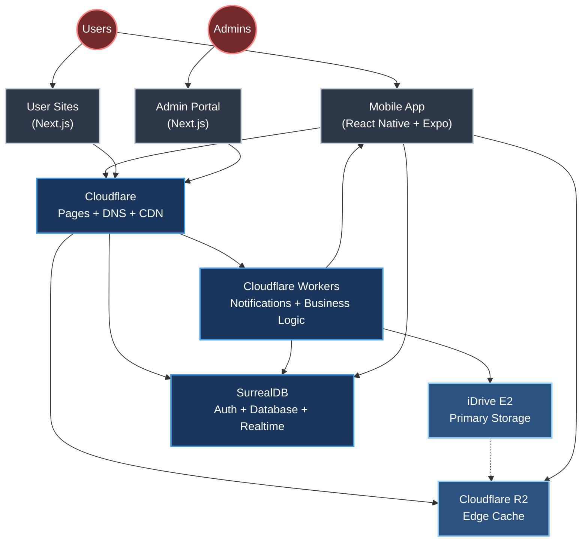

# iDance - System Architecture



## 1. Overview

iDance is a mobile application and web platform designed to connect dancers, enabling them to showcase their talents, find dance partners, explore job opportunities, build professional networks, and foster a vibrant community.

**Key Features:**
- Comprehensive user profiles (dance styles, proficiency, media, awards)
- Swipe-based matching system
- TikTok-like timeline and dance journal
- Direct chat capabilities
- Multi-level referral system
- Custom user websites
- Real-time push notifications (APNs/FCM)

**Guiding Principles:**
- **Mobile-First**: Primary focus on iOS and Android apps
- **Rapid Development**: Using React Native, Expo, SurrealDB, Cloudflare
- **Scalability**: Cloud-native architecture with SurrealDB and Cloudflare
- **Cost-Effectiveness**: Leveraging affordable managed services (Cloudflare, iDrive E2)

## 2. Core Software Components

### 2.1 Mobile App (iOS/Android)
- **Technology**:
  - React Native with Expo
  - TypeScript
  - EAS Build + Updates
  - SurrealDB Client SDK (`surrealdb.js`)
  - React Navigation
- **Key Features**:
  - Authentication & profile management
  - Swipe-based matching
  - Timeline/social features
  - Chat system
  - Media management
  - Location-based search
  - Referral dashboard
  - Push notifications (APNs/FCM)
- **Key Screens**:
  - Auth & Onboarding
  - Timeline Feed
  - Swipe Discovery
  - Profile Management
  - Chat & Messages
  - Settings & Preferences
  - Referral Dashboard

### 2.2 Backend Services
- **Technology**:
  - SurrealDB (Database, Auth, Realtime)
  - Cloudflare Workers (TypeScript)
  - SurrealQL + WebSocket
  - iDrive E2 Storage
  - Cloudflare R2 Edge Cache
- **Core Services**:
  - User Authentication (JWT-based)
  - Database & Data Access (SurrealQL)
  - Media Storage
  - Real-time Features (WebSocket `LIVE SELECT`)
  - Business Logic (Cloudflare Workers)
  - Geospatial Search (MTREE)
  - Push Notifications (APNs/FCM via Cloudflare Workers)
- **Key Functions**:
  - User Management
  - Profile Operations
  - Matching Logic
  - Timeline Processing
  - Referral System
  - Media Handling
  - Notification Delivery
  - Analytics Collection

### 2.3 Unified Admin Portal
- **Technology**:
  - Next.js (TypeScript)
  - TailwindCSS
  - SurrealDB Client SDK (`surrealdb.js`)
  - Cloudflare Pages
- **Access Levels**:
  - Site Administrators (iDance Team)
  - Group Administrators (Dance Companies/Studios)
  - Pro Users
  - Free Users
- **Core Features**:
  - Role-based Dashboard
  - User/Group Management
  - Content Moderation
  - Analytics & Reports
  - System Configuration
  - Site Customization
  - Media Management
  - SEO Tools
- **Key Interfaces**:
  - Global Admin Dashboard
  - Group Management Console
  - User Site Editor
  - Analytics Dashboard
  - Content Manager
  - System Settings

### 2.4 Dynamic User Sites
- **Technology**:
  - Next.js (TypeScript)
  - TailwindCSS
  - Cloudflare Pages
  - Cloudflare Workers
- **Architecture**:
  - Single Next.js application
  - Dynamic routing per user/group
  - Edge-based content resolution
  - Real-time data updates via SurrealDB
  - Global CDN distribution
- **Core Features**:
  - Personal/Group subdomains
  - Custom domain support
  - Dynamic content rendering
  - Media optimization
  - SEO enhancement
  - Contact forms
  - Blog/Updates
  - Analytics tracking
- **Performance Features**:
  - Edge caching
  - Image optimization
  - Incremental Static Regeneration
  - Analytics per site
  - Regional distribution

## 3. Infrastructure & Services

### 3.1 Storage Architecture
- **Primary Storage (iDrive E2)**:
  - Long-term media storage
  - Image optimization
  - Video transcoding
  - Access control
  - Quota management
  - Cost-effective for large storage volumes
- **Edge Caching (Cloudflare R2)**:
  - Fast edge-cached access to frequent assets
  - Global distribution
  - Seamless Cloudflare integration
  - Automatic cache invalidation
  - Pay-per-use pricing model

### 3.2 Deployment Infrastructure
- **Mobile App**:
  - EAS Build (iOS/Android)
  - EAS Update (OTA updates)
- **Web Components**:
  - Cloudflare Pages (SSR/Static)
  - Cloudflare Workers
  - Custom Domain Support
- **Backend**:
  - SurrealDB (Cloudflare-hosted)
  - Database Migrations (SurrealQL)
  - Cloudflare Workers (Business Logic, Notifications)

### 3.3 Domain & DNS
- **Core Setup**:
  - Cloudflare for `idance.live` domain
  - Automatic SSL for all subdomains
  - CDN for global performance
  - CNAME setup for custom domains
- **Custom Domain Support**:
  - Simple documentation for CNAME setup
  - Users can point their domains to `sites.idance.live`
  - Automatic SSL via Cloudflare
  - Zero additional cost for the platform

### 3.4 Notification Service
- **Overview**:
  - Push notifications for iOS (APNs) and Android (FCM) are delivered via a Cloudflare Worker (`notify.js`) that subscribes to SurrealDB’s WebSocket (`LIVE SELECT` on `notification` table).
  - Supports all app states (foreground, background, terminated).
  - Optional email notifications (e.g., via SendGrid) can be enabled.
- **Components**:
  - **SurrealDB**: Stores notifications in the `notification` table with `push_status` (`pending`, `sent`, `failed`). Uses `device` table for APNs/FCM tokens.
  - **Cloudflare Worker**: Listens for new notifications, sends APNs/FCM push, updates `push_status`.
  - **React Native**: Registers device tokens using `react-native-notifications`.
- **Setup Instructions**:
  1. **APNs Configuration**:
     - Create an Apple Developer account (free).
     - In [Apple Developer Portal](https://developer.apple.com/account/resources/authkeys/list), generate a push notification key (.p8).
     - Create a JWT token using `jsonwebtoken`:
       ```javascript
       const jwt = require('jsonwebtoken');
       const key = '<your-p8-key>';
       const token = jwt.sign({}, key, {
         algorithm: 'ES256',
         keyid: '<key-id>',
         issuer: '<team-id>',
         expiresIn: '1h'
       });
       ```
     - Store `APNS_JWT` in Cloudflare Worker environment:
       ```bash
       wrangler secret put APNS_JWT
       ```
  2. **FCM Configuration**:
     - Create a Firebase project at [Firebase Console](https://console.firebase.google.com).
     - Under Project Settings > Cloud Messaging, generate a server key.
     - Store `FCM_SERVER_KEY` in Worker environment:
       ```bash
       wrangler secret put FCM_SERVER_KEY
       ```
  3. **SurrealDB Configuration**:
     - Ensure WebSocket endpoint (`wss://idance.cloud.surrealdb.com`) is accessible.
     - Generate a JWT token for the Worker:
       ```surrealql
       DEFINE TOKEN worker_token ON SCOPE idance TYPE HS256 VALUE '<secret>';
       ```
     - Store `SURREAL_TOKEN` in Worker environment:
       ```bash
       wrangler secret put SURREAL_TOKEN
       ```
  4. **Optional Email (SendGrid)**:
     - Create a SendGrid account (free tier: 100 emails/day).
     - Generate an API key at [SendGrid API Keys](https://app.sendgrid.com/settings/api_keys).
     - Store `SENDGRID_API_KEY` in Worker environment:
       ```bash
       wrangler secret put SENDGRID_API_KEY
       ```
     - Verify sender email (`notifications@idance.app`) in SendGrid.
     - Uncomment email code in `notify.js` to enable.
  5. **Deploy Cloudflare Worker**:
     - Install Wrangler:
       ```bash
       npm install -g @cloudflare/wrangler
       ```
     - Deploy `notify.js`:
       ```bash
       wrangler deploy notify.js
       ```
  6. **Frontend Integration (React Native)**:
     - Install dependencies:
       ```bash
       npm install react-native-notifications surrealdb.js
       ```
     - Use `NotificationService.js` (provided below) to register device tokens:
       ```javascript
       import { useNotificationService } from './NotificationService';
       function App() {
         const auth = useAuth(); // Assume auth provider
         useNotificationService(auth);
         return <MainApp />;
       }
       ```
  7. **Apply SurrealDB Schema**:
     - Ensure the schema includes `notification` and `device` tables (see `0000_initial_schema.surql`).
     - Apply schema:
       ```bash
       surreal import --conn wss://idance.cloud.surrealdb.com --ns idance --db dev migrations/0000_initial_schema.surql
       ```
  8. **Test Notifications**:
     - Create a test notification:
       ```surrealql
       CREATE notification SET
         user = 'user:test',
         type = 'like',
         data = { vlog: 'vlog:123' },
         created_at = time::now();
       ```
     - Verify delivery on iOS/Android devices.
- **Costs**:
  - Cloudflare Workers: Free tier (100,000 requests/day), ~$0.30/M requests beyond (~$0-$2/month for 1M notifications).
  - SurrealDB: Free tier (5GB storage, 100,000 queries/day), ~$0-$5/month if exceeded.
  - APNs/FCM: Free.
  - SendGrid (optional): Free for 3,000 emails/month, ~$15/month for 1M emails.
  - Total: ~$0-$7/month (push only), ~$15-$22/month (with email).
- **Scalability**:
  - Cloudflare Workers: Handles millions of requests/second.
  - SurrealDB: Single Worker WebSocket connection, scales with Cloudflare’s enterprise tier (~$0.10/GB).
  - APNs/FCM: Designed for high-scale apps.

## 4. Business Features

### 4.1 User Tiers
- **Initial Launch (Free)**:
  - Personal `username.idance.live` subdomain
  - Full-featured portfolio site
  - Media gallery and blog
  - Contact form
  - Basic analytics
  - Custom domain support (via CNAME)
  - Basic SEO tools
  - Referral tracking
- **Pro Tier (Future)**:
  - To be introduced after company setup
  - Enhanced analytics
  - Priority support
  - Premium themes
  - Advanced SEO tools
  - Commission payouts
- **VIP (Future - Earned)**:
  - Recognition for top creators
  - Special profile badges
  - Early feature access
  - Community leadership opportunities

### 4.2 Referral System
- **Features**:
  - Multi-level structure
  - Commission tracking
  - Automated payouts
  - Analytics dashboard

## 5. Launch Strategy: User Sites First

### 5.1 Initial Launch: Personal Dance Sites
- **Direct Value Proposition**:
  - Instant `username.idance.live` subdomain upon signup
  - Portfolio site with media gallery and blog
  - Built-in SEO optimization
  - Contact forms and social links
  - Custom domain support
  - Analytics dashboard
- **Admin Portal Access**:
  - Site customization tools
  - Content management
  - Visitor analytics
  - Referral system tracking
  - SEO settings
- **Built-in Growth Engine**:
  - Users share their iDance sites on social media
  - Referral tracking from day one
  - Commission system for Pro signups
  - SEO drives organic growth

### 5.2 Phase Two: Mobile App Launch
- **Data-Driven Features**:
  - Pre-built network of verified dancers
  - Existing content for timeline/social features
  - Ready user base for matching algorithm
  - Proven user engagement metrics
- **Natural Platform Evolution**:
  - Web users transition to mobile features
  - Integration between sites and app
  - Cross-platform content sharing
  - Unified analytics and tracking

## 6. Technical Architecture
- **Frontend**:
  - Mobile: React Native (TypeScript), Expo
  - Web: Next.js (TypeScript), TailwindCSS
- **Backend**:
  - Database/Auth/Realtime: SurrealDB (SurrealQL, JWT, WebSocket)
  - Business Logic: Cloudflare Workers (TypeScript)
  - Notifications: Cloudflare Workers (APNs/FCM)
- **Storage**:
  - Primary: iDrive E2
  - Edge Cache: Cloudflare R2
- **Infrastructure**:
  - Cloudflare (Pages, Workers, DNS, CDN)
- **Integrations**:
  - Payment: Stripe
  - Notifications: APNs, FCM, (optional) SendGrid

## 7. Development & Deployment

### 7.1 Development
- **Repo Structure**:
  - pnpm workspace
  - Shared types
  - Consistent tooling
- **Key Tools**:
  - TypeScript
  - ESLint/Prettier
  - Jest/Testing Library
  - Storybook

### 7.2 CI/CD
- **Mobile**:
  - EAS Build
  - TestFlight/Internal Testing
  - Production Release
  - GitHub Actions
- **Web**:
  - Cloudflare Pages
  - Preview Deployments
  - Production Release
- **Backend**:
  - SurrealDB Migrations
  - Cloudflare Workers Deployment

## 8. Technology Stack Summary
- **Frontend**: React Native (TypeScript), Next.js (TypeScript)
- **Backend**: SurrealDB, Cloudflare Workers (TypeScript)
- **Storage**: iDrive E2 (primary storage), Cloudflare R2 (edge caching)
- **Infrastructure**: Cloudflare
- **Payment**: Stripe
- **Notifications**: APNs, FCM, (optional) SendGrid
- **Development Tools**:
  - TypeScript for all components
  - pnpm for package management
  - ESLint + Prettier for code formatting
  - Jest for testing
  - GitHub Actions for CI/CD

### Type Safety & Code Sharing
- Shared TypeScript types between:
  - Mobile app and web components
  - Frontend and backend (SurrealDB)
  - API interfaces and database schema
- Automatic type generation from SurrealDB schema
- Strong typing for API responses and requests

This architecture emphasizes type safety, code reuse, and maintainable development practices while enabling rapid iteration and scalability.