# iDance - System Architecture

```mermaid
flowchart TD
    %% User Layer
    Users(("Users"))
    Admins(("Admins"))

    %% Frontend Layer
    subgraph "Frontend Applications"
        MobileApp["📱 Mobile App<br>(React Native + Expo)<br>iOS & Android"]
        UserSites["🌐 User Sites<br>(Next.js)<br>Public Websites"]
        AdminPortal["⚙️ Admin Portal<br>(Next.js)<br>Management Interface"]
    end

    %% CDN & Edge Layer
    subgraph "Cloudflare Edge"
        CFPages["📄 Cloudflare Pages<br>Static Hosting"]
        CFCDN["🌍 CDN + DNS<br>Global Distribution"]
    end

    %% Backend Services Layer
    subgraph "Backend Services"
        CFWorkers["⚡ Cloudflare Workers<br>Business Logic API"]
        NotificationWorker["🔔 Notification Worker<br>WebSocket → Push Notifications"]
    end

    %% Database Layer
    subgraph "Database"
        SurrealDB["🗄️ SurrealDB<br>Auth + Database + Realtime<br>WebSocket Connections"]
    end

    %% Storage Layer
    subgraph "Storage Systems"
        iDriveE2["💾 iDrive E2<br>Primary Storage<br>Media Files"]
        R2["⚡ Cloudflare R2<br>Edge Cache<br>Fast Access"]
    end

    %% User Access
    Users --> MobileApp
    Users --> UserSites
    Admins --> AdminPortal

    %% Frontend to Edge
    MobileApp --> CFCDN
    UserSites --> CFPages
    AdminPortal --> CFPages

    %% Edge Distribution
    CFPages --> CFCDN

    %% Frontend to Backend Services
    MobileApp -.->|"Direct API Calls"| CFWorkers
    UserSites --> CFWorkers
    AdminPortal --> CFWorkers

    %% Backend Services to Database
    CFWorkers --> SurrealDB
    NotificationWorker --> SurrealDB

    %% Database WebSocket Connections
    SurrealDB -.->|"WebSocket Events"| NotificationWorker
    SurrealDB -.->|"Realtime Updates"| MobileApp

    %% Notification Flow
    NotificationWorker -.->|"Push Notifications"| MobileApp

    %% Storage Operations
    CFWorkers --> iDriveE2
    CFWorkers --> R2
    iDriveE2 -.->|"Cache Sync"| R2

    %% Media Delivery
    R2 --> CFCDN
    CFCDN --> MobileApp
    CFCDN --> UserSites

    %% Styling
    classDef frontend fill:#2d3748,stroke:#cbd5e0,stroke-width:2px,color:white
    classDef edge fill:#f56500,stroke:#fed7aa,stroke-width:2px,color:white
    classDef backend fill:#1a365d,stroke:#4299e1,stroke-width:2px,color:white
    classDef database fill:#2c5282,stroke:#90cdf4,stroke-width:2px,color:white
    classDef storage fill:#065f46,stroke:#6ee7b7,stroke-width:2px,color:white
    classDef users fill:#742a2a,stroke:#fc8181,stroke-width:2px,color:white

    class MobileApp,UserSites,AdminPortal frontend
    class CFPages,CFCDN edge
    class CFWorkers,NotificationWorker backend
    class SurrealDB database
    class iDriveE2,R2 storage
    class Users,Admins users
```

## Overview

iDance connects dancers through mobile and web platforms for networking, matching, and professional opportunities.

**Core Features:**
- User profiles with dance styles, media, and achievements
- Swipe-based matching system
- Timeline feed and dance journal
- Real-time chat and notifications
- Referral system
- Custom user websites

**Architecture Principles:**
- Mobile-first design (React Native + Expo)
- Serverless backend (Cloudflare Workers + SurrealDB)
- Edge-distributed content delivery
- Cost-effective storage (iDrive E2 + R2 caching)

## Frontend Applications

### Mobile App (React Native + Expo)
**Stack:** TypeScript, React Navigation, SurrealDB.js, EAS Build/Updates
**Features:**
- Authentication and onboarding
- Profile management and media uploads
- Swipe discovery and matching
- Timeline feed and social features
- Real-time chat system
- Push notifications (APNs/FCM)
- Location-based search
- Referral dashboard

### User Sites (Next.js)
**Stack:** TypeScript, TailwindCSS, Cloudflare Pages
**Features:**
- Dynamic subdomain routing (`user.idance.live`)
- Custom domain support
- SEO-optimized personal/group websites
- Real-time content updates
- Media galleries and portfolios
- Contact forms and analytics

### Admin Portal (Next.js)
**Stack:** TypeScript, TailwindCSS, NextAuth.js, Cloudflare Pages
**Access Levels:** Site admins, group admins, pro users, free users
**Features:**
- Role-based dashboards
- User and group management
- Content moderation tools
- Analytics and reporting
- System configuration
- Media management

## Backend Services

### Cloudflare Workers (Main API)
**Technology:** TypeScript, SurrealQL
**Responsibilities:**
- User authentication (JWT)
- Business logic processing
- Database operations
- Media storage management
- API endpoints for all frontends
- Geospatial search (MTREE)

### Notification Worker
**Technology:** TypeScript, WebSocket, APNs/FCM
**Responsibilities:**
- Listen to SurrealDB WebSocket events
- Process notification triggers
- Send push notifications to mobile devices
- Handle notification preferences and delivery

## Database

### SurrealDB
**Features:** Multi-model database, built-in auth, real-time subscriptions
**Capabilities:**
- User data and relationships
- Real-time updates via WebSocket (`LIVE SELECT`)
- Geospatial indexing for location search
- Graph relationships for matching
- Session management and JWT tokens

## Storage Architecture

### iDrive E2 (Primary Storage)
- Long-term media storage
- Video transcoding and image optimization
- Access control and quota management
- Cost-effective for large volumes

### Cloudflare R2 (Edge Cache)
- Fast global access to frequently used assets
- Automatic cache invalidation
- Seamless integration with Cloudflare CDN
- Pay-per-use pricing

## Infrastructure

### Deployment
- **Mobile:** EAS Build (iOS/Android) + OTA Updates
- **Web:** Cloudflare Pages (SSR/Static)
- **Backend:** Cloudflare Workers
- **Database:** SurrealDB (cloud-hosted)

### Domain & CDN
- Primary domain: `idance.live`
- Automatic SSL for all subdomains
- Global CDN distribution
- Custom domain support for user sites

### Data Flow
1. **Frontend → Edge:** All web traffic through Cloudflare CDN
2. **API Calls:** Direct connections to Cloudflare Workers
3. **Database:** Workers handle all SurrealDB operations
4. **Real-time:** WebSocket connections for live updates
5. **Notifications:** Dedicated worker processes database events
6. **Media:** E2 storage with R2 edge caching and CDN delivery

This architecture provides scalable, cost-effective infrastructure with real-time capabilities and global content distribution.