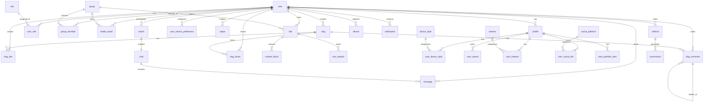

# iDance - Database Schema (SurrealDB)

This document outlines the SurrealDB schema for the iDance application, hosted at `wss://idance.cloud.surrealdb.com` (namespace: `idance`, database: `dev` or `prod`), as of May 24, 2025. It provides table definitions, relationships, security rules, setup instructions, and design decisions for the mobile-first dance community platform.

## 1. Overview

iDance uses SurrealDB to manage user profiles, social interactions, media, sites, and notifications, focusing on dancers, including cheerleaders seeking partners and jobs. Key features include:
- **Authentication**: JWT-based for users (email/password, OAuth via NextAuth.js) and Cloudflare Workers.
- **Real-time**: WebSocket `LIVE SELECT` for notifications (e.g., likes, matches).
- **Geospatial Search**: MTREE index for location-based dancer discovery.
- **Scalability**: Cloud-hosted, with iDrive E2 for media storage and Cloudflare R2 for edge caching.
- **Security**: Record-level permissions via `DEFINE ACCESS` and SurrealDB functions.
- **Business Logic**: Core access control in SurrealDB functions; complex workflows (e.g., swipe matching, notifications) in Cloudflare Workers.

The schema supports a React Native mobile app, Next.js-based User Sites and Admin Portal, and Cloudflare Workers for notifications and business logic. The `user` table holds generic fields for reusability across future `modelling_profile` and `acting_profile` tables, while the `profile` table contains dancer-specific data.

## 2. Entity Relationship Diagram (ERD)



## 3. Database Configuration

### 3.1 Setup
- **Endpoint**: `wss://idance.cloud.surrealdb.com`
- **Namespace**: `idance`
- **Database**: `dev` (development), `prod` (production)
- **Access**:
  - Users: `DEFINE ACCESS user ON DATABASE TYPE RECORD` with JWT (email/password, OAuth).
  - Workers: `DEFINE ACCESS worker ON DATABASE TYPE JWT` for Cloudflare Workers.
- **Dependencies**:
  - `surrealdb.js` for React Native and Next.js.
  - iDrive E2 for media storage, Cloudflare R2 for caching.
- **CLI Tools**:
  - Install SurrealDB CLI: `curl -sSf https://install.surrealdb.com | sh`
  - Apply schema: `surreal import --conn wss://idance.cloud.surrealdb.com --ns idance --db dev migrations/0000_initial_schema.surql`

### 3.2 Authentication
- **User Access**:
  ```surrealql
  DEFINE ACCESS user ON DATABASE TYPE RECORD
    SIGNUP ( CREATE user SET email = $email, password = crypto::argon2::generate($password), oauth_providers = $oauth_providers )
    SIGNIN ( SELECT * FROM user WHERE email = $email AND crypto::argon2::compare(password, $password) OR oauth_providers[$provider].id = $provider_id )
    WITH JWT ALGORITHM HS256 DURATION 1h;
  ```
- **Worker Access**:
  ```surrealql
  DEFINE TOKEN worker_token ON SCOPE worker TYPE HS256 VALUE '<secret>';
  DEFINE ACCESS worker ON DATABASE TYPE JWT WITH TOKEN worker_token;
  ```
- **NextAuth.js Integration**:
  - Stores OAuth data in `user.oauth_providers` (Google, Facebook, Apple).
  - Uses SurrealDB JWT for session validation in Next.js.

### 3.3 Real-time Features
- **Notifications**:
  - `LIVE SELECT` on `notification` streams new records to Cloudflare Workers.
  - Example:
    ```surrealql
    LIVE SELECT * FROM notification WHERE push_status = 'pending';
    ```
- **Chats**:
  - `LIVE SELECT` on `message` for real-time chat updates.
- **Vlogs**:
  - `LIVE SELECT` on `vlog_like`, `vlog_comment` for engagement updates.

### 3.4 Geospatial Search
- **Index**: MTREE on `profile.location` for distance-based queries.
  ```surrealql
  DEFINE INDEX profile_location ON profile FIELDS location MTREE DIMENSION 2;
  ```
- **Query Example**:
  ```surrealql
  SELECT * FROM profile WHERE location NEAR [40.7128, -74.0060] < 50mi;
  ```

### 3.5 Migrations
- **Apply Schema**:
  ```bash
  surreal import --conn wss://idance.cloud.surrealdb.com --ns idance --db dev migrations/0000_initial_schema.surql
  ```
- **Backup**:
  ```bash
  surreal export --conn wss://idance.cloud.surrealdb.com --ns idance --db dev backup_$(date +%F).surql
  ```
- **Restore**:
  ```bash
  surreal import --conn wss://idance.cloud.surrealdb.com --ns idance --db dev backup_2025-05-24.surql
  ```

### 3.6 Costs
- **SurrealDB**: Free tier (5GB storage, 100,000 queries/day), ~$0-$5/month for 100,000 MAUs.
- **iDrive E2**: ~$0.005/GB/month (~$5/month for 1TB media).
- **Cloudflare R2**: ~$0.015/GB/month (~$1.50/month for 100GB cached assets).

## 4. Table Schemas

Tables are defined using `DEFINE TABLE` and `DEFINE FIELD` in SurrealQL. Permissions use `PERMIT` clauses with `DEFINE FUNCTION` for complex access control. Cloudflare Workers handle workflows like swipe matching and referral commissions. See `migrations/0000_initial_schema.surql` for the executable schema.

### 4.1 `user`
- **Description**: Stores generic user authentication data, reusable for future `modelling_profile` and `acting_profile` tables.
- **Schema**:
  ```surrealql
  DEFINE TABLE user SCHEMAFULL;
  DEFINE FIELD email ON user TYPE string ASSERT $value != NONE AND string::is::email($value);
  DEFINE FIELD password ON user TYPE string; -- Hashed with argon2
  DEFINE FIELD oauth_providers ON user TYPE object DEFAULT {};
  DEFINE FIELD created_at ON user TYPE datetime DEFAULT time::now();
  DEFINE FIELD updated_at ON user TYPE datetime DEFAULT time::now() FLEXIBLE;
  DEFINE INDEX user_email ON user FIELDS email UNIQUE;
  ```
- **Permissions**:
  ```surrealql
  DEFINE ACCESS user ON DATABASE
    PERMIT SELECT WHERE id = $auth.id,
    PERMIT CREATE WHERE id = $auth.id,
    PERMIT UPDATE WHERE id = $auth.id,
    PERMIT DELETE WHERE id = $auth.id;
  ```

### 4.2 `profile`
- **Description**: Stores dancer-specific profile details, including physical attributes for partner and job matching.
- **Schema**:
  ```surrealql
  DEFINE TABLE profile SCHEMAFULL;
  DEFINE FIELD user ON profile TYPE record<user> ASSERT $value != NONE;
  DEFINE FIELD username ON profile TYPE string ASSERT $value != NONE AND string::len($value) >= 3 AND string::len($value) <= 30 AND $value MATCHES '^[a-z0-9]+(?:-[a-z0-9]+)*$';
  DEFINE FIELD first_name ON profile TYPE string ASSERT $value != NONE;
  DEFINE FIELD last_name ON profile TYPE string ASSERT $value != NONE;
  DEFINE FIELD date_of_birth ON profile TYPE datetime ASSERT $value != NONE;
  DEFINE FIELD gender ON profile TYPE string ASSERT $value IN ['Male', 'Female', 'Non-binary', 'Other', 'Prefer not to say'];
  DEFINE FIELD bio ON profile TYPE string ASSERT string::len($value) <= 2000;
  DEFINE FIELD looking_for_partners ON profile TYPE bool DEFAULT false;
  DEFINE FIELD looking_for_jobs ON profile TYPE bool DEFAULT false;
  DEFINE FIELD looking_for_dancers ON profile TYPE bool DEFAULT false;
  DEFINE FIELD referrer ON profile TYPE record<user>;
  DEFINE FIELD referral_code ON profile TYPE string;
  DEFINE FIELD commission_tier ON profile TYPE string;
  DEFINE FIELD profile_status ON profile TYPE string DEFAULT 'pending_waitlist_approval';
  DEFINE FIELD profile_picture_url ON profile TYPE string;
  DEFINE FIELD user_tier ON profile TYPE string DEFAULT 'basic';
  DEFINE FIELD stripe_customer_id ON profile TYPE string;
  DEFINE FIELD location ON profile TYPE point;
  DEFINE FIELD location_city ON profile TYPE string;
  DEFINE FIELD location_state ON profile TYPE string;
  DEFINE FIELD location_country ON profile TYPE string;
  DEFINE FIELD last_active_at ON profile TYPE datetime DEFAULT time::now();
  DEFINE FIELD weight ON profile TYPE float; -- kg or lbs, optional
  DEFINE FIELD weight_unit ON profile TYPE string ASSERT $value IN ['kg', 'lbs', null];
  DEFINE FIELD height ON profile TYPE float; -- cm or ft/in, optional
  DEFINE FIELD height_unit ON profile TYPE string ASSERT $value IN ['cm', 'ft', null];
  DEFINE FIELD hair_color ON profile TYPE string ASSERT $value IN ['Black', 'Brown', 'Blonde', 'Red', 'Gray', 'Other', null];
  DEFINE FIELD eye_color ON profile TYPE string ASSERT $value IN ['Blue', 'Brown', 'Green', 'Hazel', 'Gray', 'Other', null];
  DEFINE FIELD body_type ON profile TYPE string ASSERT $value IN ['Athletic', 'Slim', 'Average', 'Muscular', 'Curvy', 'Other', null];
  DEFINE FIELD measurements ON profile TYPE object; -- e.g., { chest: 34, waist: 28, hips: 36 }, optional
  DEFINE FIELD measurements_unit ON profile TYPE string ASSERT $value IN ['in', 'cm', null];
  DEFINE FIELD ethnicity ON profile TYPE string ASSERT $value IN ['Asian', 'Black', 'Hispanic', 'White', 'Native American', 'Pacific Islander', 'Other', null];
  DEFINE FIELD created_at ON profile TYPE datetime DEFAULT time::now();
  DEFINE FIELD updated_at ON profile TYPE datetime DEFAULT time::now() FLEXIBLE;
  DEFINE INDEX profile_username ON profile FIELDS username UNIQUE;
  DEFINE INDEX profile_referral_code ON profile FIELDS referral_code UNIQUE;
  DEFINE INDEX profile_location ON profile FIELDS location MTREE DIMENSION 2;
  ```
- **Permissions**:
  ```surrealql
  PERMIT SELECT WHERE fn::can_view_profile(id, $auth.id),
  PERMIT CREATE WHERE user = $auth.id,
  PERMIT UPDATE WHERE user = $auth.id,
  PERMIT DELETE WHERE user = $auth.id;
  ```

### 4.3 `role`
- **Description**: Defines user roles (e.g., site_admin).
- **Schema**:
  ```surrealql
  DEFINE TABLE role SCHEMAFULL;
  DEFINE FIELD name ON role TYPE string ASSERT $value IN ['site_admin', 'group_admin', 'pro_user', 'free_user'];
  DEFINE FIELD permissions ON role TYPE array<string> DEFAULT [];
  DEFINE FIELD created_at ON role TYPE datetime DEFAULT time::now();
  ```
- **Permissions**:
  ```surrealql
  PERMIT SELECT FOR authenticated;
  ```

### 4.4 `user_role`
- **Description**: Assigns roles to users, optionally scoped to groups.
- **Schema**:
  ```surrealql
  DEFINE TABLE user_role SCHEMAFULL;
  DEFINE FIELD user ON user_role TYPE record<user> ASSERT $value != NONE;
  DEFINE FIELD role ON user_role TYPE record<role> ASSERT $value != NONE;
  DEFINE FIELD scope ON user_role TYPE record<group>;
  DEFINE FIELD granted_at ON user_role TYPE datetime DEFAULT time::now();
  ```
- **Permissions**:
  ```surrealql
  PERMIT SELECT WHERE user = $auth.id OR fn::is_group_admin_or_owner(scope, $auth.id),
  PERMIT ALL WHERE fn::is_group_admin_or_owner(scope, $auth.id);
  ```

### 4.5 `group`
- **Description**: Represents dance companies, studios, or teams.
- **Schema**:
  ```surrealql
  DEFINE TABLE group SCHEMAFULL;
  DEFINE FIELD name ON group TYPE string ASSERT $value != NONE;
  DEFINE FIELD type ON group TYPE string ASSERT $value IN ['company', 'studio', 'team'];
  DEFINE FIELD subdomain ON group TYPE string ASSERT $value != NONE;
  DEFINE FIELD custom_domain ON group TYPE string;
  DEFINE FIELD settings ON group TYPE object DEFAULT {};
  DEFINE FIELD created_at ON group TYPE datetime DEFAULT time::now();
  DEFINE FIELD updated_at ON group TYPE datetime DEFAULT time::now() FLEXIBLE;
  DEFINE INDEX group_subdomain ON group FIELDS subdomain UNIQUE;
  DEFINE INDEX group_custom_domain ON group FIELDS custom_domain UNIQUE;
  ```
- **Permissions**:
  ```surrealql
  PERMIT SELECT FOR authenticated,
  PERMIT CREATE FOR authenticated,
  PERMIT UPDATE WHERE fn::is_group_admin_or_owner(id, $auth.id),
  PERMIT DELETE WHERE fn::is_group_owner(id, $auth.id);
  ```

### 4.6 `group_member`
- **Description**: Tracks group memberships.
- **Schema**:
  ```surrealql
  DEFINE TABLE group_member SCHEMAFULL;
  DEFINE FIELD group ON group_member TYPE record<group> ASSERT $value != NONE;
  DEFINE FIELD user ON group_member TYPE record<user> ASSERT $value != NONE;
  DEFINE FIELD role ON group_member TYPE string ASSERT $value IN ['owner', 'admin', 'member'];
  DEFINE FIELD joined_at ON group_member TYPE datetime DEFAULT time::now();
  ```
- **Permissions**:
  ```surrealql
  PERMIT SELECT FOR authenticated,
  PERMIT INSERT WHERE fn::is_group_admin_or_owner(group, $auth.id),
  PERMIT UPDATE WHERE fn::is_group_admin_or_owner(group, $auth.id),
  PERMIT DELETE WHERE fn::is_group_admin_or_owner(group, $auth.id) OR (user = $auth.id AND NOT fn::is_sole_owner(group, user));
  ```

### 4.7 `dance_style`
- **Description**: Stores dance styles (e.g., ballet, hip-hop).
- **Schema**:
  ```surrealql
  DEFINE TABLE dance_style SCHEMAFULL;
  DEFINE FIELD name ON dance_style TYPE string ASSERT $value != NONE;
  DEFINE FIELD created_at ON dance_style TYPE datetime DEFAULT time::now();
  DEFINE INDEX dance_style_name ON dance_style FIELDS name UNIQUE;
  ```
- **Permissions**:
  ```surrealql
  PERMIT SELECT FOR authenticated;
  ```

### 4.8 `user_dance_style`
- **Description**: Links users to dance styles with proficiency.
- **Schema**:
  ```surrealql
  DEFINE TABLE user_dance_style SCHEMAFULL;
  DEFINE FIELD user ON user_dance_style TYPE record<profile> ASSERT $value != NONE;
  DEFINE FIELD style ON user_dance_style TYPE record<dance_style> ASSERT $value != NONE;
  DEFINE FIELD proficiency_level ON user_dance_style TYPE string ASSERT $value != NONE;
  DEFINE FIELD created_at ON user_dance_style TYPE datetime DEFAULT time::now();
  ```
- **Permissions**:
  ```surrealql
  PERMIT SELECT FOR authenticated,
  PERMIT INSERT WHERE user.user = $auth.id,
  PERMIT DELETE WHERE user.user = $auth.id;
  ```

### 4.9 `user_award`
- **Description**: Stores user awards.
- **Schema**:
  ```surrealql
  DEFINE TABLE user_award SCHEMAFULL;
  DEFINE FIELD user ON user_award TYPE record<profile> ASSERT $value != NONE;
  DEFINE FIELD name ON user_award TYPE string ASSERT $value != NONE;
  DEFINE FIELD year ON user_award TYPE int;
  DEFINE FIELD description ON user_award TYPE string;
  DEFINE FIELD created_at ON user_award TYPE datetime DEFAULT time::now();
  ```
- **Permissions**:
  ```surrealql
  PERMIT SELECT FOR authenticated,
  PERMIT INSERT WHERE user.user = $auth.id,
  PERMIT UPDATE WHERE user.user = $auth.id,
  PERMIT DELETE WHERE user.user = $auth.id;
  ```

### 4.10 `interest`
- **Description**: Stores user interests.
- **Schema**:
  ```surrealql
  DEFINE TABLE interest SCHEMAFULL;
  DEFINE FIELD name ON interest TYPE string ASSERT $value != NONE;
  DEFINE FIELD created_at ON interest TYPE datetime DEFAULT time::now();
  DEFINE INDEX interest_name ON interest FIELDS name UNIQUE;
  ```
- **Permissions**:
  ```surrealql
  PERMIT SELECT FOR authenticated;
  ```

### 4.11 `user_interest`
- **Description**: Links users to interests.
- **Schema**:
  ```surrealql
  DEFINE TABLE user_interest SCHEMAFULL;
  DEFINE FIELD user ON user_interest TYPE record<profile> ASSERT $value != NONE;
  DEFINE FIELD interest ON user_interest TYPE record<interest> ASSERT $value != NONE;
  DEFINE FIELD created_at ON user_interest TYPE datetime DEFAULT time::now();
  ```
- **Permissions**:
  ```surrealql
  PERMIT SELECT FOR authenticated,
  PERMIT INSERT WHERE user.user = $auth.id,
  PERMIT DELETE WHERE user.user = $auth.id;
  ```

### 4.12 `social_platform`
- **Description**: Stores social media platforms.
- **Schema**:
  ```surrealql
  DEFINE TABLE social_platform SCHEMAFULL;
  DEFINE FIELD name ON social_platform TYPE string ASSERT $value != NONE;
  DEFINE FIELD created_at ON social_platform TYPE datetime DEFAULT time::now();
  DEFINE INDEX social_platform_name ON social_platform FIELDS name UNIQUE;
  ```
- **Permissions**:
  ```surrealql
  PERMIT SELECT FOR authenticated;
  ```

### 4.13 `user_social_link`
- **Description**: Links users to social platforms.
- **Schema**:
  ```surrealql
  DEFINE TABLE user_social_link SCHEMAFULL;
  DEFINE FIELD user ON user_social_link TYPE record<profile> ASSERT $value != NONE;
  DEFINE FIELD platform ON user_social_link TYPE record<social_platform> ASSERT $value != NONE;
  DEFINE FIELD url ON user_social_link TYPE string ASSERT $value != NONE;
  DEFINE FIELD created_at ON user_social_link TYPE datetime DEFAULT time::now();
  DEFINE INDEX user_platform_unique ON user_social_link FIELDS user, platform UNIQUE;
  ```
- **Permissions**:
  ```surrealql
  PERMIT SELECT FOR authenticated,
  PERMIT INSERT WHERE user.user = $auth.id,
  PERMIT UPDATE WHERE user.user = $auth.id,
  PERMIT DELETE WHERE user.user = $auth.id;
  ```

### 4.14 `user_portfolio_item`
- **Description**: Stores user portfolio media.
- **Schema**:
  ```surrealql
  DEFINE TABLE user_portfolio_item SCHEMAFULL;
  DEFINE FIELD user ON user_portfolio_item TYPE record<profile> ASSERT $value != NONE;
  DEFINE FIELD item_type ON user_portfolio_item TYPE string ASSERT $value != NONE;
  DEFINE FIELD url ON user_portfolio_item TYPE string ASSERT $value != NONE;
  DEFINE FIELD caption ON user_portfolio_item TYPE string;
  DEFINE FIELD thumbnail_url ON user_portfolio_item TYPE string;
  DEFINE FIELD display_order ON user_portfolio_item TYPE int DEFAULT 0;
  DEFINE FIELD created_at ON user_portfolio_item TYPE datetime DEFAULT time::now();
  ```
- **Permissions**:
  ```surrealql
  PERMIT SELECT FOR authenticated,
  PERMIT INSERT WHERE user.user = $auth.id,
  PERMIT UPDATE WHERE user.user = $auth.id,
  PERMIT DELETE WHERE user.user = $auth.id;
  ```

### 4.15 `user_search_preference`
- **Description**: Stores user search preferences.
- **Schema**:
  ```surrealql
  DEFINE TABLE user_search_preference SCHEMAFULL;
  DEFINE FIELD user ON user_search_preference TYPE record<user> ASSERT $value != NONE;
  DEFINE FIELD discovery_dance_styles ON user_search_preference TYPE array<string> DEFAULT [];
  DEFINE FIELD discovery_skill_levels ON user_search_preference TYPE array<string> DEFAULT [];
  DEFINE FIELD discovery_min_age ON user_search_preference TYPE int ASSERT $value >= 18;
  DEFINE FIELD discovery_max_age ON user_search_preference TYPE int ASSERT $value >= discovery_min_age OR $value IS NONE;
  DEFINE FIELD discovery_distance_miles ON user_search_preference TYPE int DEFAULT 50;
  DEFINE FIELD discovery_gender_preference ON user_search_preference TYPE array<string> DEFAULT [];
  DEFINE FIELD notifications_enabled ON user_search_preference TYPE bool DEFAULT true;
  DEFINE FIELD search_location ON user_search_preference TYPE point;
  DEFINE FIELD search_location_city ON user_search_preference TYPE string;
  DEFINE FIELD search_location_state ON user_search_preference TYPE string;
  DEFINE FIELD search_location_country ON user_search_preference TYPE string;
  DEFINE FIELD use_custom_location ON user_search_preference TYPE bool DEFAULT false;
  DEFINE FIELD updated_at ON user_search_preference TYPE datetime DEFAULT time::now() FLEXIBLE;
  ```
- **Permissions**:
  ```surrealql
  PERMIT SELECT WHERE user = $auth.id,
  PERMIT INSERT WHERE user = $auth.id,
  PERMIT UPDATE WHERE user = $auth.id,
  PERMIT DELETE WHERE user = $auth.id;
  ```

### 4.16 `swipe`
- **Description**: Tracks user swipes.
- **Schema**:
  ```surrealql
  DEFINE TABLE swipe SCHEMAFULL;
  DEFINE FIELD swiper_user ON swipe TYPE record<user> ASSERT $value != NONE AND $value != swiped_user;
  DEFINE FIELD swiped_user ON swipe TYPE record<user> ASSERT $value != NONE;
  DEFINE FIELD swipe_type ON swipe TYPE string ASSERT $value IN ['like', 'dislike', 'superlike'];
  DEFINE FIELD created_at ON swipe TYPE datetime DEFAULT time::now();
  ```
- **Permissions**:
  ```surrealql
  PERMIT SELECT WHERE swiper_user = $auth.id OR swiped_user = $auth.id,
  PERMIT INSERT WHERE swiper_user = $auth.id;
  ```

### 4.17 `match`
- **Description**: Stores user matches.
- **Schema**:
  ```surrealql
  DEFINE TABLE match SCHEMAFULL;
  DEFINE FIELD user1 ON match TYPE record<user> ASSERT $value != NONE AND $value != user2;
  DEFINE FIELD user2 ON match TYPE record<user> ASSERT $value != NONE;
  DEFINE FIELD matched_at ON match TYPE datetime DEFAULT time::now();
  DEFINE INDEX match_users ON match FIELDS user1, user2 UNIQUE;
  ```
- **Permissions**:
  ```surrealql
  PERMIT SELECT WHERE fn::is_match_member(id, $auth.id);
  ```

### 4.18 `chat`
- **Description**: Manages chat sessions.
- **Schema**:
  ```surrealql
  DEFINE TABLE chat SCHEMAFULL;
  DEFINE FIELD match ON chat TYPE record<match> ASSERT $value != NONE;
  DEFINE FIELD last_message ON chat TYPE record<message>;
  DEFINE FIELD last_activity ON chat TYPE datetime DEFAULT time::now() FLEXIBLE;
  DEFINE INDEX chat_match ON chat FIELDS match UNIQUE;
  ```
- **Permissions**:
  ```surrealql
  PERMIT SELECT WHERE fn::is_chat_member(id, $auth.id);
  ```

### 4.19 `message`
- **Description**: Stores chat messages.
- **Schema**:
  ```surrealql
  DEFINE TABLE message SCHEMAFULL;
  DEFINE FIELD chat ON message TYPE record<chat> ASSERT $value != NONE;
  DEFINE FIELD sender ON message TYPE record<user> ASSERT $value != NONE;
  DEFINE FIELD content_type ON message TYPE string ASSERT $value IN ['text', 'image', 'video', 'audio'];
  DEFINE FIELD content ON message TYPE string ASSERT $value != NONE;
  DEFINE FIELD media_url ON message TYPE string;
  DEFINE FIELD sent_at ON message TYPE datetime DEFAULT time::now();
  ```
- **Permissions**:
  ```surrealql
  PERMIT SELECT WHERE fn::is_chat_member(chat, $auth.id),
  PERMIT INSERT WHERE sender = $auth.id AND fn::is_chat_member(chat, $auth.id),
  PERMIT UPDATE WHERE sender = $auth.id AND fn::is_chat_member(chat, $auth.id),
  PERMIT DELETE WHERE sender = $auth.id AND fn::is_chat_member(chat, $auth.id);
  ```

### 4.20 `vlog`
- **Description**: Stores user vlogs.
- **Schema**:
  ```surrealql
  DEFINE TABLE vlog SCHEMAFULL;
  DEFINE FIELD user ON vlog TYPE record<user> ASSERT $value != NONE;
  DEFINE FIELD post_type ON vlog TYPE string ASSERT $value IN ['text', 'image', 'video', 'story'];
  DEFINE FIELD title ON vlog TYPE string;
  DEFINE FIELD caption ON vlog TYPE string;
  DEFINE FIELD media_items ON vlog TYPE array<object> DEFAULT [];
  DEFINE FIELD engagement_counts ON vlog TYPE object DEFAULT {};
  DEFINE FIELD visibility ON vlog TYPE string ASSERT $value IN ['public', 'followers', 'private'] DEFAULT 'public';
  DEFINE FIELD created_at ON vlog TYPE datetime DEFAULT time::now();
  DEFINE FIELD updated_at ON vlog TYPE datetime DEFAULT time::now() FLEXIBLE;
  ```
- **Permissions**:
  ```surrealql
  PERMIT SELECT WHERE fn::can_view_vlog(id, $auth.id),
  PERMIT INSERT WHERE user = $auth.id,
  PERMIT UPDATE WHERE user = $auth.id,
  PERMIT DELETE WHERE user = $auth.id;
  ```

### 4.21 `vlog_like`
- **Description**: Tracks vlog likes.
- **Schema**:
  ```surrealql
  DEFINE TABLE vlog_like SCHEMAFULL;
  DEFINE FIELD vlog ON vlog_like TYPE record<vlog> ASSERT $value != NONE;
  DEFINE FIELD user ON vlog_like TYPE record<user> ASSERT $value != NONE;
  DEFINE FIELD created_at ON vlog_like TYPE datetime DEFAULT time::now();
  DEFINE INDEX vlog_like_unique ON vlog_like FIELDS vlog, user UNIQUE;
  ```
- **Permissions**:
  ```surrealql
  PERMIT SELECT WHERE fn::can_view_vlog(vlog, $auth.id),
  PERMIT INSERT WHERE user = $auth.id AND fn::can_view_vlog(vlog, $auth.id),
  PERMIT DELETE WHERE user = $auth.id;
  ```

### 4.22 `vlog_comment`
- **Description**: Stores vlog comments.
- **Schema**:
  ```surrealql
  DEFINE TABLE vlog_comment SCHEMAFULL;
  DEFINE FIELD vlog ON vlog_comment TYPE record<vlog> ASSERT $value != NONE;
  DEFINE FIELD user ON vlog_comment TYPE record<user> ASSERT $value != NONE;
  DEFINE FIELD content ON vlog_comment TYPE string ASSERT $value != NONE;
  DEFINE FIELD metadata ON vlog_comment TYPE object;
  DEFINE FIELD reply_to ON vlog_comment TYPE record<vlog_comment>;
  DEFINE FIELD created_at ON vlog_comment TYPE datetime DEFAULT time::now();
  DEFINE FIELD updated_at ON vlog_comment TYPE datetime DEFAULT time::now() FLEXIBLE;
  ```
- **Permissions**:
  ```surrealql
  PERMIT SELECT WHERE fn::can_view_vlog(vlog, $auth.id),
  PERMIT INSERT WHERE user = $auth.id AND fn::can_view_vlog(vlog, $auth.id),
  PERMIT UPDATE WHERE user = $auth.id AND fn::can_view_vlog(vlog, $auth.id),
  PERMIT DELETE WHERE user = $auth.id;
  ```

### 4.23 `vlog_share`
- **Description**: Tracks vlog shares.
- **Schema**:
  ```surrealql
  DEFINE TABLE vlog_share SCHEMAFULL;
  DEFINE FIELD vlog ON vlog_share TYPE record<vlog> ASSERT $value != NONE;
  DEFINE FIELD user ON vlog_share TYPE record<user> ASSERT $value != NONE;
  DEFINE FIELD share_type ON vlog_share TYPE string ASSERT $value != NONE;
  DEFINE FIELD created_at ON vlog_share TYPE datetime DEFAULT time::now();
  ```
- **Permissions**:
  ```surrealql
  PERMIT SELECT WHERE fn::can_view_vlog(vlog, $auth.id),
  PERMIT INSERT WHERE user = $auth.id AND fn::can_view_vlog(vlog, $auth.id),
  PERMIT DELETE WHERE user = $auth.id;
  ```

### 4.24 `referral`
- **Description**: Manages referrals.
- **Schema**:
  ```surrealql
  DEFINE TABLE referral SCHEMAFULL;
  DEFINE FIELD referrer ON referral TYPE record<user> ASSERT $value != NONE AND $value != referred;
  DEFINE FIELD referred ON referral TYPE record<user> ASSERT $value != NONE;
  DEFINE FIELD status ON referral TYPE string DEFAULT 'pending';
  DEFINE FIELD level ON referral TYPE int DEFAULT 1;
  DEFINE FIELD parent_referral ON referral TYPE record<referral>;
  DEFINE FIELD created_at ON referral TYPE datetime DEFAULT time::now();
  DEFINE INDEX referral_referred ON referral FIELDS referred UNIQUE;
  ```
- **Permissions**:
  ```surrealql
  PERMIT SELECT WHERE referrer = $auth.id OR referred = $auth.id,
  PERMIT INSERT WHERE referrer = $auth.id;
  ```

### 4.25 `commission`
- **Description**: Tracks referral commissions.
- **Schema**:
  ```surrealql
  DEFINE TABLE commission SCHEMAFULL;
  DEFINE FIELD referral ON commission TYPE record<referral> ASSERT $value != NONE;
  DEFINE FIELD earner ON commission TYPE record<user> ASSERT $value != NONE AND $value != payer;
  DEFINE FIELD payer ON commission TYPE record<user> ASSERT $value != NONE;
  DEFINE FIELD amount ON commission TYPE float ASSERT $value > 0;
  DEFINE FIELD currency ON commission TYPE string DEFAULT 'USD';
  DEFINE FIELD type ON commission TYPE string ASSERT $value != NONE;
  DEFINE FIELD status ON commission TYPE string DEFAULT 'pending';
  DEFINE FIELD created_at ON commission TYPE datetime DEFAULT time::now();
  ```
- **Permissions**:
  ```surrealql
  PERMIT SELECT WHERE earner = $auth.id;
  ```

### 4.26 `site`
- **Description**: Stores user or group sites.
- **Schema**:
  ```surrealql
  DEFINE TABLE site SCHEMAFULL;
  DEFINE FIELD owner ON site TYPE record<user,group> ASSERT $value != NONE;
  DEFINE FIELD owner_type ON site TYPE string ASSERT $value IN ['user', 'group'];
  DEFINE FIELD theme ON site TYPE string;
  DEFINE FIELD layout ON site TYPE object;
  DEFINE FIELD settings ON site TYPE object;
  DEFINE FIELD custom_domain ON site TYPE string;
  DEFINE FIELD site_title ON site TYPE string;
  DEFINE FIELD site_description ON site TYPE string;
  DEFINE FIELD use_app_profile ON site TYPE bool DEFAULT false;
  DEFINE FIELD show_contact_form ON site TYPE bool DEFAULT false;
  DEFINE FIELD contact_email ON site TYPE string;
  DEFINE FIELD social_links ON site TYPE object;
  DEFINE FIELD featured_content ON site TYPE object;
  DEFINE FIELD custom_sections ON site TYPE object;
  DEFINE FIELD created_at ON site TYPE datetime DEFAULT time::now();
  DEFINE FIELD updated_at ON site TYPE datetime DEFAULT time::now() FLEXIBLE;
  DEFINE INDEX site_custom_domain ON site FIELDS custom_domain UNIQUE;
  ```
- **Permissions**:
  ```surrealql
  PERMIT SELECT,
  PERMIT INSERT WHERE fn::can_manage_site(id, $auth.id),
  PERMIT UPDATE WHERE fn::can_manage_site(id, $auth.id),
  PERMIT DELETE WHERE fn::can_manage_site(id, $auth.id);
  ```

### 4.27 `site_analytic`
- **Description**: Tracks site analytics.
- **Schema**:
  ```surrealql
  DEFINE TABLE site_analytic SCHEMAFULL;
  DEFINE FIELD site ON site_analytic TYPE record<site> ASSERT $value != NONE;
  DEFINE FIELD date ON site_analytic TYPE datetime ASSERT $value != NONE;
  DEFINE FIELD visits ON site_analytic TYPE int DEFAULT 0;
  DEFINE FIELD unique_visitors ON site_analytic TYPE int DEFAULT 0;
  DEFINE FIELD page_views ON site_analytic TYPE object;
  DEFINE FIELD traffic_sources ON site_analytic TYPE object;
  DEFINE FIELD updated_at ON site_analytic TYPE datetime DEFAULT time::now() FLEXIBLE;
  ```
- **Permissions**:
  ```surrealql
  PERMIT SELECT WHERE fn::can_manage_site(site, $auth.id);
  ```

### 4.28 `content_block`
- **Description**: Stores site content blocks.
- **Schema**:
  ```surrealql
  DEFINE TABLE content_block SCHEMAFULL;
  DEFINE FIELD site ON content_block TYPE record<site> ASSERT $value != NONE;
  DEFINE FIELD type ON content_block TYPE string ASSERT $value != NONE;
  DEFINE FIELD display_order ON content_block TYPE int DEFAULT 0;
  DEFINE FIELD content ON content_block TYPE object;
  DEFINE FIELD published ON content_block TYPE bool DEFAULT false;
  DEFINE FIELD created_at ON content_block TYPE datetime DEFAULT time::now();
  DEFINE FIELD updated_at ON content_block TYPE datetime DEFAULT time::now() FLEXIBLE;
  ```
- **Permissions**:
  ```surrealql
  PERMIT SELECT WHERE published = true,
  PERMIT ALL WHERE fn::can_manage_site(site, $auth.id);
  ```

### 4.29 `media_asset`
- **Description**: Stores media files (links to iDrive E2/R2).
- **Schema**:
  ```surrealql
  DEFINE TABLE media_asset SCHEMAFULL;
  DEFINE FIELD owner ON media_asset TYPE record<user,group> ASSERT $value != NONE;
  DEFINE FIELD owner_type ON media_asset TYPE string ASSERT $value IN ['user', 'group'];
  DEFINE FIELD type ON media_asset TYPE string ASSERT $value IN ['image', 'video', 'document'];
  DEFINE FIELD filename ON media_asset TYPE string;
  DEFINE FIELD storage_path ON media_asset TYPE string ASSERT $value != NONE;
  DEFINE FIELD size_bytes ON media_asset TYPE int;
  DEFINE FIELD url ON media_asset TYPE string ASSERT $value != NONE;
  DEFINE FIELD metadata ON media_asset TYPE object;
  DEFINE FIELD uploaded_at ON media_asset TYPE datetime DEFAULT time::now();
  DEFINE FIELD updated_at ON media_asset TYPE datetime DEFAULT time::now() FLEXIBLE;
  DEFINE INDEX media_asset_storage_path ON media_asset FIELDS storage_path UNIQUE;
  DEFINE INDEX media_asset_url ON media_asset FIELDS url UNIQUE;
  ```
- **Permissions**:
  ```surrealql
  PERMIT SELECT,
  PERMIT INSERT WHERE fn::can_manage_media(id, $auth.id),
  PERMIT UPDATE WHERE fn::can_manage_media(id, $auth.id),
  PERMIT DELETE WHERE fn::can_manage_media(id, $auth.id);
  ```

### 4.30 `device`
- **Description**: Stores user device tokens for notifications.
- **Schema**:
  ```surrealql
  DEFINE TABLE device SCHEMAFULL;
  DEFINE FIELD user ON device TYPE record<user> ASSERT $value != NONE;
  DEFINE FIELD token ON device TYPE string ASSERT $value != NONE;
  DEFINE FIELD platform ON device TYPE string ASSERT $value IN ['ios', 'android'];
  DEFINE FIELD created_at ON device TYPE datetime DEFAULT time::now();
  DEFINE FIELD updated_at ON device TYPE datetime DEFAULT time::now() FLEXIBLE;
  DEFINE INDEX device_token ON device FIELDS token UNIQUE;
  ```
- **Permissions**:
  ```surrealql
  PERMIT SELECT WHERE user = $auth.id OR $access = 'worker',
  PERMIT INSERT WHERE user = $auth.id,
  PERMIT UPDATE WHERE user = $auth.id,
  PERMIT DELETE WHERE user = $auth.id;
  ```

### 4.31 `notification`
- **Description**: Stores push notifications.
- **Schema**:
  ```surrealql
  DEFINE TABLE notification SCHEMAFULL;
  DEFINE FIELD user ON notification TYPE record<user> ASSERT $value != NONE;
  DEFINE FIELD type ON notification TYPE string ASSERT $value IN ['like', 'comment', 'match', 'message', 'follow'];
  DEFINE FIELD data ON notification TYPE object;
  DEFINE FIELD push_status ON notification TYPE string ASSERT $value IN ['pending', 'sent', 'failed'] DEFAULT 'pending';
  DEFINE FIELD created_at ON notification TYPE datetime DEFAULT time::now();
  ```
- **Permissions**:
  ```surrealql
  PERMIT SELECT WHERE user = $auth.id OR $access = 'worker',
  PERMIT INSERT WHERE user != NONE,
  PERMIT UPDATE WHERE $access = 'worker';
  ```

## 5. Helper Functions

SurrealDB functions (`DEFINE FUNCTION`) enforce complex access control, optimizing performance and security by centralizing permission logic.

### 5.1 `is_match_member`
- **Description**: Checks if a user is part of a match.
  ```surrealql
  DEFINE FUNCTION fn::is_match_member($match_id: record<match>, $user_id: record<user>) RETURNS bool {
    RETURN (SELECT id FROM match WHERE id = $match_id AND (user1 = $user_id OR user2 = $user_id) LIMIT 1) IS NOT NONE;
  };
  ```

### 5.2 `is_chat_member`
- **Description**: Checks if a user is part of a chat.
  ```surrealql
  DEFINE FUNCTION fn::is_chat_member($chat_id: record<chat>, $user_id: record<user>) RETURNS bool {
    LET $match_id = (SELECT match FROM chat WHERE id = $chat_id LIMIT 1);
    RETURN $match_id IS NONE ? false : fn::is_match_member($match_id, $user_id);
  };
  ```

### 5.3 `can_view_vlog`
- **Description**: Checks if a user can view a vlog based on visibility.
  ```surrealql
  DEFINE FUNCTION fn::can_view_vlog($vlog_id: record<vlog>, $user_id: record<user>) RETURNS bool {
    LET $vlog = (SELECT user, visibility FROM vlog WHERE id = $vlog_id LIMIT 1);
    RETURN $vlog IS NONE ? false :
           $vlog.visibility = 'public' ? true :
           $user_id IS NONE ? false :
           $vlog.user = $user_id ? true :
           $vlog.visibility = 'followers' AND (SELECT id FROM follower WHERE follower = $user_id AND followed = $vlog.user LIMIT 1) IS NOT NONE;
  };
  ```
- **Note**: Assumes a `follower` table for follow relationships. If not implemented, Workers can handle follow checks.

### 5.4 `is_group_admin_or_owner`
- **Description**: Checks if a user is a group admin or owner.
  ```surrealql
  DEFINE FUNCTION fn::is_group_admin_or_owner($group_id: record<group>, $user_id: record<user>) RETURNS bool {
    RETURN (SELECT id FROM group_member WHERE group = $group_id AND user = $user_id AND role IN ['admin', 'owner'] LIMIT 1) IS NOT NONE;
  };
  ```

### 5.5 `is_group_owner`
- **Description**: Checks if a user is a group owner.
  ```surrealql
  DEFINE FUNCTION fn::is_group_owner($group_id: record<group>, $user_id: record<user>) RETURNS bool {
    RETURN (SELECT id FROM group_member WHERE group = $group_id AND user = $user_id AND role = 'owner' LIMIT 1) IS NOT NONE;
  };
  ```

### 5.6 `is_sole_owner`
- **Description**: Checks if a user is the sole group owner.
  ```surrealql
  DEFINE FUNCTION fn::is_sole_owner($group_id: record<group>, $user_id: record<user>) RETURNS bool {
    LET $is_owner = (SELECT role = 'owner' FROM group_member WHERE group = $group_id AND user = $user_id LIMIT 1);
    RETURN $is_owner ? (SELECT count() FROM group_member WHERE group = $group_id AND role = 'owner' GROUP ALL) = 1 : false;
  };
  ```

### 5.7 `can_manage_site`
- **Description**: Checks if a user can manage a site.
  ```surrealql
  DEFINE FUNCTION fn::can_manage_site($site_id: record<site>, $user_id: record<user>) RETURNS bool {
    LET $site = (SELECT owner, owner_type FROM site WHERE id = $site_id LIMIT 1);
    RETURN $site IS NONE ? false :
           $site.owner_type = 'user' ? $site.owner = $user_id :
           fn::is_group_admin_or_owner($site.owner, $user_id);
  };
  ```

### 5.8 `can_manage_media`
- **Description**: Checks if a user can manage a media asset.
  ```surrealql
  DEFINE FUNCTION fn::can_manage_media($media_id: record<media_asset>, $user_id: record<user>) RETURNS bool {
    LET $media = (SELECT owner, owner_type FROM media_asset WHERE id = $media_id LIMIT 1);
    RETURN $media IS NONE ? false :
           $media.owner_type = 'user' ? $media.owner = $user_id :
           fn::is_group_admin_or_owner($media.owner, $user_id);
  };
  ```

### 5.9 `can_view_profile`
- **Description**: Checks if a user can view a profile, restricting sensitive fields.
  ```surrealql
  DEFINE FUNCTION fn::can_view_profile($profile_id: record<profile>, $user_id: record<user>) RETURNS bool {
    LET $profile = (SELECT user, profile_status FROM profile WHERE id = $profile_id LIMIT 1);
    RETURN $profile IS NONE ? false :
           $profile.profile_status = 'active' ? true :
           $user_id IS NONE ? false :
           $profile.user = $user_id;
  };
  ```
- **Note**: Sensitive fields (e.g., `weight`, `ethnicity`) are accessible only to recruiters or matched users via Cloudflare Worker logic.

## 6. Notification System

The `notification` and `device` tables integrate with Cloudflare Workers (`notify.js`, artifact ID `5ad4f3c9-d29c-4ffb-9110-c63306d87edc`) for APNs/FCM push notifications.

- **Workflow**:
  - React Native app registers device tokens using `NotificationService.js` (artifact ID `bdbc747b-887a-4654-9b90-c5a069711b89`), storing them in `device`.
  - Events (e.g., likes, matches) create `notification` records with `push_status = 'pending'`.
  - Cloudflare Worker subscribes to `LIVE SELECT * FROM notification WHERE push_status = 'pending'`.
  - Worker sends APNs/FCM push notifications and updates `push_status` to `sent` or `failed`.
- **Setup**:
  - Apply schema (section 3.5).
  - Configure APNs/FCM and deploy Worker (see `architecture.md`, artifact ID `e9df0d7a-34b0-4283-9fd3-600f79e39840`, section 3.4).
- **Example Notification**:
  ```surrealql
  CREATE notification SET
    user = user:test,
    type = 'like',
    data = { vlog = vlog:123 },
    created_at = time::now();
  ```

## 7. Performance Considerations

- **Indexes**: Unique and MTREE indexes ensure fast queries (e.g., `profile.username`, `profile.location`).
- **Caching**: Cloudflare R2 caches `media_asset.url` for low-latency media access.
- **Real-time**: Single WebSocket connection per Worker minimizes overhead.
- **Scalability**: SurrealDB’s distributed architecture supports 100,000+ MAUs.
- **Query Optimization**:
  - Use `SELECT * FROM profile WHERE location NEAR ...` for geospatial searches.
  - Leverage `LIVE SELECT` for real-time updates, avoiding polling.
- **Functions**: Server-side execution reduces Worker round-trips.

## 8. Security

- **Access Control**: `DEFINE ACCESS` and functions ensure authorized data access.
- **Field Validation**: `ASSERT` clauses enforce data integrity (e.g., email format, unique usernames).
- **JWT Security**: Short-lived tokens (1h) with HS256 algorithm.
- **Data Privacy**: Functions like `fn::can_view_profile` protect sensitive fields (e.g., `ethnicity`).
- **Audit Logging**: `created_at` and `updated_at` track changes.

## 9. Maintenance

- **Monitoring**:
  - Use SurrealDB’s `INFO FOR DB` to check query performance.
  - Monitor Worker logs: `wrangler tail`.
- **Updates**:
  - Apply schema changes via `surreal import migrations/0000_initial_schema.surql`.
  - Use `SCHEMALESS` for flexible fields during prototyping.
- **Backups**:
  - Schedule daily exports (section 3.5).
  - Store backups in iDrive E2 for redundancy.

## 10. Design Decisions

This section explains the rationale for key architectural choices, optimizing for performance, security, maintainability, and dancer-specific functionality.

### 10.1 Database Choice: SurrealDB
- **Why**: SurrealDB’s document-relational model supports flexible schemas, real-time WebSocket queries (`LIVE SELECT`), and geospatial indexing (MTREE), ideal for iDance’s social, mobile-first, and location-based features.
- **Performance**: Native indexing (e.g., MTREE for location) and WebSocket reduce latency vs. traditional polling.
- **Scalability**: Distributed architecture handles 100,000+ MAUs.
- **Cost**: Free tier (5GB, 100,000 queries/day) suits early growth, with predictable scaling costs (~$5/month for 100,000 MAUs).

### 10.2 Access Control: SurrealDB Functions
- **Why**: SurrealDB functions (`DEFINE FUNCTION`) centralize access control (e.g., vlog visibility, group admin checks) at the database level.
  - **Performance**: Server-side execution minimizes round-trips (e.g., one query checks vlog visibility vs. multiple Worker queries).
  - **Security**: Ensures consistent permission enforcement, preventing Worker misconfigurations.
  - **Maintainability**: Reusable functions (e.g., `fn::is_group_admin_or_owner`) simplify schema updates.
- **Alternative Considered**: Cloudflare Workers for all permission checks.
  - **Trade-off**: Increases latency (additional queries) and risks inconsistent logic across Workers.
  - **Decision**: Use SurrealDB functions for core permissions (e.g., `fn::can_view_vlog`), with Workers handling complex workflows (e.g., swipe matching).

### 10.3 Notifications: SurrealDB + Cloudflare Workers
- **Why**: SurrealDB’s `LIVE SELECT` streams notification events to Workers, which handle APNs/FCM delivery.
  - **Performance**: WebSocket minimizes polling; Workers’ edge compute ensures low-latency push delivery.
  - **Scalability**: Workers scale globally, supporting high notification volumes.

### 10.4 Media Storage: iDrive E2 + Cloudflare R2
- **Why**: iDrive E2 offers cost-effective storage ($0.005/GB/month); R2 provides edge caching ($0.015/GB/month).
  - **Performance**: R2 reduces media load times for mobile users.
  - **Cost**: Balances low storage costs with fast delivery.

### 10.5 Geospatial Search: SurrealDB MTREE
- **Why**: MTREE index on `profile.location` enables fast distance-based queries.
  - **Performance**: Native indexing outperforms Worker-based geospatial calculations.

### 10.6 Dancer-Specific Fields in `profile`
- **Why**: Added `weight`, `height`, `hair_color`, `eye_color`, `body_type`, `measurements`, and `ethnicity` to `profile` to enhance dancer partner and job matching, especially for cheerleaders transitioning from college.
  - **Relevance**:
    - **Weight/Height**: Ensures physical compatibility for partnered dances (e.g., lifts, cheerleading stunts) and job requirements (e.g., cheerleading squads).
    - **Hair/Eye Color**: Supports casting for roles requiring specific aesthetics (e.g., dance productions, team uniformity).
    - **Body Type**: Aligns with partner matching (e.g., group performance aesthetics) and job preferences (e.g., ‘Athletic’ for cheerleading).
    - **Measurements**: Critical for costume-based roles (e.g., cheerleading uniforms) and visual symmetry in partnered dances.
    - **Ethnicity**: Aids casting for roles seeking diverse representation (e.g., productions, cheerleading teams) and partner matching for aesthetic alignment.
  - **Privacy**: Fields are optional and restricted by `fn::can_view_profile` to authorized users (e.g., recruiters, matched partners).
  - **Reusability**: Non-dancer fields (e.g., `email`, `password`) remain in `user` for future `modelling_profile` and `acting_profile` tables.
  - **UX**: Optional fields with clear UI explanations (e.g., “Ethnicity helps match you with diverse roles”) avoid discomfort for casual users.
  - **Reasoning**: These fields align with industry needs (e.g., NFL cheerleader auditions) and iDance’s goal to connect dancers, especially cheerleaders, with partners and jobs.

### 10.7 Table Structure for Reusability
- **Why**: Separated generic fields (`user`) from dancer-specific fields (`profile`) to support future `modelling_profile` and `acting_profile` tables.
  - **user**: Holds authentication and universal fields (e.g., `email`, `password`, `oauth_providers`).
  - **profile**: Contains dancer-specific fields (e.g., `height`, `ethnicity`).
  - **Reasoning**: Enables `modelling_profile` and `acting_profile` to reference `user` for common data, reducing duplication and simplifying schema extensions.

This schema optimizes iDance’s mobile-first, real-time, and scalable architecture, with SurrealDB handling dancer-specific data and access control, and Cloudflare Workers managing notifications and workflows.