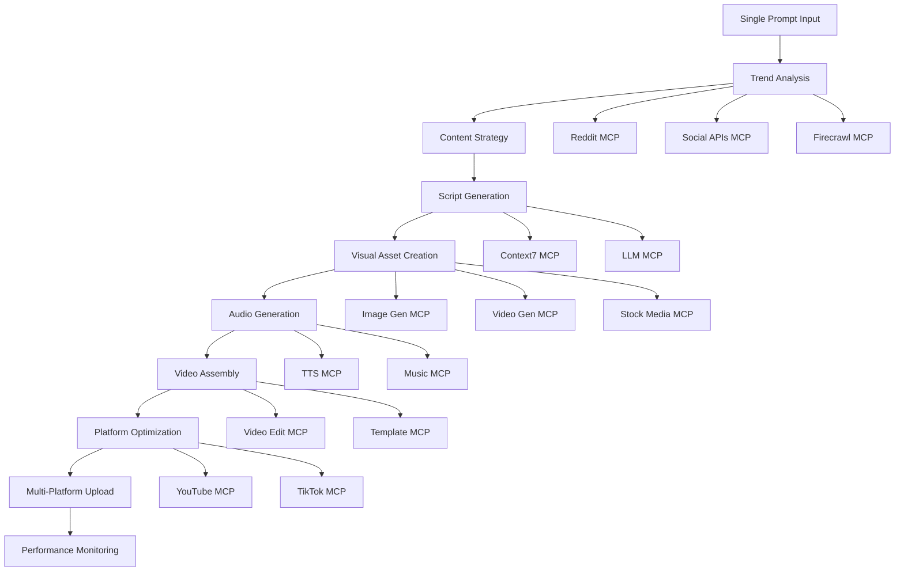

# Viral Video Creation with MCP Servers
## Replicating and Exceeding DeepAgent Capabilities

Based on analysis of [DeepAgent](https://deepagent.abacus.ai/), **absolutely yes** - with the right MCP server stack, we could replicate and potentially exceed DeepAgent's capabilities for automated viral video creation. DeepAgent is a general-purpose AI agent that can build apps, create presentations, and connect to various systems, but it's not specifically optimized for viral video creation like what we could build.

## MCP Server Stack for Viral Video Creation

### 🎯 Core Video Creation Pipeline

#### 1. Content Research & Trend Analysis
- **Social Media APIs MCP**: TikTok/YouTube trending APIs, hashtag analysis
- **Reddit MCP** (✅ already available): Mine viral discussions and content
- **News/Trends MCP**: Real-time trending topics, viral content patterns
- **Firecrawl MCP** (✅ already available): Scrape competitor content and trends

#### 2. Script & Content Generation
- **Context7 MCP** (✅ already available): Access latest content creation frameworks
- **Advanced LLM MCP**: GPT-4, Claude for script writing optimized for virality
- **Copywriting MCP**: Viral hooks, engagement patterns, platform-specific optimization

#### 3. Visual Content Creation
- **Image Generation MCP**: DALL-E, Midjourney, Stable Diffusion for thumbnails/visuals
- **Video Generation MCP**: RunwayML, Pika Labs, Luma AI for video clips
- **Stock Media MCP**: Unsplash, Pexels, Getty Images for B-roll content
- **Animation MCP**: Lottie animations, motion graphics

#### 4. Audio & Voice
- **Text-to-Speech MCP**: ElevenLabs, OpenAI TTS for voiceovers
- **Music/SFX MCP**: Epidemic Sound, AudioJungle for background music
- **Audio Processing MCP**: Noise reduction, audio mixing, synchronization

#### 5. Video Assembly & Editing
- **Video Editing MCP**: FFmpeg operations, automated editing workflows
- **Template MCP**: Pre-built viral video templates and formats
- **Subtitle/Caption MCP**: Auto-generated captions with styling

#### 6. Platform Optimization
- **YouTube MCP**: Upload, optimize metadata, thumbnails, scheduling
- **TikTok MCP**: Upload, hashtag optimization, trend alignment
- **Analytics MCP**: Performance tracking, A/B testing results

## Workflow Architecture

## Advantages Over DeepAgent

### 🚀 Specialized for Virality
- Purpose-built for viral content creation vs. general-purpose agent
- Deep understanding of platform algorithms and engagement patterns
- Optimized workflows for speed and viral potential

### 🎨 Advanced Creative Capabilities
- Multi-modal content generation (video, audio, images, text)
- Platform-specific optimization (TikTok vs. YouTube formats)
- Real-time trend integration and adaptation

### 📊 Data-Driven Optimization
- Continuous learning from viral content patterns
- A/B testing capabilities for thumbnails, titles, hooks
- Performance feedback loops for improvement

## Implementation Strategy

### Phase 1: Core Pipeline
- Set up trend analysis and script generation
- Basic video assembly with templates
- Single platform upload (start with YouTube)

### Phase 2: Enhanced Creation
- Add AI-generated visuals and voiceovers
- Multi-platform optimization
- Advanced editing capabilities

### Phase 3: Intelligence Layer
- Performance analytics and optimization
- Automated A/B testing
- Viral prediction algorithms

## Example Single Prompt Workflow

**Input**: *"Create a viral TikTok about the latest AI breakthrough that will get 1M+ views"*

**Automated Process**:
1. **Research**: Scan trending AI topics, viral formats, competitor analysis
2. **Strategy**: Identify hook angle, target audience, optimal posting time
3. **Script**: Generate engaging script with viral hooks and call-to-actions
4. **Visuals**: Create eye-catching thumbnail, generate B-roll footage
5. **Audio**: Generate professional voiceover, add trending background music
6. **Assembly**: Edit video with captions, transitions, platform-optimized format
7. **Upload**: Post with optimized title, description, hashtags, scheduling
8. **Monitor**: Track performance and suggest improvements

## Conclusion

**The answer is definitively YES** - with the right MCP server ecosystem, we could build something significantly more powerful than DeepAgent specifically for viral video creation. The key is having specialized tools for each step of the content creation pipeline, rather than a general-purpose agent trying to do everything.

## Required MCP Servers Summary

### Currently Available
- ✅ **Context7 MCP**: Documentation and framework access
- ✅ **Reddit MCP**: Viral content mining
- ✅ **Firecrawl MCP**: Web scraping for trends

### Needed for Full Implementation
- 🔄 **Social Media APIs MCP**: TikTok, YouTube, Instagram APIs
- 🔄 **Image Generation MCP**: DALL-E, Midjourney integration
- 🔄 **Video Generation MCP**: RunwayML, Pika Labs, Luma AI
- 🔄 **Text-to-Speech MCP**: ElevenLabs, OpenAI TTS
- 🔄 **Music/Audio MCP**: Epidemic Sound, royalty-free music
- 🔄 **Video Editing MCP**: FFmpeg automation, template system
- 🔄 **Platform Upload MCP**: YouTube, TikTok direct upload
- 🔄 **Analytics MCP**: Performance tracking and optimization

With this stack, a single prompt could trigger a complete viral video creation pipeline from research to upload to performance monitoring.