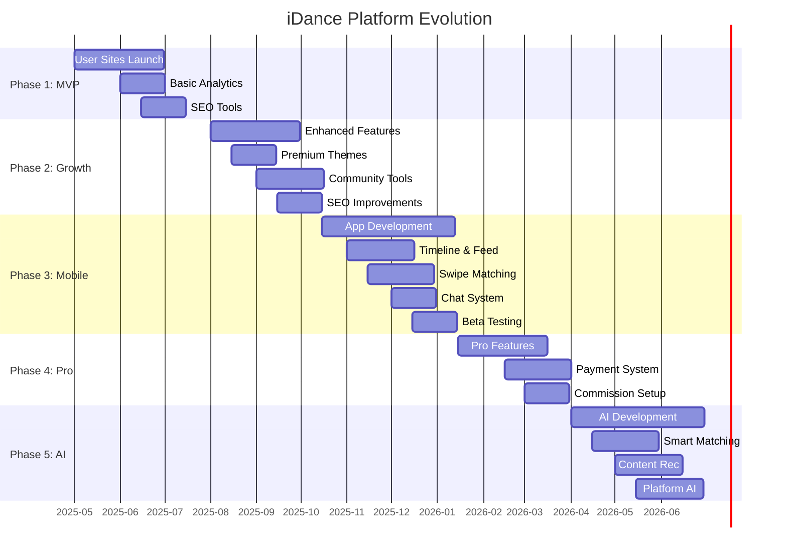

# iDance Platform Roadmap

## Development Phases

## 1. Phase One: User Sites (Current Focus)

### Core Features
- Personal dance websites (`username.idance.live`)
- Media gallery and portfolio
- Dance journal/blog
- Contact forms
- SEO optimization
- Custom domain support (CNAME)
- Basic analytics

### Technical Implementation
- Next.js + TypeScript stack
- Cloudflare Pages deployment
- Supabase backend
- Media optimization pipeline
- User admin portal

## 2. Phase Two: Growth & Engagement

### Platform Enhancements
- Enhanced analytics dashboard
- Additional site themes
- Improved SEO tools
- Social sharing features
- Community spotlights
- Featured profiles

### Technical Focus
- Analytics pipeline
- Theme system
- Social integrations
- Performance optimization
- Content delivery improvements

## 3. Phase Three: Mobile App Launch

### Core Mobile Features
- Timeline/social feed
- Swipe-based matching
- Real-time chat
- Mobile-optimized profiles
- Cross-platform content sharing

### Technical Requirements
- React Native with TypeScript
- Real-time communications
- Media upload optimization
- Location-based features
- Push notifications

## 4. Phase Four: Monetization

### Pro Features
- Premium site themes
- Advanced analytics
- Priority support system
- Referral commissions
- Enhanced customization

### Business Infrastructure
- Payment processing
- Commission tracking
- Support system
- Usage monitoring
- Billing management

## 5. Phase Five: Advanced Features

### AI & Automation
- Smart dancer matching
- Content recommendations
- Automated SEO
- Profile optimization
- Content moderation

### Platform Evolution
- Events & competitions
- Virtual workshops
- Professional networking
- Talent marketplace
- Dance studio integrations

## Key Success Metrics

### Phase 1
- Number of active sites
- Media uploads
- Profile completion rate
- Organic traffic
- Referral signups

### Phase 2
- User engagement
- Content creation
- Social shares
- SEO performance
- Community growth

### Phase 3
- App downloads
- Daily active users
- Match rate
- Chat engagement
- Cross-platform usage

### Phase 4
- Pro conversions
- Revenue metrics
- Commission payouts
- Customer satisfaction
- Feature adoption

### Phase 5
- AI accuracy
- Automation efficiency
- Platform scalability
- Market penetration
- Industry partnerships
