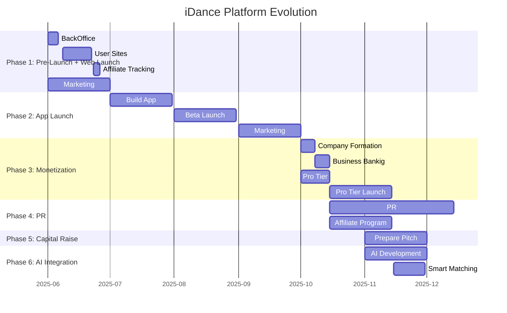

# iDance Platform Roadmap

## Development Phases

## 1. Phase One: Pre-Launch + Web Launch (June 2025)

### Core Features
- Back office administration system
- Personal dance websites (`username.idance.live`)
- Media gallery and portfolio
- Affiliate tracking system
- Basic analytics
- SEO optimization
- Marketing infrastructure

### Technical Implementation
- Next.js + TypeScript stack
- Cloudflare Pages deployment
- Supabase backend
- Media optimization pipeline
- User admin portal
- Affiliate tracking system

## 2. Phase Two: App Launch (July-September 2025)

### Core Features
- Mobile application development
- Beta testing program
- User feedback integration
- Marketing campaign

### Technical Focus
- React Native implementation
- Beta testing infrastructure
- Performance optimization
- User engagement tracking
- Marketing analytics

## 3. Phase Three: Monetization (October 2025)

### Business Setup
- Company formation
- Business banking setup
- Pro tier feature development
- Payment processing integration

### Pro Features
- Premium site themes
- Advanced analytics
- Priority support system
- Enhanced customization options

## 4. Phase Four: PR (October-December 2025)

### Focus Areas
- Public relations campaign
- Media outreach
- Affiliate program launch
- Community building
- Brand awareness

### Implementation
- PR strategy execution
- Affiliate tracking and management
- Community engagement tools
- Social media presence

## 5. Phase Five: Capital Raise (November 2025)

### Key Activities
- Pitch deck preparation
- Financial projections
- Market analysis
- Investor outreach
- Due diligence preparation

## 6. Phase Six: AI Integration (November 2025 - January 2026)

### AI Features
- Smart dancer matching
- Content recommendations
- Automated SEO
- Profile optimization
- Smart matching system

### Technical Implementation
- AI development pipeline
- Machine learning models
- Data processing infrastructure
- Integration testing

## Key Success Metrics

### Phase 1: Pre-Launch + Web Launch
- Number of active sites
- Media uploads
- Profile completion rate
- Affiliate sign-ups
- Marketing reach

### Phase 2: App Launch
- App downloads
- Beta tester engagement
- User feedback metrics
- Daily active users
- Feature adoption rate

### Phase 3: Monetization
- Pro tier conversions
- Revenue metrics
- Payment processing success
- Customer satisfaction

### Phase 4: PR
- Media coverage
- Affiliate program growth
- Social media engagement
- Brand mention metrics

### Phase 5: Capital Raise
- Investor meetings
- Pitch deck engagement
- Due diligence completion
- Term sheet discussions

### Phase 6: AI Integration
- AI model accuracy
- Smart matching success rate
- User satisfaction with AI features
- System performance metrics
